## Quarto Feature Tour {#sec-quarto-tour}


This document is both a **visual branding showcase** and a **Quarto feature
showcase**. It demonstrates long-form reporting patterns you can reuse in
real client-facing work: callouts, citations, cross-references, columns,
full-width layouts, tables, links, footnotes, tabsets, equations, and rich
content blocks [@allaire2022quarto; @wickham2016ggplot2].

ChanWe styling emphasizes clarity and hierarchy: muted body text, confident
headings, and selective orange accents for high-signal elements. The design
language follows a pragmatic “editorial dashboard” approach rather than a
generic notebook look.^[The objective is readability first, then brand
personality.]

You can jump directly to the examples in [Section @sec-examples], open the
[Quarto docs](https://quarto.org/docs/), or inspect package usage in the
[chanwer README](README.md).

::: {.callout-note title="Document Intent"}
This page intentionally mixes prose and analytical components to mimic a real
report workflow: executive narrative, exploration, and production-ready
visualizations.
:::

::: {.callout-important title="Brand Behavior"}
Use orange as an accent and semantic signal, not as a full-page fill. Dense
orange usage reduces hierarchy and harms scanability.
:::

::: {.callout-warning title="Output Format Guidance"}
`highcharter` and `reactable` are HTML-native widgets. For PDF/PPTX exports,
prefer `ggplot2` and `gt` where static rendering is required.
:::

::: {.aside}
This aside block is useful for constraints, assumptions, or reviewer notes
without interrupting the core narrative.
:::

### Structured Layouts

::: {.columns}
::: {.column width="55%"}
The left column carries narrative context, assumptions, and interpretation.
This is useful for executive summaries where each chart needs a concise
takeaway.

- Keep section intros short and explicit.
- Use callouts for risk/status signals.
- Prefer references to labeled figures and tables over “see above”.
:::
::: {.column width="45%"}

``` r
ggplot(mt, aes(wt, mpg, color = cyl)) +
    geom_point(size = 3, alpha = 0.9) +
    scale_color_chanwe_d() +
    theme_chanwe() +
    labs(
        title = "Quick Look",
        subtitle = chanwe_subtitle("Performance profile by cylinder")
    )
```

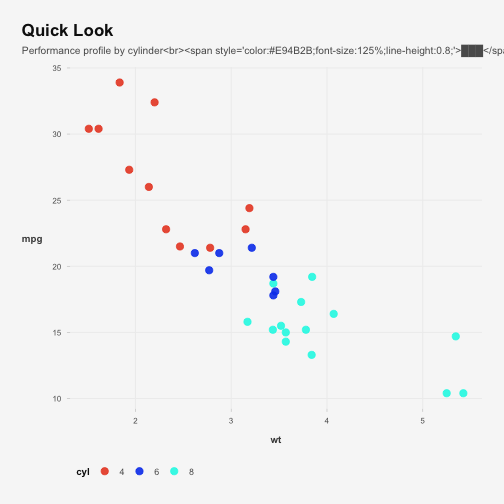

:::
:::

As shown in @fig-quick-look, the subtitle accent line creates a compact visual
anchor between heading text and chart body.

::: {.column-page}
### Full-Width Comparison

Use a wider layout for side-by-side displays where detail density is high.


``` r
ggplot(mt, aes(hp, mpg, color = am)) +
    geom_point(size = 2.6) +
    geom_smooth(method = "lm", se = FALSE, linewidth = 0.8) +
    scale_color_chanwe_d() +
    theme_chanwe() +
    labs(title = "Model View", subtitle = chanwe_subtitle("Regression trend"))
```

```
## `geom_smooth()` using formula = 'y ~ x'
```

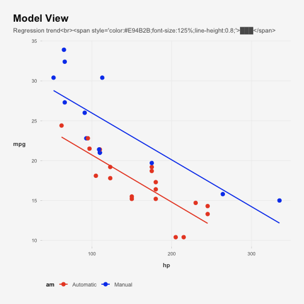

``` r
gt(head(mt, 10)) |>
    tab_header(title = "Operational Snapshot") |>
    gt_theme_chanwe()
```

```
## Warning in file(con, "wb"): cannot open file
## '/Users/alejandro.abraham@scalapay.com/Library/Caches/org.R-project.R/R/sass/a98da307bd8bf100d6afaaa36994bf52':
## Operation not permitted
```

<!--html_preserve--><div id="bbiaxctrvw" style="padding-left:0px;padding-right:0px;padding-top:10px;padding-bottom:10px;overflow-x:auto;overflow-y:auto;width:auto;height:auto;">
<style>@import url("https://fonts.googleapis.com/css2?family=DM+Sans:ital,wght@0,100;0,200;0,300;0,400;0,500;0,600;0,700;0,800;0,900;1,100;1,200;1,300;1,400;1,500;1,600;1,700;1,800;1,900&display=swap");
#bbiaxctrvw table {
  font-family: 'DM Sans', system-ui, 'Segoe UI', Roboto, Helvetica, Arial, sans-serif, 'Apple Color Emoji', 'Segoe UI Emoji', 'Segoe UI Symbol', 'Noto Color Emoji';
  -webkit-font-smoothing: antialiased;
  -moz-osx-font-smoothing: grayscale;
}

#bbiaxctrvw thead, #bbiaxctrvw tbody, #bbiaxctrvw tfoot, #bbiaxctrvw tr, #bbiaxctrvw td, #bbiaxctrvw th {
  border-style: none;
}

#bbiaxctrvw p {
  margin: 0;
  padding: 0;
}

#bbiaxctrvw .gt_table {
  display: table;
  border-collapse: collapse;
  line-height: normal;
  margin-left: auto;
  margin-right: auto;
  color: #5B5B5B;
  font-size: 13.5px;
  font-weight: 400;
  font-style: normal;
  background-color: #F7F7F7;
  width: auto;
  border-top-style: solid;
  border-top-width: 1px;
  border-top-color: #EEEEEE;
  border-right-style: none;
  border-right-width: 2px;
  border-right-color: #D3D3D3;
  border-bottom-style: solid;
  border-bottom-width: 1px;
  border-bottom-color: #EEEEEE;
  border-left-style: none;
  border-left-width: 2px;
  border-left-color: #D3D3D3;
}

#bbiaxctrvw .gt_caption {
  padding-top: 4px;
  padding-bottom: 4px;
}

#bbiaxctrvw .gt_title {
  color: #5B5B5B;
  font-size: 24px;
  font-weight: 900;
  padding-top: 4px;
  padding-bottom: 4px;
  padding-left: 5px;
  padding-right: 5px;
  border-bottom-color: #F7F7F7;
  border-bottom-width: 0;
}

#bbiaxctrvw .gt_subtitle {
  color: #5B5B5B;
  font-size: 14px;
  font-weight: 500;
  padding-top: 3px;
  padding-bottom: 5px;
  padding-left: 5px;
  padding-right: 5px;
  border-top-color: #F7F7F7;
  border-top-width: 0;
}

#bbiaxctrvw .gt_heading {
  background-color: #FFFFFF;
  text-align: center;
  border-bottom-color: #F7F7F7;
  border-left-style: none;
  border-left-width: 1px;
  border-left-color: #D3D3D3;
  border-right-style: none;
  border-right-width: 1px;
  border-right-color: #D3D3D3;
}

#bbiaxctrvw .gt_bottom_border {
  border-bottom-style: solid;
  border-bottom-width: 2px;
  border-bottom-color: #E94B2B;
}

#bbiaxctrvw .gt_col_headings {
  border-top-style: solid;
  border-top-width: 2px;
  border-top-color: #EEEEEE;
  border-bottom-style: solid;
  border-bottom-width: 2px;
  border-bottom-color: #EEEEEE;
  border-left-style: none;
  border-left-width: 1px;
  border-left-color: #D3D3D3;
  border-right-style: none;
  border-right-width: 1px;
  border-right-color: #D3D3D3;
}

#bbiaxctrvw .gt_col_heading {
  color: #5B5B5B;
  background-color: #F8F8F8;
  font-size: 12px;
  font-weight: 700;
  text-transform: inherit;
  border-left-style: none;
  border-left-width: 1px;
  border-left-color: #D3D3D3;
  border-right-style: none;
  border-right-width: 1px;
  border-right-color: #D3D3D3;
  vertical-align: bottom;
  padding-top: 5px;
  padding-bottom: 6px;
  padding-left: 5px;
  padding-right: 5px;
  overflow-x: hidden;
}

#bbiaxctrvw .gt_column_spanner_outer {
  color: #5B5B5B;
  background-color: #F8F8F8;
  font-size: 12px;
  font-weight: 700;
  text-transform: inherit;
  padding-top: 0;
  padding-bottom: 0;
  padding-left: 4px;
  padding-right: 4px;
}

#bbiaxctrvw .gt_column_spanner_outer:first-child {
  padding-left: 0;
}

#bbiaxctrvw .gt_column_spanner_outer:last-child {
  padding-right: 0;
}

#bbiaxctrvw .gt_column_spanner {
  border-bottom-style: solid;
  border-bottom-width: 2px;
  border-bottom-color: #EEEEEE;
  vertical-align: bottom;
  padding-top: 5px;
  padding-bottom: 5px;
  overflow-x: hidden;
  display: inline-block;
  width: 100%;
}

#bbiaxctrvw .gt_spanner_row {
  border-bottom-style: hidden;
}

#bbiaxctrvw .gt_group_heading {
  padding-top: 8px;
  padding-bottom: 8px;
  padding-left: 5px;
  padding-right: 5px;
  color: #5B5B5B;
  background-color: #F7F7F7;
  font-size: 100%;
  font-weight: initial;
  text-transform: inherit;
  border-top-style: solid;
  border-top-width: 2px;
  border-top-color: #D3D3D3;
  border-bottom-style: solid;
  border-bottom-width: 2px;
  border-bottom-color: #D3D3D3;
  border-left-style: none;
  border-left-width: 1px;
  border-left-color: #D3D3D3;
  border-right-style: none;
  border-right-width: 1px;
  border-right-color: #D3D3D3;
  vertical-align: middle;
  text-align: left;
}

#bbiaxctrvw .gt_empty_group_heading {
  padding: 0.5px;
  color: #5B5B5B;
  background-color: #F7F7F7;
  font-size: 100%;
  font-weight: initial;
  border-top-style: solid;
  border-top-width: 2px;
  border-top-color: #D3D3D3;
  border-bottom-style: solid;
  border-bottom-width: 2px;
  border-bottom-color: #D3D3D3;
  vertical-align: middle;
}

#bbiaxctrvw .gt_from_md > :first-child {
  margin-top: 0;
}

#bbiaxctrvw .gt_from_md > :last-child {
  margin-bottom: 0;
}

#bbiaxctrvw .gt_row {
  padding-top: 6px;
  padding-bottom: 6px;
  padding-left: 5px;
  padding-right: 5px;
  margin: 10px;
  border-top-style: solid;
  border-top-width: 1px;
  border-top-color: #EEEEEE;
  border-left-style: none;
  border-left-width: 1px;
  border-left-color: #EEEEEE;
  border-right-style: none;
  border-right-width: 1px;
  border-right-color: #EEEEEE;
  vertical-align: middle;
  overflow-x: hidden;
}

#bbiaxctrvw .gt_stub {
  color: #5B5B5B;
  background-color: #F7F7F7;
  font-size: 100%;
  font-weight: initial;
  text-transform: inherit;
  border-right-style: solid;
  border-right-width: 2px;
  border-right-color: #D3D3D3;
  padding-left: 5px;
  padding-right: 5px;
}

#bbiaxctrvw .gt_stub_row_group {
  color: #5B5B5B;
  background-color: #F7F7F7;
  font-size: 100%;
  font-weight: initial;
  text-transform: inherit;
  border-right-style: solid;
  border-right-width: 2px;
  border-right-color: #D3D3D3;
  padding-left: 5px;
  padding-right: 5px;
  vertical-align: top;
}

#bbiaxctrvw .gt_row_group_first td {
  border-top-width: 2px;
}

#bbiaxctrvw .gt_row_group_first th {
  border-top-width: 2px;
}

#bbiaxctrvw .gt_summary_row {
  color: #5B5B5B;
  background-color: #F7F7F7;
  text-transform: inherit;
  padding-top: 8px;
  padding-bottom: 8px;
  padding-left: 5px;
  padding-right: 5px;
}

#bbiaxctrvw .gt_first_summary_row {
  border-top-style: solid;
  border-top-color: #D3D3D3;
}

#bbiaxctrvw .gt_first_summary_row.thick {
  border-top-width: 2px;
}

#bbiaxctrvw .gt_last_summary_row {
  padding-top: 8px;
  padding-bottom: 8px;
  padding-left: 5px;
  padding-right: 5px;
  border-bottom-style: solid;
  border-bottom-width: 2px;
  border-bottom-color: #D3D3D3;
}

#bbiaxctrvw .gt_grand_summary_row {
  color: #5B5B5B;
  background-color: #F7F7F7;
  text-transform: inherit;
  padding-top: 8px;
  padding-bottom: 8px;
  padding-left: 5px;
  padding-right: 5px;
}

#bbiaxctrvw .gt_first_grand_summary_row {
  padding-top: 8px;
  padding-bottom: 8px;
  padding-left: 5px;
  padding-right: 5px;
  border-top-style: double;
  border-top-width: 6px;
  border-top-color: #D3D3D3;
}

#bbiaxctrvw .gt_last_grand_summary_row_top {
  padding-top: 8px;
  padding-bottom: 8px;
  padding-left: 5px;
  padding-right: 5px;
  border-bottom-style: double;
  border-bottom-width: 6px;
  border-bottom-color: #D3D3D3;
}

#bbiaxctrvw .gt_striped {
  background-color: rgba(128, 128, 128, 0.05);
}

#bbiaxctrvw .gt_table_body {
  border-top-style: solid;
  border-top-width: 2px;
  border-top-color: #D3D3D3;
  border-bottom-style: solid;
  border-bottom-width: 2px;
  border-bottom-color: #D3D3D3;
}

#bbiaxctrvw .gt_footnotes {
  color: #5B5B5B;
  background-color: #F7F7F7;
  border-bottom-style: none;
  border-bottom-width: 2px;
  border-bottom-color: #D3D3D3;
  border-left-style: none;
  border-left-width: 2px;
  border-left-color: #D3D3D3;
  border-right-style: none;
  border-right-width: 2px;
  border-right-color: #D3D3D3;
}

#bbiaxctrvw .gt_footnote {
  margin: 0px;
  font-size: 11px;
  padding-top: 4px;
  padding-bottom: 4px;
  padding-left: 5px;
  padding-right: 5px;
}

#bbiaxctrvw .gt_sourcenotes {
  color: #5B5B5B;
  background-color: #F7F7F7;
  border-bottom-style: none;
  border-bottom-width: 2px;
  border-bottom-color: #D3D3D3;
  border-left-style: none;
  border-left-width: 2px;
  border-left-color: #D3D3D3;
  border-right-style: none;
  border-right-width: 2px;
  border-right-color: #D3D3D3;
}

#bbiaxctrvw .gt_sourcenote {
  font-size: 11px;
  padding-top: 4px;
  padding-bottom: 4px;
  padding-left: 5px;
  padding-right: 5px;
}

#bbiaxctrvw .gt_left {
  text-align: left;
}

#bbiaxctrvw .gt_center {
  text-align: center;
}

#bbiaxctrvw .gt_right {
  text-align: right;
  font-variant-numeric: tabular-nums;
}

#bbiaxctrvw .gt_font_normal {
  font-weight: normal;
}

#bbiaxctrvw .gt_font_bold {
  font-weight: bold;
}

#bbiaxctrvw .gt_font_italic {
  font-style: italic;
}

#bbiaxctrvw .gt_super {
  font-size: 65%;
}

#bbiaxctrvw .gt_footnote_marks {
  font-size: 75%;
  vertical-align: 0.4em;
  position: initial;
}

#bbiaxctrvw .gt_asterisk {
  font-size: 100%;
  vertical-align: 0;
}

#bbiaxctrvw .gt_indent_1 {
  text-indent: 5px;
}

#bbiaxctrvw .gt_indent_2 {
  text-indent: 10px;
}

#bbiaxctrvw .gt_indent_3 {
  text-indent: 15px;
}

#bbiaxctrvw .gt_indent_4 {
  text-indent: 20px;
}

#bbiaxctrvw .gt_indent_5 {
  text-indent: 25px;
}

#bbiaxctrvw .katex-display {
  display: inline-flex !important;
  margin-bottom: 0.75em !important;
}

#bbiaxctrvw div.Reactable > div.rt-table > div.rt-thead > div.rt-tr.rt-tr-group-header > div.rt-th-group:after {
  height: 0px !important;
}

.gt_table {
  border-radius: 4px;
  box-shadow: none;
}

.gt_heading {
  border-left: 4px solid #E94B2B;
  padding-left: 10px;
}

.gt_caption {
  color: #6D6D6D;
  font-size: 12px;
}

.gt_row {
  line-height: 1.6;
}
</style>
<table class="gt_table" data-quarto-disable-processing="false" data-quarto-bootstrap="false">
  <thead>
    <tr class="gt_heading">
      <td colspan="12" class="gt_heading gt_title gt_font_normal gt_bottom_border" style="color: #101010; font-size: 24px; text-align: left; font-weight: bolder;">Operational Snapshot</td>
    </tr>
    
    <tr class="gt_col_headings">
      <th class="gt_col_heading gt_columns_bottom_border gt_left" rowspan="1" colspan="1" scope="col" id="model">model</th>
      <th class="gt_col_heading gt_columns_bottom_border gt_right" rowspan="1" colspan="1" scope="col" id="mpg">mpg</th>
      <th class="gt_col_heading gt_columns_bottom_border gt_center" rowspan="1" colspan="1" scope="col" id="cyl">cyl</th>
      <th class="gt_col_heading gt_columns_bottom_border gt_right" rowspan="1" colspan="1" scope="col" id="disp">disp</th>
      <th class="gt_col_heading gt_columns_bottom_border gt_right" rowspan="1" colspan="1" scope="col" id="hp">hp</th>
      <th class="gt_col_heading gt_columns_bottom_border gt_right" rowspan="1" colspan="1" scope="col" id="drat">drat</th>
      <th class="gt_col_heading gt_columns_bottom_border gt_right" rowspan="1" colspan="1" scope="col" id="wt">wt</th>
      <th class="gt_col_heading gt_columns_bottom_border gt_right" rowspan="1" colspan="1" scope="col" id="qsec">qsec</th>
      <th class="gt_col_heading gt_columns_bottom_border gt_right" rowspan="1" colspan="1" scope="col" id="vs">vs</th>
      <th class="gt_col_heading gt_columns_bottom_border gt_center" rowspan="1" colspan="1" scope="col" id="am">am</th>
      <th class="gt_col_heading gt_columns_bottom_border gt_center" rowspan="1" colspan="1" scope="col" id="gear">gear</th>
      <th class="gt_col_heading gt_columns_bottom_border gt_right" rowspan="1" colspan="1" scope="col" id="carb">carb</th>
    </tr>
  </thead>
  <tbody class="gt_table_body">
    <tr><td headers="model" class="gt_row gt_left">Mazda RX4</td>
<td headers="mpg" class="gt_row gt_right">21.0</td>
<td headers="cyl" class="gt_row gt_center">6</td>
<td headers="disp" class="gt_row gt_right">160.0</td>
<td headers="hp" class="gt_row gt_right">110</td>
<td headers="drat" class="gt_row gt_right">3.90</td>
<td headers="wt" class="gt_row gt_right">2.620</td>
<td headers="qsec" class="gt_row gt_right">16.46</td>
<td headers="vs" class="gt_row gt_right">0</td>
<td headers="am" class="gt_row gt_center">Manual</td>
<td headers="gear" class="gt_row gt_center">4</td>
<td headers="carb" class="gt_row gt_right">4</td></tr>
    <tr><td headers="model" class="gt_row gt_left">Mazda RX4 Wag</td>
<td headers="mpg" class="gt_row gt_right">21.0</td>
<td headers="cyl" class="gt_row gt_center">6</td>
<td headers="disp" class="gt_row gt_right">160.0</td>
<td headers="hp" class="gt_row gt_right">110</td>
<td headers="drat" class="gt_row gt_right">3.90</td>
<td headers="wt" class="gt_row gt_right">2.875</td>
<td headers="qsec" class="gt_row gt_right">17.02</td>
<td headers="vs" class="gt_row gt_right">0</td>
<td headers="am" class="gt_row gt_center">Manual</td>
<td headers="gear" class="gt_row gt_center">4</td>
<td headers="carb" class="gt_row gt_right">4</td></tr>
    <tr><td headers="model" class="gt_row gt_left">Datsun 710</td>
<td headers="mpg" class="gt_row gt_right">22.8</td>
<td headers="cyl" class="gt_row gt_center">4</td>
<td headers="disp" class="gt_row gt_right">108.0</td>
<td headers="hp" class="gt_row gt_right">93</td>
<td headers="drat" class="gt_row gt_right">3.85</td>
<td headers="wt" class="gt_row gt_right">2.320</td>
<td headers="qsec" class="gt_row gt_right">18.61</td>
<td headers="vs" class="gt_row gt_right">1</td>
<td headers="am" class="gt_row gt_center">Manual</td>
<td headers="gear" class="gt_row gt_center">4</td>
<td headers="carb" class="gt_row gt_right">1</td></tr>
    <tr><td headers="model" class="gt_row gt_left">Hornet 4 Drive</td>
<td headers="mpg" class="gt_row gt_right">21.4</td>
<td headers="cyl" class="gt_row gt_center">6</td>
<td headers="disp" class="gt_row gt_right">258.0</td>
<td headers="hp" class="gt_row gt_right">110</td>
<td headers="drat" class="gt_row gt_right">3.08</td>
<td headers="wt" class="gt_row gt_right">3.215</td>
<td headers="qsec" class="gt_row gt_right">19.44</td>
<td headers="vs" class="gt_row gt_right">1</td>
<td headers="am" class="gt_row gt_center">Automatic</td>
<td headers="gear" class="gt_row gt_center">3</td>
<td headers="carb" class="gt_row gt_right">1</td></tr>
    <tr><td headers="model" class="gt_row gt_left">Hornet Sportabout</td>
<td headers="mpg" class="gt_row gt_right">18.7</td>
<td headers="cyl" class="gt_row gt_center">8</td>
<td headers="disp" class="gt_row gt_right">360.0</td>
<td headers="hp" class="gt_row gt_right">175</td>
<td headers="drat" class="gt_row gt_right">3.15</td>
<td headers="wt" class="gt_row gt_right">3.440</td>
<td headers="qsec" class="gt_row gt_right">17.02</td>
<td headers="vs" class="gt_row gt_right">0</td>
<td headers="am" class="gt_row gt_center">Automatic</td>
<td headers="gear" class="gt_row gt_center">3</td>
<td headers="carb" class="gt_row gt_right">2</td></tr>
    <tr><td headers="model" class="gt_row gt_left">Valiant</td>
<td headers="mpg" class="gt_row gt_right">18.1</td>
<td headers="cyl" class="gt_row gt_center">6</td>
<td headers="disp" class="gt_row gt_right">225.0</td>
<td headers="hp" class="gt_row gt_right">105</td>
<td headers="drat" class="gt_row gt_right">2.76</td>
<td headers="wt" class="gt_row gt_right">3.460</td>
<td headers="qsec" class="gt_row gt_right">20.22</td>
<td headers="vs" class="gt_row gt_right">1</td>
<td headers="am" class="gt_row gt_center">Automatic</td>
<td headers="gear" class="gt_row gt_center">3</td>
<td headers="carb" class="gt_row gt_right">1</td></tr>
    <tr><td headers="model" class="gt_row gt_left">Duster 360</td>
<td headers="mpg" class="gt_row gt_right">14.3</td>
<td headers="cyl" class="gt_row gt_center">8</td>
<td headers="disp" class="gt_row gt_right">360.0</td>
<td headers="hp" class="gt_row gt_right">245</td>
<td headers="drat" class="gt_row gt_right">3.21</td>
<td headers="wt" class="gt_row gt_right">3.570</td>
<td headers="qsec" class="gt_row gt_right">15.84</td>
<td headers="vs" class="gt_row gt_right">0</td>
<td headers="am" class="gt_row gt_center">Automatic</td>
<td headers="gear" class="gt_row gt_center">3</td>
<td headers="carb" class="gt_row gt_right">4</td></tr>
    <tr><td headers="model" class="gt_row gt_left">Merc 240D</td>
<td headers="mpg" class="gt_row gt_right">24.4</td>
<td headers="cyl" class="gt_row gt_center">4</td>
<td headers="disp" class="gt_row gt_right">146.7</td>
<td headers="hp" class="gt_row gt_right">62</td>
<td headers="drat" class="gt_row gt_right">3.69</td>
<td headers="wt" class="gt_row gt_right">3.190</td>
<td headers="qsec" class="gt_row gt_right">20.00</td>
<td headers="vs" class="gt_row gt_right">1</td>
<td headers="am" class="gt_row gt_center">Automatic</td>
<td headers="gear" class="gt_row gt_center">4</td>
<td headers="carb" class="gt_row gt_right">2</td></tr>
    <tr><td headers="model" class="gt_row gt_left">Merc 230</td>
<td headers="mpg" class="gt_row gt_right">22.8</td>
<td headers="cyl" class="gt_row gt_center">4</td>
<td headers="disp" class="gt_row gt_right">140.8</td>
<td headers="hp" class="gt_row gt_right">95</td>
<td headers="drat" class="gt_row gt_right">3.92</td>
<td headers="wt" class="gt_row gt_right">3.150</td>
<td headers="qsec" class="gt_row gt_right">22.90</td>
<td headers="vs" class="gt_row gt_right">1</td>
<td headers="am" class="gt_row gt_center">Automatic</td>
<td headers="gear" class="gt_row gt_center">4</td>
<td headers="carb" class="gt_row gt_right">2</td></tr>
    <tr><td headers="model" class="gt_row gt_left">Merc 280</td>
<td headers="mpg" class="gt_row gt_right">19.2</td>
<td headers="cyl" class="gt_row gt_center">6</td>
<td headers="disp" class="gt_row gt_right">167.6</td>
<td headers="hp" class="gt_row gt_right">123</td>
<td headers="drat" class="gt_row gt_right">3.92</td>
<td headers="wt" class="gt_row gt_right">3.440</td>
<td headers="qsec" class="gt_row gt_right">18.30</td>
<td headers="vs" class="gt_row gt_right">1</td>
<td headers="am" class="gt_row gt_center">Automatic</td>
<td headers="gear" class="gt_row gt_center">4</td>
<td headers="carb" class="gt_row gt_right">4</td></tr>
  </tbody>
  
</table>
</div><!--/html_preserve-->

:::

### Cross-Refs, Tables, and Equation


``` r
token_tbl <- tibble::tribble(
    ~token       , ~value    , ~usage                      ,
    "foreground" , "#5B5B5B" , "Body text"                 ,
    "background" , "#F7F7F7" , "Page/panel background"     ,
    "primary"    , "#E94B2B" , "Accent and highlights"     ,
    "info"       , "#11F7E6" , "Informational callouts"    ,
    "success"    , "#1EB508" , "Positive status callouts"  ,
    "danger"     , "#F40C0C" , "Risk and caution callouts"
)
knitr::kable(token_tbl, align = c("l", "l", "l"))
```


|token      |value   |usage                     |
|:----------|:-------|:-------------------------|
|foreground |#5B5B5B |Body text                 |
|background |#F7F7F7 |Page/panel background     |
|primary    |#E94B2B |Accent and highlights     |
|info       |#11F7E6 |Informational callouts    |
|success    |#1EB508 |Positive status callouts  |
|danger     |#F40C0C |Risk and caution callouts |

Table @tbl-semantic-tokens summarizes the semantic mapping used by the theme.

The simplified visual quality score used in this narrative is:

$$
Q = 0.6 \\times R + 0.4 \\times B
$$ {#eq-quality}

where \(R\) is readability and \(B\) is brand consistency. Equation @eq-quality
is illustrative but helps show how math is rendered in the same styled flow.

### Tabs and Rich Content

::: {.panel-tabset}
## Narrative

A good branded report combines:

1. Context and business framing.
2. Visual evidence with consistent semantics.
3. Action-oriented summaries and explicit caveats.

## Technical Notes


``` r
list(
    extension = "_extensions/chanwe-brand/brand.yml",
    report_css = chanwe_reporting_css(),
    chart_palette = unname(chanwe_palette("chart"))
)
```

```
## $extension
## [1] "_extensions/chanwe-brand/brand.yml"
## 
## $report_css
## [1] "/Users/alejandro.abraham@scalapay.com/Documents/GitHub/chanwer/inst/quarto/chanwe-reporting.scss"
## 
## $chart_palette
## [1] "#E94B2B" "#0C48ED" "#11F7E6" "#1EB508" "#F9E710" "#EB03F2" "#F40C0C"
## [8] "#6B6B6B"
```

## Links

- [Quarto Guide](https://quarto.org/docs/)
- [ggplot2 Reference](https://ggplot2.tidyverse.org/)
- [gt Documentation](https://gt.rstudio.com/)
- [reactable Documentation](https://glin.github.io/reactable/)
- [highcharter Documentation](https://jkunst.com/highcharter/)
:::

## Component Examples {#sec-examples}

## Setup


``` r
if (!requireNamespace("chanwer", quietly = TRUE)) {
    devtools::load_all(".")
}

library(chanwer)
library(ggplot2)
library(dplyr)
library(tidyr)
library(highcharter)
library(reactable)
library(gt)
library(scales)

mt <- tibble::as_tibble(mtcars, rownames = "model")
mt <- mt |>
    mutate(
        cyl = factor(cyl),
        gear = factor(gear),
        am = factor(am, labels = c("Automatic", "Manual"))
    )

mpg2 <- ggplot2::mpg
econ <- ggplot2::economics
iris2 <- iris |>
    mutate(Species = as.character(Species))

mt_summary <- mt |>
    group_by(cyl) |>
    summarise(
        mpg = mean(mpg),
        hp = mean(hp),
        wt = mean(wt),
        qsec = mean(qsec),
        .groups = "drop"
    )
```

Total examples in this document: **40**.

## ggplot2 Examples (1-10)

### Example 1: Scatter by cylinders


``` r
ggplot(mt, aes(wt, mpg, color = cyl)) +
    geom_point(size = 3, alpha = 0.9) +
    scale_color_chanwe_d() +
    theme_chanwe() +
    labs(title = "MPG vs Weight", subtitle = "Colored by cylinders")
```

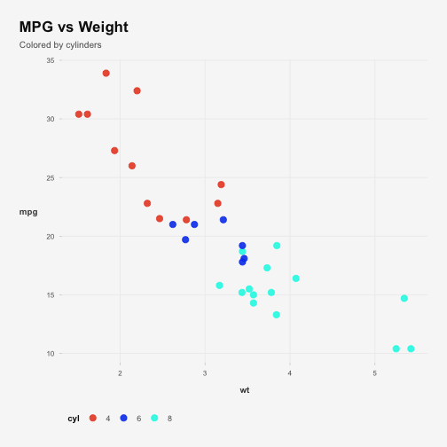

### Example 2: Scatter with trend line


``` r
ggplot(mt, aes(hp, mpg, color = am)) +
    geom_point(size = 2.8) +
    geom_smooth(method = "lm", se = FALSE, linewidth = 0.9) +
    scale_color_chanwe_d() +
    theme_chanwe() +
    labs(title = "Horsepower vs MPG", subtitle = "Linear trend by transmission")
```

```
## `geom_smooth()` using formula = 'y ~ x'
```

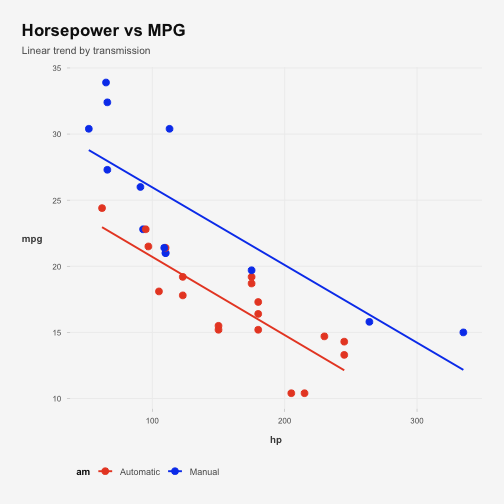

### Example 3: Boxplot


``` r
ggplot(mt, aes(cyl, mpg, fill = cyl)) +
    geom_boxplot(width = 0.65) +
    scale_fill_chanwe_d() +
    theme_chanwe() +
    labs(title = "MPG Distribution", subtitle = "By cylinder group")
```

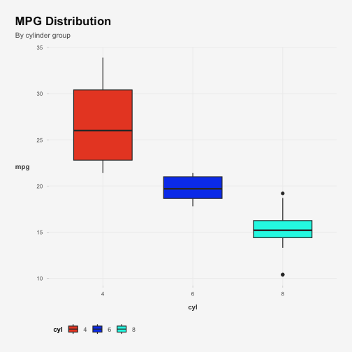

### Example 4: Violin + jitter


``` r
ggplot(mt, aes(cyl, qsec, fill = cyl)) +
    geom_violin(alpha = 0.65, color = NA) +
    geom_jitter(width = 0.1, size = 2, color = "#101010") +
    scale_fill_chanwe_d() +
    theme_chanwe() +
    labs(title = "Quarter Mile Time", subtitle = "Violin with observations")
```

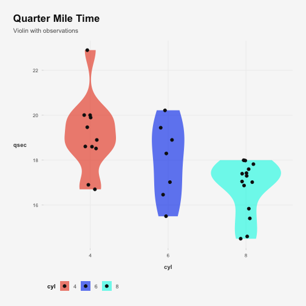

### Example 5: Bar chart summary


``` r
ggplot(mt_summary, aes(cyl, mpg, fill = cyl)) +
    geom_col(width = 0.62) +
    scale_fill_chanwe_d() +
    theme_chanwe() +
    labs(title = "Average MPG", subtitle = "Grouped by cylinders")
```

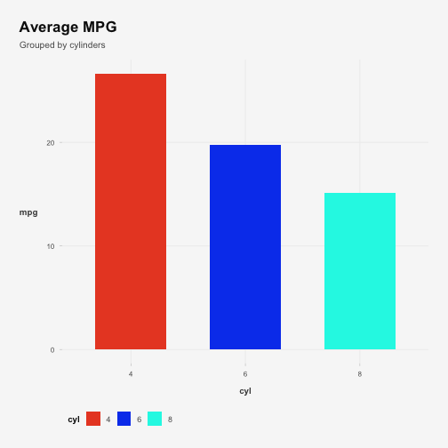

### Example 6: Line chart over economics time


``` r
ggplot(econ, aes(date, unemploy / 1000)) +
    geom_line(color = chanwe_palette("chart")[1], linewidth = 0.9) +
    theme_chanwe() +
    labs(
        title = "US Unemployment",
        subtitle = "Economics dataset",
        y = "Thousands"
    )
```

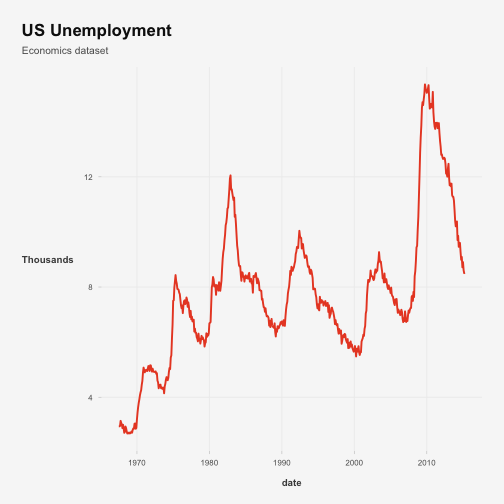

### Example 7: Density chart


``` r
ggplot(mt, aes(mpg, fill = cyl)) +
    geom_density(alpha = 0.35) +
    scale_fill_chanwe_d() +
    theme_chanwe() +
    labs(title = "Density of MPG", subtitle = "By cylinders")
```

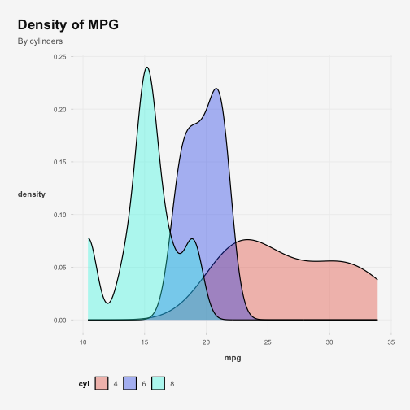

### Example 8: Faceted scatter


``` r
ggplot(mt, aes(disp, mpg, color = gear)) +
    geom_point(size = 2.5) +
    facet_wrap(~am) +
    scale_color_chanwe_d() +
    theme_chanwe() +
    labs(title = "Displacement vs MPG", subtitle = "Faceted by transmission")
```

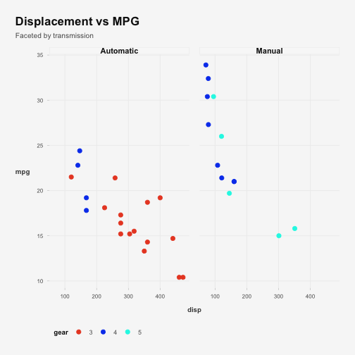

### Example 9: Continuous color scale


``` r
ggplot(mt, aes(wt, mpg, color = hp)) +
    geom_point(size = 3) +
    scale_color_chanwe_c() +
    theme_chanwe() +
    labs(title = "Continuous ChanWe Gradient", subtitle = "HP encoded as color")
```

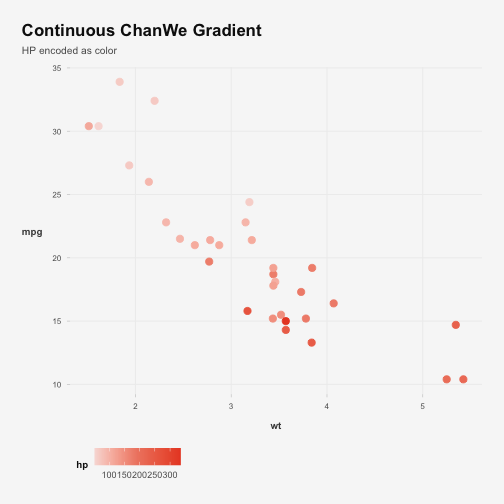

### Example 10: Area chart


``` r
series <- econ |>
    select(date, psavert, uempmed) |>
    pivot_longer(-date, names_to = "metric", values_to = "value")

ggplot(series, aes(date, value, fill = metric)) +
    geom_area(position = "stack", alpha = 0.8) +
    scale_fill_chanwe_d() +
    theme_chanwe() +
    labs(title = "Stacked Area", subtitle = "Economic indicators")
```

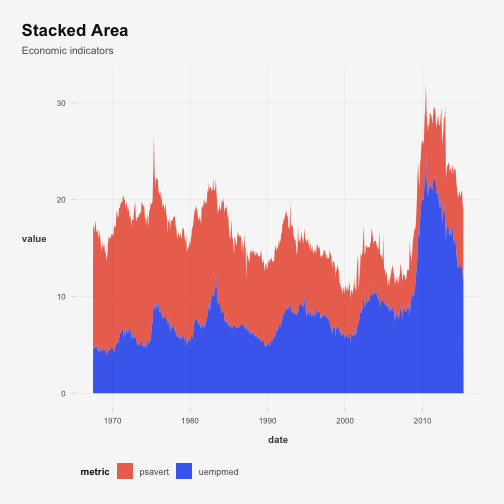

## highcharter Examples (11-20)

### Example 11: Scatter


``` r
hchart(mt, "scatter", hcaes(wt, mpg, group = cyl)) |>
    hc_title(text = "Scatter: MPG vs Weight") |>
    hc_add_theme(hc_theme_chanwe())
```

```
## Error in `loadNamespace()`:
## ! there is no package called 'webshot'
```

### Example 12: Line


``` r
hchart(econ |> select(date, unemploy), "line", hcaes(x = date, y = unemploy)) |>
    hc_title(text = "Line: Unemployment over time") |>
    hc_add_theme(hc_theme_chanwe())
```

```
## Error in `loadNamespace()`:
## ! there is no package called 'webshot'
```

### Example 13: Column


``` r
col_df <- mt |>
    count(cyl, name = "n")

hchart(col_df, "column", hcaes(x = cyl, y = n, group = cyl)) |>
    hc_title(text = "Column: Count by cylinders") |>
    hc_add_theme(hc_theme_chanwe())
```

```
## Error in `loadNamespace()`:
## ! there is no package called 'webshot'
```

### Example 14: Bar


``` r
bar_df <- mt |>
    group_by(cyl) |>
    summarise(avg_hp = mean(hp), .groups = "drop")

hchart(bar_df, "bar", hcaes(x = cyl, y = avg_hp, group = cyl)) |>
    hc_title(text = "Bar: Average horsepower") |>
    hc_add_theme(hc_theme_chanwe())
```

```
## Error in `loadNamespace()`:
## ! there is no package called 'webshot'
```

### Example 15: Area


``` r
area_df <- econ |> select(date, psavert)

hchart(area_df, "area", hcaes(x = date, y = psavert)) |>
    hc_title(text = "Area: Personal savings rate") |>
    hc_add_theme(hc_theme_chanwe())
```

```
## Error in `loadNamespace()`:
## ! there is no package called 'webshot'
```

### Example 16: Spline


``` r
spline_df <- mt |>
    arrange(disp) |>
    mutate(idx = row_number())

hchart(spline_df, "spline", hcaes(x = idx, y = mpg, group = cyl)) |>
    hc_title(text = "Spline: Ordered MPG profile") |>
    hc_add_theme(hc_theme_chanwe())
```

```
## Error in `loadNamespace()`:
## ! there is no package called 'webshot'
```

### Example 17: Bubble


``` r
hchart(mt, "bubble", hcaes(wt, mpg, size = hp, group = cyl)) |>
    hc_title(text = "Bubble: HP as size") |>
    hc_add_theme(hc_theme_chanwe())
```

```
## Error in `loadNamespace()`:
## ! there is no package called 'webshot'
```

### Example 18: Heatmap


``` r
num_mat <- mt |>
    select(where(is.numeric)) |>
    cor() |>
    round(2)

hchart(num_mat) |>
    hc_title(text = "Heatmap: Correlation matrix") |>
    hc_add_theme(hc_theme_chanwe())
```

```
## Error in `loadNamespace()`:
## ! there is no package called 'webshot'
```

### Example 19: Boxplot


``` r
hchart(mt, "boxplot", hcaes(x = cyl, y = mpg, group = cyl)) |>
    hc_title(text = "Boxplot: MPG by cylinders") |>
    hc_add_theme(hc_theme_chanwe())
```

```
## Error in `loadNamespace()`:
## ! there is no package called 'webshot'
```

### Example 20: Histogram


``` r
hchart(mt$mpg, name = "MPG") |>
    hc_title(text = "Histogram: MPG distribution") |>
    hc_add_theme(hc_theme_chanwe())
```

```
## Error in `loadNamespace()`:
## ! there is no package called 'webshot'
```

## reactable Examples (21-30)

### Example 21: Basic reactable


``` r
reactable(head(mt, 10), theme = reactable_theme_chanwe())
```

```
## Error in `loadNamespace()`:
## ! there is no package called 'webshot'
```

### Example 22: Pagination


``` r
reactable(mt, theme = reactable_theme_chanwe(), defaultPageSize = 8)
```

```
## Error in `loadNamespace()`:
## ! there is no package called 'webshot'
```

### Example 23: Searchable table


``` r
reactable(mt, theme = reactable_theme_chanwe(), searchable = TRUE)
```

```
## Error in `loadNamespace()`:
## ! there is no package called 'webshot'
```

### Example 24: Grouped rows


``` r
reactable(mt, theme = reactable_theme_chanwe(), groupBy = "cyl")
```

```
## Error in `loadNamespace()`:
## ! there is no package called 'webshot'
```

### Example 25: Sorted by MPG descending


``` r
reactable(
    mt,
    theme = reactable_theme_chanwe(),
    defaultSorted = list(mpg = "desc")
)
```

```
## Error in `loadNamespace()`:
## ! there is no package called 'webshot'
```

### Example 26: Highlight horsepower column


``` r
reactable(
    mt,
    theme = reactable_theme_chanwe(),
    columns = list(
        hp = colDef(
            style = function(value) {
                if (value >= 200) {
                    list(color = "#E94B2B", fontWeight = "700")
                } else {
                    list(color = "#5B5B5B")
                }
            }
        )
    )
)
```

```
## Error in `loadNamespace()`:
## ! there is no package called 'webshot'
```

### Example 27: Currency formatting


``` r
price_df <- mt |>
    transmute(model, cyl, mpg, price_est = mpg * 1250 + hp * 9)

reactable(
    price_df,
    theme = reactable_theme_chanwe(),
    columns = list(
        price_est = colDef(
            format = colFormat(currency = "USD", separators = TRUE)
        )
    )
)
```

```
## Error in `loadNamespace()`:
## ! there is no package called 'webshot'
```

### Example 28: Percent formatting


``` r
share_df <- mt |>
    count(cyl, name = "n") |>
    mutate(share = n / sum(n))

reactable(
    share_df,
    theme = reactable_theme_chanwe(),
    columns = list(
        share = colDef(
            format = colFormat(percent = TRUE, digits = 1)
        )
    )
)
```

```
## Error in `loadNamespace()`:
## ! there is no package called 'webshot'
```

### Example 29: Row details


``` r
reactable(
    mt,
    theme = reactable_theme_chanwe(),
    details = function(index) {
        row <- mt[index, ]
        sprintf(
            "%s | MPG: %.1f | HP: %.0f | Weight: %.2f",
            row$model,
            row$mpg,
            row$hp,
            row$wt
        )
    }
)
```

```
## Error in `loadNamespace()`:
## ! there is no package called 'webshot'
```

### Example 30: Single row selection


``` r
reactable(
    mt,
    theme = reactable_theme_chanwe(),
    selection = "single",
    onClick = "select"
)
```

```
## Error in `loadNamespace()`:
## ! there is no package called 'webshot'
```

## gt Examples (31-40)

### Example 31: Basic gt theme


``` r
gt(head(mt, 10)) |>
    tab_header(title = "GT Basic Table") |>
    gt_theme_chanwe()
```

```
## Warning in file(con, "wb"): cannot open file
## '/Users/alejandro.abraham@scalapay.com/Library/Caches/org.R-project.R/R/sass/3dd9fb199b6b8a4a10bd9a03d41d8e42':
## Operation not permitted
```

<!--html_preserve--><div id="bwcjnxrhmg" style="padding-left:0px;padding-right:0px;padding-top:10px;padding-bottom:10px;overflow-x:auto;overflow-y:auto;width:auto;height:auto;">
<style>@import url("https://fonts.googleapis.com/css2?family=DM+Sans:ital,wght@0,100;0,200;0,300;0,400;0,500;0,600;0,700;0,800;0,900;1,100;1,200;1,300;1,400;1,500;1,600;1,700;1,800;1,900&display=swap");
#bwcjnxrhmg table {
  font-family: 'DM Sans', system-ui, 'Segoe UI', Roboto, Helvetica, Arial, sans-serif, 'Apple Color Emoji', 'Segoe UI Emoji', 'Segoe UI Symbol', 'Noto Color Emoji';
  -webkit-font-smoothing: antialiased;
  -moz-osx-font-smoothing: grayscale;
}

#bwcjnxrhmg thead, #bwcjnxrhmg tbody, #bwcjnxrhmg tfoot, #bwcjnxrhmg tr, #bwcjnxrhmg td, #bwcjnxrhmg th {
  border-style: none;
}

#bwcjnxrhmg p {
  margin: 0;
  padding: 0;
}

#bwcjnxrhmg .gt_table {
  display: table;
  border-collapse: collapse;
  line-height: normal;
  margin-left: auto;
  margin-right: auto;
  color: #5B5B5B;
  font-size: 13.5px;
  font-weight: 400;
  font-style: normal;
  background-color: #F7F7F7;
  width: auto;
  border-top-style: solid;
  border-top-width: 1px;
  border-top-color: #EEEEEE;
  border-right-style: none;
  border-right-width: 2px;
  border-right-color: #D3D3D3;
  border-bottom-style: solid;
  border-bottom-width: 1px;
  border-bottom-color: #EEEEEE;
  border-left-style: none;
  border-left-width: 2px;
  border-left-color: #D3D3D3;
}

#bwcjnxrhmg .gt_caption {
  padding-top: 4px;
  padding-bottom: 4px;
}

#bwcjnxrhmg .gt_title {
  color: #5B5B5B;
  font-size: 24px;
  font-weight: 900;
  padding-top: 4px;
  padding-bottom: 4px;
  padding-left: 5px;
  padding-right: 5px;
  border-bottom-color: #F7F7F7;
  border-bottom-width: 0;
}

#bwcjnxrhmg .gt_subtitle {
  color: #5B5B5B;
  font-size: 14px;
  font-weight: 500;
  padding-top: 3px;
  padding-bottom: 5px;
  padding-left: 5px;
  padding-right: 5px;
  border-top-color: #F7F7F7;
  border-top-width: 0;
}

#bwcjnxrhmg .gt_heading {
  background-color: #FFFFFF;
  text-align: center;
  border-bottom-color: #F7F7F7;
  border-left-style: none;
  border-left-width: 1px;
  border-left-color: #D3D3D3;
  border-right-style: none;
  border-right-width: 1px;
  border-right-color: #D3D3D3;
}

#bwcjnxrhmg .gt_bottom_border {
  border-bottom-style: solid;
  border-bottom-width: 2px;
  border-bottom-color: #E94B2B;
}

#bwcjnxrhmg .gt_col_headings {
  border-top-style: solid;
  border-top-width: 2px;
  border-top-color: #EEEEEE;
  border-bottom-style: solid;
  border-bottom-width: 2px;
  border-bottom-color: #EEEEEE;
  border-left-style: none;
  border-left-width: 1px;
  border-left-color: #D3D3D3;
  border-right-style: none;
  border-right-width: 1px;
  border-right-color: #D3D3D3;
}

#bwcjnxrhmg .gt_col_heading {
  color: #5B5B5B;
  background-color: #F8F8F8;
  font-size: 12px;
  font-weight: 700;
  text-transform: inherit;
  border-left-style: none;
  border-left-width: 1px;
  border-left-color: #D3D3D3;
  border-right-style: none;
  border-right-width: 1px;
  border-right-color: #D3D3D3;
  vertical-align: bottom;
  padding-top: 5px;
  padding-bottom: 6px;
  padding-left: 5px;
  padding-right: 5px;
  overflow-x: hidden;
}

#bwcjnxrhmg .gt_column_spanner_outer {
  color: #5B5B5B;
  background-color: #F8F8F8;
  font-size: 12px;
  font-weight: 700;
  text-transform: inherit;
  padding-top: 0;
  padding-bottom: 0;
  padding-left: 4px;
  padding-right: 4px;
}

#bwcjnxrhmg .gt_column_spanner_outer:first-child {
  padding-left: 0;
}

#bwcjnxrhmg .gt_column_spanner_outer:last-child {
  padding-right: 0;
}

#bwcjnxrhmg .gt_column_spanner {
  border-bottom-style: solid;
  border-bottom-width: 2px;
  border-bottom-color: #EEEEEE;
  vertical-align: bottom;
  padding-top: 5px;
  padding-bottom: 5px;
  overflow-x: hidden;
  display: inline-block;
  width: 100%;
}

#bwcjnxrhmg .gt_spanner_row {
  border-bottom-style: hidden;
}

#bwcjnxrhmg .gt_group_heading {
  padding-top: 8px;
  padding-bottom: 8px;
  padding-left: 5px;
  padding-right: 5px;
  color: #5B5B5B;
  background-color: #F7F7F7;
  font-size: 100%;
  font-weight: initial;
  text-transform: inherit;
  border-top-style: solid;
  border-top-width: 2px;
  border-top-color: #D3D3D3;
  border-bottom-style: solid;
  border-bottom-width: 2px;
  border-bottom-color: #D3D3D3;
  border-left-style: none;
  border-left-width: 1px;
  border-left-color: #D3D3D3;
  border-right-style: none;
  border-right-width: 1px;
  border-right-color: #D3D3D3;
  vertical-align: middle;
  text-align: left;
}

#bwcjnxrhmg .gt_empty_group_heading {
  padding: 0.5px;
  color: #5B5B5B;
  background-color: #F7F7F7;
  font-size: 100%;
  font-weight: initial;
  border-top-style: solid;
  border-top-width: 2px;
  border-top-color: #D3D3D3;
  border-bottom-style: solid;
  border-bottom-width: 2px;
  border-bottom-color: #D3D3D3;
  vertical-align: middle;
}

#bwcjnxrhmg .gt_from_md > :first-child {
  margin-top: 0;
}

#bwcjnxrhmg .gt_from_md > :last-child {
  margin-bottom: 0;
}

#bwcjnxrhmg .gt_row {
  padding-top: 6px;
  padding-bottom: 6px;
  padding-left: 5px;
  padding-right: 5px;
  margin: 10px;
  border-top-style: solid;
  border-top-width: 1px;
  border-top-color: #EEEEEE;
  border-left-style: none;
  border-left-width: 1px;
  border-left-color: #EEEEEE;
  border-right-style: none;
  border-right-width: 1px;
  border-right-color: #EEEEEE;
  vertical-align: middle;
  overflow-x: hidden;
}

#bwcjnxrhmg .gt_stub {
  color: #5B5B5B;
  background-color: #F7F7F7;
  font-size: 100%;
  font-weight: initial;
  text-transform: inherit;
  border-right-style: solid;
  border-right-width: 2px;
  border-right-color: #D3D3D3;
  padding-left: 5px;
  padding-right: 5px;
}

#bwcjnxrhmg .gt_stub_row_group {
  color: #5B5B5B;
  background-color: #F7F7F7;
  font-size: 100%;
  font-weight: initial;
  text-transform: inherit;
  border-right-style: solid;
  border-right-width: 2px;
  border-right-color: #D3D3D3;
  padding-left: 5px;
  padding-right: 5px;
  vertical-align: top;
}

#bwcjnxrhmg .gt_row_group_first td {
  border-top-width: 2px;
}

#bwcjnxrhmg .gt_row_group_first th {
  border-top-width: 2px;
}

#bwcjnxrhmg .gt_summary_row {
  color: #5B5B5B;
  background-color: #F7F7F7;
  text-transform: inherit;
  padding-top: 8px;
  padding-bottom: 8px;
  padding-left: 5px;
  padding-right: 5px;
}

#bwcjnxrhmg .gt_first_summary_row {
  border-top-style: solid;
  border-top-color: #D3D3D3;
}

#bwcjnxrhmg .gt_first_summary_row.thick {
  border-top-width: 2px;
}

#bwcjnxrhmg .gt_last_summary_row {
  padding-top: 8px;
  padding-bottom: 8px;
  padding-left: 5px;
  padding-right: 5px;
  border-bottom-style: solid;
  border-bottom-width: 2px;
  border-bottom-color: #D3D3D3;
}

#bwcjnxrhmg .gt_grand_summary_row {
  color: #5B5B5B;
  background-color: #F7F7F7;
  text-transform: inherit;
  padding-top: 8px;
  padding-bottom: 8px;
  padding-left: 5px;
  padding-right: 5px;
}

#bwcjnxrhmg .gt_first_grand_summary_row {
  padding-top: 8px;
  padding-bottom: 8px;
  padding-left: 5px;
  padding-right: 5px;
  border-top-style: double;
  border-top-width: 6px;
  border-top-color: #D3D3D3;
}

#bwcjnxrhmg .gt_last_grand_summary_row_top {
  padding-top: 8px;
  padding-bottom: 8px;
  padding-left: 5px;
  padding-right: 5px;
  border-bottom-style: double;
  border-bottom-width: 6px;
  border-bottom-color: #D3D3D3;
}

#bwcjnxrhmg .gt_striped {
  background-color: rgba(128, 128, 128, 0.05);
}

#bwcjnxrhmg .gt_table_body {
  border-top-style: solid;
  border-top-width: 2px;
  border-top-color: #D3D3D3;
  border-bottom-style: solid;
  border-bottom-width: 2px;
  border-bottom-color: #D3D3D3;
}

#bwcjnxrhmg .gt_footnotes {
  color: #5B5B5B;
  background-color: #F7F7F7;
  border-bottom-style: none;
  border-bottom-width: 2px;
  border-bottom-color: #D3D3D3;
  border-left-style: none;
  border-left-width: 2px;
  border-left-color: #D3D3D3;
  border-right-style: none;
  border-right-width: 2px;
  border-right-color: #D3D3D3;
}

#bwcjnxrhmg .gt_footnote {
  margin: 0px;
  font-size: 11px;
  padding-top: 4px;
  padding-bottom: 4px;
  padding-left: 5px;
  padding-right: 5px;
}

#bwcjnxrhmg .gt_sourcenotes {
  color: #5B5B5B;
  background-color: #F7F7F7;
  border-bottom-style: none;
  border-bottom-width: 2px;
  border-bottom-color: #D3D3D3;
  border-left-style: none;
  border-left-width: 2px;
  border-left-color: #D3D3D3;
  border-right-style: none;
  border-right-width: 2px;
  border-right-color: #D3D3D3;
}

#bwcjnxrhmg .gt_sourcenote {
  font-size: 11px;
  padding-top: 4px;
  padding-bottom: 4px;
  padding-left: 5px;
  padding-right: 5px;
}

#bwcjnxrhmg .gt_left {
  text-align: left;
}

#bwcjnxrhmg .gt_center {
  text-align: center;
}

#bwcjnxrhmg .gt_right {
  text-align: right;
  font-variant-numeric: tabular-nums;
}

#bwcjnxrhmg .gt_font_normal {
  font-weight: normal;
}

#bwcjnxrhmg .gt_font_bold {
  font-weight: bold;
}

#bwcjnxrhmg .gt_font_italic {
  font-style: italic;
}

#bwcjnxrhmg .gt_super {
  font-size: 65%;
}

#bwcjnxrhmg .gt_footnote_marks {
  font-size: 75%;
  vertical-align: 0.4em;
  position: initial;
}

#bwcjnxrhmg .gt_asterisk {
  font-size: 100%;
  vertical-align: 0;
}

#bwcjnxrhmg .gt_indent_1 {
  text-indent: 5px;
}

#bwcjnxrhmg .gt_indent_2 {
  text-indent: 10px;
}

#bwcjnxrhmg .gt_indent_3 {
  text-indent: 15px;
}

#bwcjnxrhmg .gt_indent_4 {
  text-indent: 20px;
}

#bwcjnxrhmg .gt_indent_5 {
  text-indent: 25px;
}

#bwcjnxrhmg .katex-display {
  display: inline-flex !important;
  margin-bottom: 0.75em !important;
}

#bwcjnxrhmg div.Reactable > div.rt-table > div.rt-thead > div.rt-tr.rt-tr-group-header > div.rt-th-group:after {
  height: 0px !important;
}

.gt_table {
  border-radius: 4px;
  box-shadow: none;
}

.gt_heading {
  border-left: 4px solid #E94B2B;
  padding-left: 10px;
}

.gt_caption {
  color: #6D6D6D;
  font-size: 12px;
}

.gt_row {
  line-height: 1.6;
}
</style>
<table class="gt_table" data-quarto-disable-processing="false" data-quarto-bootstrap="false">
  <thead>
    <tr class="gt_heading">
      <td colspan="12" class="gt_heading gt_title gt_font_normal gt_bottom_border" style="color: #101010; font-size: 24px; text-align: left; font-weight: bolder;">GT Basic Table</td>
    </tr>
    
    <tr class="gt_col_headings">
      <th class="gt_col_heading gt_columns_bottom_border gt_left" rowspan="1" colspan="1" scope="col" id="model">model</th>
      <th class="gt_col_heading gt_columns_bottom_border gt_right" rowspan="1" colspan="1" scope="col" id="mpg">mpg</th>
      <th class="gt_col_heading gt_columns_bottom_border gt_center" rowspan="1" colspan="1" scope="col" id="cyl">cyl</th>
      <th class="gt_col_heading gt_columns_bottom_border gt_right" rowspan="1" colspan="1" scope="col" id="disp">disp</th>
      <th class="gt_col_heading gt_columns_bottom_border gt_right" rowspan="1" colspan="1" scope="col" id="hp">hp</th>
      <th class="gt_col_heading gt_columns_bottom_border gt_right" rowspan="1" colspan="1" scope="col" id="drat">drat</th>
      <th class="gt_col_heading gt_columns_bottom_border gt_right" rowspan="1" colspan="1" scope="col" id="wt">wt</th>
      <th class="gt_col_heading gt_columns_bottom_border gt_right" rowspan="1" colspan="1" scope="col" id="qsec">qsec</th>
      <th class="gt_col_heading gt_columns_bottom_border gt_right" rowspan="1" colspan="1" scope="col" id="vs">vs</th>
      <th class="gt_col_heading gt_columns_bottom_border gt_center" rowspan="1" colspan="1" scope="col" id="am">am</th>
      <th class="gt_col_heading gt_columns_bottom_border gt_center" rowspan="1" colspan="1" scope="col" id="gear">gear</th>
      <th class="gt_col_heading gt_columns_bottom_border gt_right" rowspan="1" colspan="1" scope="col" id="carb">carb</th>
    </tr>
  </thead>
  <tbody class="gt_table_body">
    <tr><td headers="model" class="gt_row gt_left">Mazda RX4</td>
<td headers="mpg" class="gt_row gt_right">21.0</td>
<td headers="cyl" class="gt_row gt_center">6</td>
<td headers="disp" class="gt_row gt_right">160.0</td>
<td headers="hp" class="gt_row gt_right">110</td>
<td headers="drat" class="gt_row gt_right">3.90</td>
<td headers="wt" class="gt_row gt_right">2.620</td>
<td headers="qsec" class="gt_row gt_right">16.46</td>
<td headers="vs" class="gt_row gt_right">0</td>
<td headers="am" class="gt_row gt_center">Manual</td>
<td headers="gear" class="gt_row gt_center">4</td>
<td headers="carb" class="gt_row gt_right">4</td></tr>
    <tr><td headers="model" class="gt_row gt_left">Mazda RX4 Wag</td>
<td headers="mpg" class="gt_row gt_right">21.0</td>
<td headers="cyl" class="gt_row gt_center">6</td>
<td headers="disp" class="gt_row gt_right">160.0</td>
<td headers="hp" class="gt_row gt_right">110</td>
<td headers="drat" class="gt_row gt_right">3.90</td>
<td headers="wt" class="gt_row gt_right">2.875</td>
<td headers="qsec" class="gt_row gt_right">17.02</td>
<td headers="vs" class="gt_row gt_right">0</td>
<td headers="am" class="gt_row gt_center">Manual</td>
<td headers="gear" class="gt_row gt_center">4</td>
<td headers="carb" class="gt_row gt_right">4</td></tr>
    <tr><td headers="model" class="gt_row gt_left">Datsun 710</td>
<td headers="mpg" class="gt_row gt_right">22.8</td>
<td headers="cyl" class="gt_row gt_center">4</td>
<td headers="disp" class="gt_row gt_right">108.0</td>
<td headers="hp" class="gt_row gt_right">93</td>
<td headers="drat" class="gt_row gt_right">3.85</td>
<td headers="wt" class="gt_row gt_right">2.320</td>
<td headers="qsec" class="gt_row gt_right">18.61</td>
<td headers="vs" class="gt_row gt_right">1</td>
<td headers="am" class="gt_row gt_center">Manual</td>
<td headers="gear" class="gt_row gt_center">4</td>
<td headers="carb" class="gt_row gt_right">1</td></tr>
    <tr><td headers="model" class="gt_row gt_left">Hornet 4 Drive</td>
<td headers="mpg" class="gt_row gt_right">21.4</td>
<td headers="cyl" class="gt_row gt_center">6</td>
<td headers="disp" class="gt_row gt_right">258.0</td>
<td headers="hp" class="gt_row gt_right">110</td>
<td headers="drat" class="gt_row gt_right">3.08</td>
<td headers="wt" class="gt_row gt_right">3.215</td>
<td headers="qsec" class="gt_row gt_right">19.44</td>
<td headers="vs" class="gt_row gt_right">1</td>
<td headers="am" class="gt_row gt_center">Automatic</td>
<td headers="gear" class="gt_row gt_center">3</td>
<td headers="carb" class="gt_row gt_right">1</td></tr>
    <tr><td headers="model" class="gt_row gt_left">Hornet Sportabout</td>
<td headers="mpg" class="gt_row gt_right">18.7</td>
<td headers="cyl" class="gt_row gt_center">8</td>
<td headers="disp" class="gt_row gt_right">360.0</td>
<td headers="hp" class="gt_row gt_right">175</td>
<td headers="drat" class="gt_row gt_right">3.15</td>
<td headers="wt" class="gt_row gt_right">3.440</td>
<td headers="qsec" class="gt_row gt_right">17.02</td>
<td headers="vs" class="gt_row gt_right">0</td>
<td headers="am" class="gt_row gt_center">Automatic</td>
<td headers="gear" class="gt_row gt_center">3</td>
<td headers="carb" class="gt_row gt_right">2</td></tr>
    <tr><td headers="model" class="gt_row gt_left">Valiant</td>
<td headers="mpg" class="gt_row gt_right">18.1</td>
<td headers="cyl" class="gt_row gt_center">6</td>
<td headers="disp" class="gt_row gt_right">225.0</td>
<td headers="hp" class="gt_row gt_right">105</td>
<td headers="drat" class="gt_row gt_right">2.76</td>
<td headers="wt" class="gt_row gt_right">3.460</td>
<td headers="qsec" class="gt_row gt_right">20.22</td>
<td headers="vs" class="gt_row gt_right">1</td>
<td headers="am" class="gt_row gt_center">Automatic</td>
<td headers="gear" class="gt_row gt_center">3</td>
<td headers="carb" class="gt_row gt_right">1</td></tr>
    <tr><td headers="model" class="gt_row gt_left">Duster 360</td>
<td headers="mpg" class="gt_row gt_right">14.3</td>
<td headers="cyl" class="gt_row gt_center">8</td>
<td headers="disp" class="gt_row gt_right">360.0</td>
<td headers="hp" class="gt_row gt_right">245</td>
<td headers="drat" class="gt_row gt_right">3.21</td>
<td headers="wt" class="gt_row gt_right">3.570</td>
<td headers="qsec" class="gt_row gt_right">15.84</td>
<td headers="vs" class="gt_row gt_right">0</td>
<td headers="am" class="gt_row gt_center">Automatic</td>
<td headers="gear" class="gt_row gt_center">3</td>
<td headers="carb" class="gt_row gt_right">4</td></tr>
    <tr><td headers="model" class="gt_row gt_left">Merc 240D</td>
<td headers="mpg" class="gt_row gt_right">24.4</td>
<td headers="cyl" class="gt_row gt_center">4</td>
<td headers="disp" class="gt_row gt_right">146.7</td>
<td headers="hp" class="gt_row gt_right">62</td>
<td headers="drat" class="gt_row gt_right">3.69</td>
<td headers="wt" class="gt_row gt_right">3.190</td>
<td headers="qsec" class="gt_row gt_right">20.00</td>
<td headers="vs" class="gt_row gt_right">1</td>
<td headers="am" class="gt_row gt_center">Automatic</td>
<td headers="gear" class="gt_row gt_center">4</td>
<td headers="carb" class="gt_row gt_right">2</td></tr>
    <tr><td headers="model" class="gt_row gt_left">Merc 230</td>
<td headers="mpg" class="gt_row gt_right">22.8</td>
<td headers="cyl" class="gt_row gt_center">4</td>
<td headers="disp" class="gt_row gt_right">140.8</td>
<td headers="hp" class="gt_row gt_right">95</td>
<td headers="drat" class="gt_row gt_right">3.92</td>
<td headers="wt" class="gt_row gt_right">3.150</td>
<td headers="qsec" class="gt_row gt_right">22.90</td>
<td headers="vs" class="gt_row gt_right">1</td>
<td headers="am" class="gt_row gt_center">Automatic</td>
<td headers="gear" class="gt_row gt_center">4</td>
<td headers="carb" class="gt_row gt_right">2</td></tr>
    <tr><td headers="model" class="gt_row gt_left">Merc 280</td>
<td headers="mpg" class="gt_row gt_right">19.2</td>
<td headers="cyl" class="gt_row gt_center">6</td>
<td headers="disp" class="gt_row gt_right">167.6</td>
<td headers="hp" class="gt_row gt_right">123</td>
<td headers="drat" class="gt_row gt_right">3.92</td>
<td headers="wt" class="gt_row gt_right">3.440</td>
<td headers="qsec" class="gt_row gt_right">18.30</td>
<td headers="vs" class="gt_row gt_right">1</td>
<td headers="am" class="gt_row gt_center">Automatic</td>
<td headers="gear" class="gt_row gt_center">4</td>
<td headers="carb" class="gt_row gt_right">4</td></tr>
  </tbody>
  
</table>
</div><!--/html_preserve-->

### Example 32: Number formatting


``` r
gt(head(mt, 10)) |>
    fmt_number(columns = c(mpg, disp, hp, wt), decimals = 2) |>
    tab_header(title = "Formatted numeric columns") |>
    gt_theme_chanwe()
```

```
## Warning in file(con, "wb"): cannot open file
## '/Users/alejandro.abraham@scalapay.com/Library/Caches/org.R-project.R/R/sass/af00d5b9c26dac14ee92dc51995c08d2':
## Operation not permitted
```

<!--html_preserve--><div id="vjsmvgpupp" style="padding-left:0px;padding-right:0px;padding-top:10px;padding-bottom:10px;overflow-x:auto;overflow-y:auto;width:auto;height:auto;">
<style>@import url("https://fonts.googleapis.com/css2?family=DM+Sans:ital,wght@0,100;0,200;0,300;0,400;0,500;0,600;0,700;0,800;0,900;1,100;1,200;1,300;1,400;1,500;1,600;1,700;1,800;1,900&display=swap");
#vjsmvgpupp table {
  font-family: 'DM Sans', system-ui, 'Segoe UI', Roboto, Helvetica, Arial, sans-serif, 'Apple Color Emoji', 'Segoe UI Emoji', 'Segoe UI Symbol', 'Noto Color Emoji';
  -webkit-font-smoothing: antialiased;
  -moz-osx-font-smoothing: grayscale;
}

#vjsmvgpupp thead, #vjsmvgpupp tbody, #vjsmvgpupp tfoot, #vjsmvgpupp tr, #vjsmvgpupp td, #vjsmvgpupp th {
  border-style: none;
}

#vjsmvgpupp p {
  margin: 0;
  padding: 0;
}

#vjsmvgpupp .gt_table {
  display: table;
  border-collapse: collapse;
  line-height: normal;
  margin-left: auto;
  margin-right: auto;
  color: #5B5B5B;
  font-size: 13.5px;
  font-weight: 400;
  font-style: normal;
  background-color: #F7F7F7;
  width: auto;
  border-top-style: solid;
  border-top-width: 1px;
  border-top-color: #EEEEEE;
  border-right-style: none;
  border-right-width: 2px;
  border-right-color: #D3D3D3;
  border-bottom-style: solid;
  border-bottom-width: 1px;
  border-bottom-color: #EEEEEE;
  border-left-style: none;
  border-left-width: 2px;
  border-left-color: #D3D3D3;
}

#vjsmvgpupp .gt_caption {
  padding-top: 4px;
  padding-bottom: 4px;
}

#vjsmvgpupp .gt_title {
  color: #5B5B5B;
  font-size: 24px;
  font-weight: 900;
  padding-top: 4px;
  padding-bottom: 4px;
  padding-left: 5px;
  padding-right: 5px;
  border-bottom-color: #F7F7F7;
  border-bottom-width: 0;
}

#vjsmvgpupp .gt_subtitle {
  color: #5B5B5B;
  font-size: 14px;
  font-weight: 500;
  padding-top: 3px;
  padding-bottom: 5px;
  padding-left: 5px;
  padding-right: 5px;
  border-top-color: #F7F7F7;
  border-top-width: 0;
}

#vjsmvgpupp .gt_heading {
  background-color: #FFFFFF;
  text-align: center;
  border-bottom-color: #F7F7F7;
  border-left-style: none;
  border-left-width: 1px;
  border-left-color: #D3D3D3;
  border-right-style: none;
  border-right-width: 1px;
  border-right-color: #D3D3D3;
}

#vjsmvgpupp .gt_bottom_border {
  border-bottom-style: solid;
  border-bottom-width: 2px;
  border-bottom-color: #E94B2B;
}

#vjsmvgpupp .gt_col_headings {
  border-top-style: solid;
  border-top-width: 2px;
  border-top-color: #EEEEEE;
  border-bottom-style: solid;
  border-bottom-width: 2px;
  border-bottom-color: #EEEEEE;
  border-left-style: none;
  border-left-width: 1px;
  border-left-color: #D3D3D3;
  border-right-style: none;
  border-right-width: 1px;
  border-right-color: #D3D3D3;
}

#vjsmvgpupp .gt_col_heading {
  color: #5B5B5B;
  background-color: #F8F8F8;
  font-size: 12px;
  font-weight: 700;
  text-transform: inherit;
  border-left-style: none;
  border-left-width: 1px;
  border-left-color: #D3D3D3;
  border-right-style: none;
  border-right-width: 1px;
  border-right-color: #D3D3D3;
  vertical-align: bottom;
  padding-top: 5px;
  padding-bottom: 6px;
  padding-left: 5px;
  padding-right: 5px;
  overflow-x: hidden;
}

#vjsmvgpupp .gt_column_spanner_outer {
  color: #5B5B5B;
  background-color: #F8F8F8;
  font-size: 12px;
  font-weight: 700;
  text-transform: inherit;
  padding-top: 0;
  padding-bottom: 0;
  padding-left: 4px;
  padding-right: 4px;
}

#vjsmvgpupp .gt_column_spanner_outer:first-child {
  padding-left: 0;
}

#vjsmvgpupp .gt_column_spanner_outer:last-child {
  padding-right: 0;
}

#vjsmvgpupp .gt_column_spanner {
  border-bottom-style: solid;
  border-bottom-width: 2px;
  border-bottom-color: #EEEEEE;
  vertical-align: bottom;
  padding-top: 5px;
  padding-bottom: 5px;
  overflow-x: hidden;
  display: inline-block;
  width: 100%;
}

#vjsmvgpupp .gt_spanner_row {
  border-bottom-style: hidden;
}

#vjsmvgpupp .gt_group_heading {
  padding-top: 8px;
  padding-bottom: 8px;
  padding-left: 5px;
  padding-right: 5px;
  color: #5B5B5B;
  background-color: #F7F7F7;
  font-size: 100%;
  font-weight: initial;
  text-transform: inherit;
  border-top-style: solid;
  border-top-width: 2px;
  border-top-color: #D3D3D3;
  border-bottom-style: solid;
  border-bottom-width: 2px;
  border-bottom-color: #D3D3D3;
  border-left-style: none;
  border-left-width: 1px;
  border-left-color: #D3D3D3;
  border-right-style: none;
  border-right-width: 1px;
  border-right-color: #D3D3D3;
  vertical-align: middle;
  text-align: left;
}

#vjsmvgpupp .gt_empty_group_heading {
  padding: 0.5px;
  color: #5B5B5B;
  background-color: #F7F7F7;
  font-size: 100%;
  font-weight: initial;
  border-top-style: solid;
  border-top-width: 2px;
  border-top-color: #D3D3D3;
  border-bottom-style: solid;
  border-bottom-width: 2px;
  border-bottom-color: #D3D3D3;
  vertical-align: middle;
}

#vjsmvgpupp .gt_from_md > :first-child {
  margin-top: 0;
}

#vjsmvgpupp .gt_from_md > :last-child {
  margin-bottom: 0;
}

#vjsmvgpupp .gt_row {
  padding-top: 6px;
  padding-bottom: 6px;
  padding-left: 5px;
  padding-right: 5px;
  margin: 10px;
  border-top-style: solid;
  border-top-width: 1px;
  border-top-color: #EEEEEE;
  border-left-style: none;
  border-left-width: 1px;
  border-left-color: #EEEEEE;
  border-right-style: none;
  border-right-width: 1px;
  border-right-color: #EEEEEE;
  vertical-align: middle;
  overflow-x: hidden;
}

#vjsmvgpupp .gt_stub {
  color: #5B5B5B;
  background-color: #F7F7F7;
  font-size: 100%;
  font-weight: initial;
  text-transform: inherit;
  border-right-style: solid;
  border-right-width: 2px;
  border-right-color: #D3D3D3;
  padding-left: 5px;
  padding-right: 5px;
}

#vjsmvgpupp .gt_stub_row_group {
  color: #5B5B5B;
  background-color: #F7F7F7;
  font-size: 100%;
  font-weight: initial;
  text-transform: inherit;
  border-right-style: solid;
  border-right-width: 2px;
  border-right-color: #D3D3D3;
  padding-left: 5px;
  padding-right: 5px;
  vertical-align: top;
}

#vjsmvgpupp .gt_row_group_first td {
  border-top-width: 2px;
}

#vjsmvgpupp .gt_row_group_first th {
  border-top-width: 2px;
}

#vjsmvgpupp .gt_summary_row {
  color: #5B5B5B;
  background-color: #F7F7F7;
  text-transform: inherit;
  padding-top: 8px;
  padding-bottom: 8px;
  padding-left: 5px;
  padding-right: 5px;
}

#vjsmvgpupp .gt_first_summary_row {
  border-top-style: solid;
  border-top-color: #D3D3D3;
}

#vjsmvgpupp .gt_first_summary_row.thick {
  border-top-width: 2px;
}

#vjsmvgpupp .gt_last_summary_row {
  padding-top: 8px;
  padding-bottom: 8px;
  padding-left: 5px;
  padding-right: 5px;
  border-bottom-style: solid;
  border-bottom-width: 2px;
  border-bottom-color: #D3D3D3;
}

#vjsmvgpupp .gt_grand_summary_row {
  color: #5B5B5B;
  background-color: #F7F7F7;
  text-transform: inherit;
  padding-top: 8px;
  padding-bottom: 8px;
  padding-left: 5px;
  padding-right: 5px;
}

#vjsmvgpupp .gt_first_grand_summary_row {
  padding-top: 8px;
  padding-bottom: 8px;
  padding-left: 5px;
  padding-right: 5px;
  border-top-style: double;
  border-top-width: 6px;
  border-top-color: #D3D3D3;
}

#vjsmvgpupp .gt_last_grand_summary_row_top {
  padding-top: 8px;
  padding-bottom: 8px;
  padding-left: 5px;
  padding-right: 5px;
  border-bottom-style: double;
  border-bottom-width: 6px;
  border-bottom-color: #D3D3D3;
}

#vjsmvgpupp .gt_striped {
  background-color: rgba(128, 128, 128, 0.05);
}

#vjsmvgpupp .gt_table_body {
  border-top-style: solid;
  border-top-width: 2px;
  border-top-color: #D3D3D3;
  border-bottom-style: solid;
  border-bottom-width: 2px;
  border-bottom-color: #D3D3D3;
}

#vjsmvgpupp .gt_footnotes {
  color: #5B5B5B;
  background-color: #F7F7F7;
  border-bottom-style: none;
  border-bottom-width: 2px;
  border-bottom-color: #D3D3D3;
  border-left-style: none;
  border-left-width: 2px;
  border-left-color: #D3D3D3;
  border-right-style: none;
  border-right-width: 2px;
  border-right-color: #D3D3D3;
}

#vjsmvgpupp .gt_footnote {
  margin: 0px;
  font-size: 11px;
  padding-top: 4px;
  padding-bottom: 4px;
  padding-left: 5px;
  padding-right: 5px;
}

#vjsmvgpupp .gt_sourcenotes {
  color: #5B5B5B;
  background-color: #F7F7F7;
  border-bottom-style: none;
  border-bottom-width: 2px;
  border-bottom-color: #D3D3D3;
  border-left-style: none;
  border-left-width: 2px;
  border-left-color: #D3D3D3;
  border-right-style: none;
  border-right-width: 2px;
  border-right-color: #D3D3D3;
}

#vjsmvgpupp .gt_sourcenote {
  font-size: 11px;
  padding-top: 4px;
  padding-bottom: 4px;
  padding-left: 5px;
  padding-right: 5px;
}

#vjsmvgpupp .gt_left {
  text-align: left;
}

#vjsmvgpupp .gt_center {
  text-align: center;
}

#vjsmvgpupp .gt_right {
  text-align: right;
  font-variant-numeric: tabular-nums;
}

#vjsmvgpupp .gt_font_normal {
  font-weight: normal;
}

#vjsmvgpupp .gt_font_bold {
  font-weight: bold;
}

#vjsmvgpupp .gt_font_italic {
  font-style: italic;
}

#vjsmvgpupp .gt_super {
  font-size: 65%;
}

#vjsmvgpupp .gt_footnote_marks {
  font-size: 75%;
  vertical-align: 0.4em;
  position: initial;
}

#vjsmvgpupp .gt_asterisk {
  font-size: 100%;
  vertical-align: 0;
}

#vjsmvgpupp .gt_indent_1 {
  text-indent: 5px;
}

#vjsmvgpupp .gt_indent_2 {
  text-indent: 10px;
}

#vjsmvgpupp .gt_indent_3 {
  text-indent: 15px;
}

#vjsmvgpupp .gt_indent_4 {
  text-indent: 20px;
}

#vjsmvgpupp .gt_indent_5 {
  text-indent: 25px;
}

#vjsmvgpupp .katex-display {
  display: inline-flex !important;
  margin-bottom: 0.75em !important;
}

#vjsmvgpupp div.Reactable > div.rt-table > div.rt-thead > div.rt-tr.rt-tr-group-header > div.rt-th-group:after {
  height: 0px !important;
}

.gt_table {
  border-radius: 4px;
  box-shadow: none;
}

.gt_heading {
  border-left: 4px solid #E94B2B;
  padding-left: 10px;
}

.gt_caption {
  color: #6D6D6D;
  font-size: 12px;
}

.gt_row {
  line-height: 1.6;
}
</style>
<table class="gt_table" data-quarto-disable-processing="false" data-quarto-bootstrap="false">
  <thead>
    <tr class="gt_heading">
      <td colspan="12" class="gt_heading gt_title gt_font_normal gt_bottom_border" style="color: #101010; font-size: 24px; text-align: left; font-weight: bolder;">Formatted numeric columns</td>
    </tr>
    
    <tr class="gt_col_headings">
      <th class="gt_col_heading gt_columns_bottom_border gt_left" rowspan="1" colspan="1" scope="col" id="model">model</th>
      <th class="gt_col_heading gt_columns_bottom_border gt_right" rowspan="1" colspan="1" scope="col" id="mpg">mpg</th>
      <th class="gt_col_heading gt_columns_bottom_border gt_center" rowspan="1" colspan="1" scope="col" id="cyl">cyl</th>
      <th class="gt_col_heading gt_columns_bottom_border gt_right" rowspan="1" colspan="1" scope="col" id="disp">disp</th>
      <th class="gt_col_heading gt_columns_bottom_border gt_right" rowspan="1" colspan="1" scope="col" id="hp">hp</th>
      <th class="gt_col_heading gt_columns_bottom_border gt_right" rowspan="1" colspan="1" scope="col" id="drat">drat</th>
      <th class="gt_col_heading gt_columns_bottom_border gt_right" rowspan="1" colspan="1" scope="col" id="wt">wt</th>
      <th class="gt_col_heading gt_columns_bottom_border gt_right" rowspan="1" colspan="1" scope="col" id="qsec">qsec</th>
      <th class="gt_col_heading gt_columns_bottom_border gt_right" rowspan="1" colspan="1" scope="col" id="vs">vs</th>
      <th class="gt_col_heading gt_columns_bottom_border gt_center" rowspan="1" colspan="1" scope="col" id="am">am</th>
      <th class="gt_col_heading gt_columns_bottom_border gt_center" rowspan="1" colspan="1" scope="col" id="gear">gear</th>
      <th class="gt_col_heading gt_columns_bottom_border gt_right" rowspan="1" colspan="1" scope="col" id="carb">carb</th>
    </tr>
  </thead>
  <tbody class="gt_table_body">
    <tr><td headers="model" class="gt_row gt_left">Mazda RX4</td>
<td headers="mpg" class="gt_row gt_right">21.00</td>
<td headers="cyl" class="gt_row gt_center">6</td>
<td headers="disp" class="gt_row gt_right">160.00</td>
<td headers="hp" class="gt_row gt_right">110.00</td>
<td headers="drat" class="gt_row gt_right">3.90</td>
<td headers="wt" class="gt_row gt_right">2.62</td>
<td headers="qsec" class="gt_row gt_right">16.46</td>
<td headers="vs" class="gt_row gt_right">0</td>
<td headers="am" class="gt_row gt_center">Manual</td>
<td headers="gear" class="gt_row gt_center">4</td>
<td headers="carb" class="gt_row gt_right">4</td></tr>
    <tr><td headers="model" class="gt_row gt_left">Mazda RX4 Wag</td>
<td headers="mpg" class="gt_row gt_right">21.00</td>
<td headers="cyl" class="gt_row gt_center">6</td>
<td headers="disp" class="gt_row gt_right">160.00</td>
<td headers="hp" class="gt_row gt_right">110.00</td>
<td headers="drat" class="gt_row gt_right">3.90</td>
<td headers="wt" class="gt_row gt_right">2.88</td>
<td headers="qsec" class="gt_row gt_right">17.02</td>
<td headers="vs" class="gt_row gt_right">0</td>
<td headers="am" class="gt_row gt_center">Manual</td>
<td headers="gear" class="gt_row gt_center">4</td>
<td headers="carb" class="gt_row gt_right">4</td></tr>
    <tr><td headers="model" class="gt_row gt_left">Datsun 710</td>
<td headers="mpg" class="gt_row gt_right">22.80</td>
<td headers="cyl" class="gt_row gt_center">4</td>
<td headers="disp" class="gt_row gt_right">108.00</td>
<td headers="hp" class="gt_row gt_right">93.00</td>
<td headers="drat" class="gt_row gt_right">3.85</td>
<td headers="wt" class="gt_row gt_right">2.32</td>
<td headers="qsec" class="gt_row gt_right">18.61</td>
<td headers="vs" class="gt_row gt_right">1</td>
<td headers="am" class="gt_row gt_center">Manual</td>
<td headers="gear" class="gt_row gt_center">4</td>
<td headers="carb" class="gt_row gt_right">1</td></tr>
    <tr><td headers="model" class="gt_row gt_left">Hornet 4 Drive</td>
<td headers="mpg" class="gt_row gt_right">21.40</td>
<td headers="cyl" class="gt_row gt_center">6</td>
<td headers="disp" class="gt_row gt_right">258.00</td>
<td headers="hp" class="gt_row gt_right">110.00</td>
<td headers="drat" class="gt_row gt_right">3.08</td>
<td headers="wt" class="gt_row gt_right">3.21</td>
<td headers="qsec" class="gt_row gt_right">19.44</td>
<td headers="vs" class="gt_row gt_right">1</td>
<td headers="am" class="gt_row gt_center">Automatic</td>
<td headers="gear" class="gt_row gt_center">3</td>
<td headers="carb" class="gt_row gt_right">1</td></tr>
    <tr><td headers="model" class="gt_row gt_left">Hornet Sportabout</td>
<td headers="mpg" class="gt_row gt_right">18.70</td>
<td headers="cyl" class="gt_row gt_center">8</td>
<td headers="disp" class="gt_row gt_right">360.00</td>
<td headers="hp" class="gt_row gt_right">175.00</td>
<td headers="drat" class="gt_row gt_right">3.15</td>
<td headers="wt" class="gt_row gt_right">3.44</td>
<td headers="qsec" class="gt_row gt_right">17.02</td>
<td headers="vs" class="gt_row gt_right">0</td>
<td headers="am" class="gt_row gt_center">Automatic</td>
<td headers="gear" class="gt_row gt_center">3</td>
<td headers="carb" class="gt_row gt_right">2</td></tr>
    <tr><td headers="model" class="gt_row gt_left">Valiant</td>
<td headers="mpg" class="gt_row gt_right">18.10</td>
<td headers="cyl" class="gt_row gt_center">6</td>
<td headers="disp" class="gt_row gt_right">225.00</td>
<td headers="hp" class="gt_row gt_right">105.00</td>
<td headers="drat" class="gt_row gt_right">2.76</td>
<td headers="wt" class="gt_row gt_right">3.46</td>
<td headers="qsec" class="gt_row gt_right">20.22</td>
<td headers="vs" class="gt_row gt_right">1</td>
<td headers="am" class="gt_row gt_center">Automatic</td>
<td headers="gear" class="gt_row gt_center">3</td>
<td headers="carb" class="gt_row gt_right">1</td></tr>
    <tr><td headers="model" class="gt_row gt_left">Duster 360</td>
<td headers="mpg" class="gt_row gt_right">14.30</td>
<td headers="cyl" class="gt_row gt_center">8</td>
<td headers="disp" class="gt_row gt_right">360.00</td>
<td headers="hp" class="gt_row gt_right">245.00</td>
<td headers="drat" class="gt_row gt_right">3.21</td>
<td headers="wt" class="gt_row gt_right">3.57</td>
<td headers="qsec" class="gt_row gt_right">15.84</td>
<td headers="vs" class="gt_row gt_right">0</td>
<td headers="am" class="gt_row gt_center">Automatic</td>
<td headers="gear" class="gt_row gt_center">3</td>
<td headers="carb" class="gt_row gt_right">4</td></tr>
    <tr><td headers="model" class="gt_row gt_left">Merc 240D</td>
<td headers="mpg" class="gt_row gt_right">24.40</td>
<td headers="cyl" class="gt_row gt_center">4</td>
<td headers="disp" class="gt_row gt_right">146.70</td>
<td headers="hp" class="gt_row gt_right">62.00</td>
<td headers="drat" class="gt_row gt_right">3.69</td>
<td headers="wt" class="gt_row gt_right">3.19</td>
<td headers="qsec" class="gt_row gt_right">20.00</td>
<td headers="vs" class="gt_row gt_right">1</td>
<td headers="am" class="gt_row gt_center">Automatic</td>
<td headers="gear" class="gt_row gt_center">4</td>
<td headers="carb" class="gt_row gt_right">2</td></tr>
    <tr><td headers="model" class="gt_row gt_left">Merc 230</td>
<td headers="mpg" class="gt_row gt_right">22.80</td>
<td headers="cyl" class="gt_row gt_center">4</td>
<td headers="disp" class="gt_row gt_right">140.80</td>
<td headers="hp" class="gt_row gt_right">95.00</td>
<td headers="drat" class="gt_row gt_right">3.92</td>
<td headers="wt" class="gt_row gt_right">3.15</td>
<td headers="qsec" class="gt_row gt_right">22.90</td>
<td headers="vs" class="gt_row gt_right">1</td>
<td headers="am" class="gt_row gt_center">Automatic</td>
<td headers="gear" class="gt_row gt_center">4</td>
<td headers="carb" class="gt_row gt_right">2</td></tr>
    <tr><td headers="model" class="gt_row gt_left">Merc 280</td>
<td headers="mpg" class="gt_row gt_right">19.20</td>
<td headers="cyl" class="gt_row gt_center">6</td>
<td headers="disp" class="gt_row gt_right">167.60</td>
<td headers="hp" class="gt_row gt_right">123.00</td>
<td headers="drat" class="gt_row gt_right">3.92</td>
<td headers="wt" class="gt_row gt_right">3.44</td>
<td headers="qsec" class="gt_row gt_right">18.30</td>
<td headers="vs" class="gt_row gt_right">1</td>
<td headers="am" class="gt_row gt_center">Automatic</td>
<td headers="gear" class="gt_row gt_center">4</td>
<td headers="carb" class="gt_row gt_right">4</td></tr>
  </tbody>
  
</table>
</div><!--/html_preserve-->

### Example 33: Percent formatting


``` r
gt(share_df) |>
    fmt_percent(columns = share, decimals = 1) |>
    tab_header(title = "Cylinders share") |>
    gt_theme_chanwe()
```

```
## Warning in file(con, "wb"): cannot open file
## '/Users/alejandro.abraham@scalapay.com/Library/Caches/org.R-project.R/R/sass/9814a0a8d8566de1b1aba10be5d69f8d':
## Operation not permitted
```

<!--html_preserve--><div id="oyqjshwofi" style="padding-left:0px;padding-right:0px;padding-top:10px;padding-bottom:10px;overflow-x:auto;overflow-y:auto;width:auto;height:auto;">
<style>@import url("https://fonts.googleapis.com/css2?family=DM+Sans:ital,wght@0,100;0,200;0,300;0,400;0,500;0,600;0,700;0,800;0,900;1,100;1,200;1,300;1,400;1,500;1,600;1,700;1,800;1,900&display=swap");
#oyqjshwofi table {
  font-family: 'DM Sans', system-ui, 'Segoe UI', Roboto, Helvetica, Arial, sans-serif, 'Apple Color Emoji', 'Segoe UI Emoji', 'Segoe UI Symbol', 'Noto Color Emoji';
  -webkit-font-smoothing: antialiased;
  -moz-osx-font-smoothing: grayscale;
}

#oyqjshwofi thead, #oyqjshwofi tbody, #oyqjshwofi tfoot, #oyqjshwofi tr, #oyqjshwofi td, #oyqjshwofi th {
  border-style: none;
}

#oyqjshwofi p {
  margin: 0;
  padding: 0;
}

#oyqjshwofi .gt_table {
  display: table;
  border-collapse: collapse;
  line-height: normal;
  margin-left: auto;
  margin-right: auto;
  color: #5B5B5B;
  font-size: 13.5px;
  font-weight: 400;
  font-style: normal;
  background-color: #F7F7F7;
  width: auto;
  border-top-style: solid;
  border-top-width: 1px;
  border-top-color: #EEEEEE;
  border-right-style: none;
  border-right-width: 2px;
  border-right-color: #D3D3D3;
  border-bottom-style: solid;
  border-bottom-width: 1px;
  border-bottom-color: #EEEEEE;
  border-left-style: none;
  border-left-width: 2px;
  border-left-color: #D3D3D3;
}

#oyqjshwofi .gt_caption {
  padding-top: 4px;
  padding-bottom: 4px;
}

#oyqjshwofi .gt_title {
  color: #5B5B5B;
  font-size: 24px;
  font-weight: 900;
  padding-top: 4px;
  padding-bottom: 4px;
  padding-left: 5px;
  padding-right: 5px;
  border-bottom-color: #F7F7F7;
  border-bottom-width: 0;
}

#oyqjshwofi .gt_subtitle {
  color: #5B5B5B;
  font-size: 14px;
  font-weight: 500;
  padding-top: 3px;
  padding-bottom: 5px;
  padding-left: 5px;
  padding-right: 5px;
  border-top-color: #F7F7F7;
  border-top-width: 0;
}

#oyqjshwofi .gt_heading {
  background-color: #FFFFFF;
  text-align: center;
  border-bottom-color: #F7F7F7;
  border-left-style: none;
  border-left-width: 1px;
  border-left-color: #D3D3D3;
  border-right-style: none;
  border-right-width: 1px;
  border-right-color: #D3D3D3;
}

#oyqjshwofi .gt_bottom_border {
  border-bottom-style: solid;
  border-bottom-width: 2px;
  border-bottom-color: #E94B2B;
}

#oyqjshwofi .gt_col_headings {
  border-top-style: solid;
  border-top-width: 2px;
  border-top-color: #EEEEEE;
  border-bottom-style: solid;
  border-bottom-width: 2px;
  border-bottom-color: #EEEEEE;
  border-left-style: none;
  border-left-width: 1px;
  border-left-color: #D3D3D3;
  border-right-style: none;
  border-right-width: 1px;
  border-right-color: #D3D3D3;
}

#oyqjshwofi .gt_col_heading {
  color: #5B5B5B;
  background-color: #F8F8F8;
  font-size: 12px;
  font-weight: 700;
  text-transform: inherit;
  border-left-style: none;
  border-left-width: 1px;
  border-left-color: #D3D3D3;
  border-right-style: none;
  border-right-width: 1px;
  border-right-color: #D3D3D3;
  vertical-align: bottom;
  padding-top: 5px;
  padding-bottom: 6px;
  padding-left: 5px;
  padding-right: 5px;
  overflow-x: hidden;
}

#oyqjshwofi .gt_column_spanner_outer {
  color: #5B5B5B;
  background-color: #F8F8F8;
  font-size: 12px;
  font-weight: 700;
  text-transform: inherit;
  padding-top: 0;
  padding-bottom: 0;
  padding-left: 4px;
  padding-right: 4px;
}

#oyqjshwofi .gt_column_spanner_outer:first-child {
  padding-left: 0;
}

#oyqjshwofi .gt_column_spanner_outer:last-child {
  padding-right: 0;
}

#oyqjshwofi .gt_column_spanner {
  border-bottom-style: solid;
  border-bottom-width: 2px;
  border-bottom-color: #EEEEEE;
  vertical-align: bottom;
  padding-top: 5px;
  padding-bottom: 5px;
  overflow-x: hidden;
  display: inline-block;
  width: 100%;
}

#oyqjshwofi .gt_spanner_row {
  border-bottom-style: hidden;
}

#oyqjshwofi .gt_group_heading {
  padding-top: 8px;
  padding-bottom: 8px;
  padding-left: 5px;
  padding-right: 5px;
  color: #5B5B5B;
  background-color: #F7F7F7;
  font-size: 100%;
  font-weight: initial;
  text-transform: inherit;
  border-top-style: solid;
  border-top-width: 2px;
  border-top-color: #D3D3D3;
  border-bottom-style: solid;
  border-bottom-width: 2px;
  border-bottom-color: #D3D3D3;
  border-left-style: none;
  border-left-width: 1px;
  border-left-color: #D3D3D3;
  border-right-style: none;
  border-right-width: 1px;
  border-right-color: #D3D3D3;
  vertical-align: middle;
  text-align: left;
}

#oyqjshwofi .gt_empty_group_heading {
  padding: 0.5px;
  color: #5B5B5B;
  background-color: #F7F7F7;
  font-size: 100%;
  font-weight: initial;
  border-top-style: solid;
  border-top-width: 2px;
  border-top-color: #D3D3D3;
  border-bottom-style: solid;
  border-bottom-width: 2px;
  border-bottom-color: #D3D3D3;
  vertical-align: middle;
}

#oyqjshwofi .gt_from_md > :first-child {
  margin-top: 0;
}

#oyqjshwofi .gt_from_md > :last-child {
  margin-bottom: 0;
}

#oyqjshwofi .gt_row {
  padding-top: 6px;
  padding-bottom: 6px;
  padding-left: 5px;
  padding-right: 5px;
  margin: 10px;
  border-top-style: solid;
  border-top-width: 1px;
  border-top-color: #EEEEEE;
  border-left-style: none;
  border-left-width: 1px;
  border-left-color: #EEEEEE;
  border-right-style: none;
  border-right-width: 1px;
  border-right-color: #EEEEEE;
  vertical-align: middle;
  overflow-x: hidden;
}

#oyqjshwofi .gt_stub {
  color: #5B5B5B;
  background-color: #F7F7F7;
  font-size: 100%;
  font-weight: initial;
  text-transform: inherit;
  border-right-style: solid;
  border-right-width: 2px;
  border-right-color: #D3D3D3;
  padding-left: 5px;
  padding-right: 5px;
}

#oyqjshwofi .gt_stub_row_group {
  color: #5B5B5B;
  background-color: #F7F7F7;
  font-size: 100%;
  font-weight: initial;
  text-transform: inherit;
  border-right-style: solid;
  border-right-width: 2px;
  border-right-color: #D3D3D3;
  padding-left: 5px;
  padding-right: 5px;
  vertical-align: top;
}

#oyqjshwofi .gt_row_group_first td {
  border-top-width: 2px;
}

#oyqjshwofi .gt_row_group_first th {
  border-top-width: 2px;
}

#oyqjshwofi .gt_summary_row {
  color: #5B5B5B;
  background-color: #F7F7F7;
  text-transform: inherit;
  padding-top: 8px;
  padding-bottom: 8px;
  padding-left: 5px;
  padding-right: 5px;
}

#oyqjshwofi .gt_first_summary_row {
  border-top-style: solid;
  border-top-color: #D3D3D3;
}

#oyqjshwofi .gt_first_summary_row.thick {
  border-top-width: 2px;
}

#oyqjshwofi .gt_last_summary_row {
  padding-top: 8px;
  padding-bottom: 8px;
  padding-left: 5px;
  padding-right: 5px;
  border-bottom-style: solid;
  border-bottom-width: 2px;
  border-bottom-color: #D3D3D3;
}

#oyqjshwofi .gt_grand_summary_row {
  color: #5B5B5B;
  background-color: #F7F7F7;
  text-transform: inherit;
  padding-top: 8px;
  padding-bottom: 8px;
  padding-left: 5px;
  padding-right: 5px;
}

#oyqjshwofi .gt_first_grand_summary_row {
  padding-top: 8px;
  padding-bottom: 8px;
  padding-left: 5px;
  padding-right: 5px;
  border-top-style: double;
  border-top-width: 6px;
  border-top-color: #D3D3D3;
}

#oyqjshwofi .gt_last_grand_summary_row_top {
  padding-top: 8px;
  padding-bottom: 8px;
  padding-left: 5px;
  padding-right: 5px;
  border-bottom-style: double;
  border-bottom-width: 6px;
  border-bottom-color: #D3D3D3;
}

#oyqjshwofi .gt_striped {
  background-color: rgba(128, 128, 128, 0.05);
}

#oyqjshwofi .gt_table_body {
  border-top-style: solid;
  border-top-width: 2px;
  border-top-color: #D3D3D3;
  border-bottom-style: solid;
  border-bottom-width: 2px;
  border-bottom-color: #D3D3D3;
}

#oyqjshwofi .gt_footnotes {
  color: #5B5B5B;
  background-color: #F7F7F7;
  border-bottom-style: none;
  border-bottom-width: 2px;
  border-bottom-color: #D3D3D3;
  border-left-style: none;
  border-left-width: 2px;
  border-left-color: #D3D3D3;
  border-right-style: none;
  border-right-width: 2px;
  border-right-color: #D3D3D3;
}

#oyqjshwofi .gt_footnote {
  margin: 0px;
  font-size: 11px;
  padding-top: 4px;
  padding-bottom: 4px;
  padding-left: 5px;
  padding-right: 5px;
}

#oyqjshwofi .gt_sourcenotes {
  color: #5B5B5B;
  background-color: #F7F7F7;
  border-bottom-style: none;
  border-bottom-width: 2px;
  border-bottom-color: #D3D3D3;
  border-left-style: none;
  border-left-width: 2px;
  border-left-color: #D3D3D3;
  border-right-style: none;
  border-right-width: 2px;
  border-right-color: #D3D3D3;
}

#oyqjshwofi .gt_sourcenote {
  font-size: 11px;
  padding-top: 4px;
  padding-bottom: 4px;
  padding-left: 5px;
  padding-right: 5px;
}

#oyqjshwofi .gt_left {
  text-align: left;
}

#oyqjshwofi .gt_center {
  text-align: center;
}

#oyqjshwofi .gt_right {
  text-align: right;
  font-variant-numeric: tabular-nums;
}

#oyqjshwofi .gt_font_normal {
  font-weight: normal;
}

#oyqjshwofi .gt_font_bold {
  font-weight: bold;
}

#oyqjshwofi .gt_font_italic {
  font-style: italic;
}

#oyqjshwofi .gt_super {
  font-size: 65%;
}

#oyqjshwofi .gt_footnote_marks {
  font-size: 75%;
  vertical-align: 0.4em;
  position: initial;
}

#oyqjshwofi .gt_asterisk {
  font-size: 100%;
  vertical-align: 0;
}

#oyqjshwofi .gt_indent_1 {
  text-indent: 5px;
}

#oyqjshwofi .gt_indent_2 {
  text-indent: 10px;
}

#oyqjshwofi .gt_indent_3 {
  text-indent: 15px;
}

#oyqjshwofi .gt_indent_4 {
  text-indent: 20px;
}

#oyqjshwofi .gt_indent_5 {
  text-indent: 25px;
}

#oyqjshwofi .katex-display {
  display: inline-flex !important;
  margin-bottom: 0.75em !important;
}

#oyqjshwofi div.Reactable > div.rt-table > div.rt-thead > div.rt-tr.rt-tr-group-header > div.rt-th-group:after {
  height: 0px !important;
}

.gt_table {
  border-radius: 4px;
  box-shadow: none;
}

.gt_heading {
  border-left: 4px solid #E94B2B;
  padding-left: 10px;
}

.gt_caption {
  color: #6D6D6D;
  font-size: 12px;
}

.gt_row {
  line-height: 1.6;
}
</style>
<table class="gt_table" data-quarto-disable-processing="false" data-quarto-bootstrap="false">
  <thead>
    <tr class="gt_heading">
      <td colspan="3" class="gt_heading gt_title gt_font_normal gt_bottom_border" style="color: #101010; font-size: 24px; text-align: left; font-weight: bolder;">Cylinders share</td>
    </tr>
    
    <tr class="gt_col_headings">
      <th class="gt_col_heading gt_columns_bottom_border gt_center" rowspan="1" colspan="1" scope="col" id="cyl">cyl</th>
      <th class="gt_col_heading gt_columns_bottom_border gt_right" rowspan="1" colspan="1" scope="col" id="n">n</th>
      <th class="gt_col_heading gt_columns_bottom_border gt_right" rowspan="1" colspan="1" scope="col" id="share">share</th>
    </tr>
  </thead>
  <tbody class="gt_table_body">
    <tr><td headers="cyl" class="gt_row gt_center">4</td>
<td headers="n" class="gt_row gt_right">11</td>
<td headers="share" class="gt_row gt_right">34.4%</td></tr>
    <tr><td headers="cyl" class="gt_row gt_center">6</td>
<td headers="n" class="gt_row gt_right">7</td>
<td headers="share" class="gt_row gt_right">21.9%</td></tr>
    <tr><td headers="cyl" class="gt_row gt_center">8</td>
<td headers="n" class="gt_row gt_right">14</td>
<td headers="share" class="gt_row gt_right">43.8%</td></tr>
  </tbody>
  
</table>
</div><!--/html_preserve-->

### Example 34: Currency formatting


``` r
gt(price_df |> select(model, cyl, price_est)) |>
    fmt_currency(columns = price_est, currency = "USD") |>
    tab_header(title = "Estimated price") |>
    gt_theme_chanwe()
```

```
## Warning in file(con, "wb"): cannot open file
## '/Users/alejandro.abraham@scalapay.com/Library/Caches/org.R-project.R/R/sass/8c26c7b36fed5528a353e4e1e45a5e82':
## Operation not permitted
```

<!--html_preserve--><div id="fkckvhijyc" style="padding-left:0px;padding-right:0px;padding-top:10px;padding-bottom:10px;overflow-x:auto;overflow-y:auto;width:auto;height:auto;">
<style>@import url("https://fonts.googleapis.com/css2?family=DM+Sans:ital,wght@0,100;0,200;0,300;0,400;0,500;0,600;0,700;0,800;0,900;1,100;1,200;1,300;1,400;1,500;1,600;1,700;1,800;1,900&display=swap");
#fkckvhijyc table {
  font-family: 'DM Sans', system-ui, 'Segoe UI', Roboto, Helvetica, Arial, sans-serif, 'Apple Color Emoji', 'Segoe UI Emoji', 'Segoe UI Symbol', 'Noto Color Emoji';
  -webkit-font-smoothing: antialiased;
  -moz-osx-font-smoothing: grayscale;
}

#fkckvhijyc thead, #fkckvhijyc tbody, #fkckvhijyc tfoot, #fkckvhijyc tr, #fkckvhijyc td, #fkckvhijyc th {
  border-style: none;
}

#fkckvhijyc p {
  margin: 0;
  padding: 0;
}

#fkckvhijyc .gt_table {
  display: table;
  border-collapse: collapse;
  line-height: normal;
  margin-left: auto;
  margin-right: auto;
  color: #5B5B5B;
  font-size: 13.5px;
  font-weight: 400;
  font-style: normal;
  background-color: #F7F7F7;
  width: auto;
  border-top-style: solid;
  border-top-width: 1px;
  border-top-color: #EEEEEE;
  border-right-style: none;
  border-right-width: 2px;
  border-right-color: #D3D3D3;
  border-bottom-style: solid;
  border-bottom-width: 1px;
  border-bottom-color: #EEEEEE;
  border-left-style: none;
  border-left-width: 2px;
  border-left-color: #D3D3D3;
}

#fkckvhijyc .gt_caption {
  padding-top: 4px;
  padding-bottom: 4px;
}

#fkckvhijyc .gt_title {
  color: #5B5B5B;
  font-size: 24px;
  font-weight: 900;
  padding-top: 4px;
  padding-bottom: 4px;
  padding-left: 5px;
  padding-right: 5px;
  border-bottom-color: #F7F7F7;
  border-bottom-width: 0;
}

#fkckvhijyc .gt_subtitle {
  color: #5B5B5B;
  font-size: 14px;
  font-weight: 500;
  padding-top: 3px;
  padding-bottom: 5px;
  padding-left: 5px;
  padding-right: 5px;
  border-top-color: #F7F7F7;
  border-top-width: 0;
}

#fkckvhijyc .gt_heading {
  background-color: #FFFFFF;
  text-align: center;
  border-bottom-color: #F7F7F7;
  border-left-style: none;
  border-left-width: 1px;
  border-left-color: #D3D3D3;
  border-right-style: none;
  border-right-width: 1px;
  border-right-color: #D3D3D3;
}

#fkckvhijyc .gt_bottom_border {
  border-bottom-style: solid;
  border-bottom-width: 2px;
  border-bottom-color: #E94B2B;
}

#fkckvhijyc .gt_col_headings {
  border-top-style: solid;
  border-top-width: 2px;
  border-top-color: #EEEEEE;
  border-bottom-style: solid;
  border-bottom-width: 2px;
  border-bottom-color: #EEEEEE;
  border-left-style: none;
  border-left-width: 1px;
  border-left-color: #D3D3D3;
  border-right-style: none;
  border-right-width: 1px;
  border-right-color: #D3D3D3;
}

#fkckvhijyc .gt_col_heading {
  color: #5B5B5B;
  background-color: #F8F8F8;
  font-size: 12px;
  font-weight: 700;
  text-transform: inherit;
  border-left-style: none;
  border-left-width: 1px;
  border-left-color: #D3D3D3;
  border-right-style: none;
  border-right-width: 1px;
  border-right-color: #D3D3D3;
  vertical-align: bottom;
  padding-top: 5px;
  padding-bottom: 6px;
  padding-left: 5px;
  padding-right: 5px;
  overflow-x: hidden;
}

#fkckvhijyc .gt_column_spanner_outer {
  color: #5B5B5B;
  background-color: #F8F8F8;
  font-size: 12px;
  font-weight: 700;
  text-transform: inherit;
  padding-top: 0;
  padding-bottom: 0;
  padding-left: 4px;
  padding-right: 4px;
}

#fkckvhijyc .gt_column_spanner_outer:first-child {
  padding-left: 0;
}

#fkckvhijyc .gt_column_spanner_outer:last-child {
  padding-right: 0;
}

#fkckvhijyc .gt_column_spanner {
  border-bottom-style: solid;
  border-bottom-width: 2px;
  border-bottom-color: #EEEEEE;
  vertical-align: bottom;
  padding-top: 5px;
  padding-bottom: 5px;
  overflow-x: hidden;
  display: inline-block;
  width: 100%;
}

#fkckvhijyc .gt_spanner_row {
  border-bottom-style: hidden;
}

#fkckvhijyc .gt_group_heading {
  padding-top: 8px;
  padding-bottom: 8px;
  padding-left: 5px;
  padding-right: 5px;
  color: #5B5B5B;
  background-color: #F7F7F7;
  font-size: 100%;
  font-weight: initial;
  text-transform: inherit;
  border-top-style: solid;
  border-top-width: 2px;
  border-top-color: #D3D3D3;
  border-bottom-style: solid;
  border-bottom-width: 2px;
  border-bottom-color: #D3D3D3;
  border-left-style: none;
  border-left-width: 1px;
  border-left-color: #D3D3D3;
  border-right-style: none;
  border-right-width: 1px;
  border-right-color: #D3D3D3;
  vertical-align: middle;
  text-align: left;
}

#fkckvhijyc .gt_empty_group_heading {
  padding: 0.5px;
  color: #5B5B5B;
  background-color: #F7F7F7;
  font-size: 100%;
  font-weight: initial;
  border-top-style: solid;
  border-top-width: 2px;
  border-top-color: #D3D3D3;
  border-bottom-style: solid;
  border-bottom-width: 2px;
  border-bottom-color: #D3D3D3;
  vertical-align: middle;
}

#fkckvhijyc .gt_from_md > :first-child {
  margin-top: 0;
}

#fkckvhijyc .gt_from_md > :last-child {
  margin-bottom: 0;
}

#fkckvhijyc .gt_row {
  padding-top: 6px;
  padding-bottom: 6px;
  padding-left: 5px;
  padding-right: 5px;
  margin: 10px;
  border-top-style: solid;
  border-top-width: 1px;
  border-top-color: #EEEEEE;
  border-left-style: none;
  border-left-width: 1px;
  border-left-color: #EEEEEE;
  border-right-style: none;
  border-right-width: 1px;
  border-right-color: #EEEEEE;
  vertical-align: middle;
  overflow-x: hidden;
}

#fkckvhijyc .gt_stub {
  color: #5B5B5B;
  background-color: #F7F7F7;
  font-size: 100%;
  font-weight: initial;
  text-transform: inherit;
  border-right-style: solid;
  border-right-width: 2px;
  border-right-color: #D3D3D3;
  padding-left: 5px;
  padding-right: 5px;
}

#fkckvhijyc .gt_stub_row_group {
  color: #5B5B5B;
  background-color: #F7F7F7;
  font-size: 100%;
  font-weight: initial;
  text-transform: inherit;
  border-right-style: solid;
  border-right-width: 2px;
  border-right-color: #D3D3D3;
  padding-left: 5px;
  padding-right: 5px;
  vertical-align: top;
}

#fkckvhijyc .gt_row_group_first td {
  border-top-width: 2px;
}

#fkckvhijyc .gt_row_group_first th {
  border-top-width: 2px;
}

#fkckvhijyc .gt_summary_row {
  color: #5B5B5B;
  background-color: #F7F7F7;
  text-transform: inherit;
  padding-top: 8px;
  padding-bottom: 8px;
  padding-left: 5px;
  padding-right: 5px;
}

#fkckvhijyc .gt_first_summary_row {
  border-top-style: solid;
  border-top-color: #D3D3D3;
}

#fkckvhijyc .gt_first_summary_row.thick {
  border-top-width: 2px;
}

#fkckvhijyc .gt_last_summary_row {
  padding-top: 8px;
  padding-bottom: 8px;
  padding-left: 5px;
  padding-right: 5px;
  border-bottom-style: solid;
  border-bottom-width: 2px;
  border-bottom-color: #D3D3D3;
}

#fkckvhijyc .gt_grand_summary_row {
  color: #5B5B5B;
  background-color: #F7F7F7;
  text-transform: inherit;
  padding-top: 8px;
  padding-bottom: 8px;
  padding-left: 5px;
  padding-right: 5px;
}

#fkckvhijyc .gt_first_grand_summary_row {
  padding-top: 8px;
  padding-bottom: 8px;
  padding-left: 5px;
  padding-right: 5px;
  border-top-style: double;
  border-top-width: 6px;
  border-top-color: #D3D3D3;
}

#fkckvhijyc .gt_last_grand_summary_row_top {
  padding-top: 8px;
  padding-bottom: 8px;
  padding-left: 5px;
  padding-right: 5px;
  border-bottom-style: double;
  border-bottom-width: 6px;
  border-bottom-color: #D3D3D3;
}

#fkckvhijyc .gt_striped {
  background-color: rgba(128, 128, 128, 0.05);
}

#fkckvhijyc .gt_table_body {
  border-top-style: solid;
  border-top-width: 2px;
  border-top-color: #D3D3D3;
  border-bottom-style: solid;
  border-bottom-width: 2px;
  border-bottom-color: #D3D3D3;
}

#fkckvhijyc .gt_footnotes {
  color: #5B5B5B;
  background-color: #F7F7F7;
  border-bottom-style: none;
  border-bottom-width: 2px;
  border-bottom-color: #D3D3D3;
  border-left-style: none;
  border-left-width: 2px;
  border-left-color: #D3D3D3;
  border-right-style: none;
  border-right-width: 2px;
  border-right-color: #D3D3D3;
}

#fkckvhijyc .gt_footnote {
  margin: 0px;
  font-size: 11px;
  padding-top: 4px;
  padding-bottom: 4px;
  padding-left: 5px;
  padding-right: 5px;
}

#fkckvhijyc .gt_sourcenotes {
  color: #5B5B5B;
  background-color: #F7F7F7;
  border-bottom-style: none;
  border-bottom-width: 2px;
  border-bottom-color: #D3D3D3;
  border-left-style: none;
  border-left-width: 2px;
  border-left-color: #D3D3D3;
  border-right-style: none;
  border-right-width: 2px;
  border-right-color: #D3D3D3;
}

#fkckvhijyc .gt_sourcenote {
  font-size: 11px;
  padding-top: 4px;
  padding-bottom: 4px;
  padding-left: 5px;
  padding-right: 5px;
}

#fkckvhijyc .gt_left {
  text-align: left;
}

#fkckvhijyc .gt_center {
  text-align: center;
}

#fkckvhijyc .gt_right {
  text-align: right;
  font-variant-numeric: tabular-nums;
}

#fkckvhijyc .gt_font_normal {
  font-weight: normal;
}

#fkckvhijyc .gt_font_bold {
  font-weight: bold;
}

#fkckvhijyc .gt_font_italic {
  font-style: italic;
}

#fkckvhijyc .gt_super {
  font-size: 65%;
}

#fkckvhijyc .gt_footnote_marks {
  font-size: 75%;
  vertical-align: 0.4em;
  position: initial;
}

#fkckvhijyc .gt_asterisk {
  font-size: 100%;
  vertical-align: 0;
}

#fkckvhijyc .gt_indent_1 {
  text-indent: 5px;
}

#fkckvhijyc .gt_indent_2 {
  text-indent: 10px;
}

#fkckvhijyc .gt_indent_3 {
  text-indent: 15px;
}

#fkckvhijyc .gt_indent_4 {
  text-indent: 20px;
}

#fkckvhijyc .gt_indent_5 {
  text-indent: 25px;
}

#fkckvhijyc .katex-display {
  display: inline-flex !important;
  margin-bottom: 0.75em !important;
}

#fkckvhijyc div.Reactable > div.rt-table > div.rt-thead > div.rt-tr.rt-tr-group-header > div.rt-th-group:after {
  height: 0px !important;
}

.gt_table {
  border-radius: 4px;
  box-shadow: none;
}

.gt_heading {
  border-left: 4px solid #E94B2B;
  padding-left: 10px;
}

.gt_caption {
  color: #6D6D6D;
  font-size: 12px;
}

.gt_row {
  line-height: 1.6;
}
</style>
<table class="gt_table" data-quarto-disable-processing="false" data-quarto-bootstrap="false">
  <thead>
    <tr class="gt_heading">
      <td colspan="3" class="gt_heading gt_title gt_font_normal gt_bottom_border" style="color: #101010; font-size: 24px; text-align: left; font-weight: bolder;">Estimated price</td>
    </tr>
    
    <tr class="gt_col_headings">
      <th class="gt_col_heading gt_columns_bottom_border gt_left" rowspan="1" colspan="1" scope="col" id="model">model</th>
      <th class="gt_col_heading gt_columns_bottom_border gt_center" rowspan="1" colspan="1" scope="col" id="cyl">cyl</th>
      <th class="gt_col_heading gt_columns_bottom_border gt_right" rowspan="1" colspan="1" scope="col" id="price_est">price_est</th>
    </tr>
  </thead>
  <tbody class="gt_table_body">
    <tr><td headers="model" class="gt_row gt_left">Mazda RX4</td>
<td headers="cyl" class="gt_row gt_center">6</td>
<td headers="price_est" class="gt_row gt_right">$27,240.00</td></tr>
    <tr><td headers="model" class="gt_row gt_left">Mazda RX4 Wag</td>
<td headers="cyl" class="gt_row gt_center">6</td>
<td headers="price_est" class="gt_row gt_right">$27,240.00</td></tr>
    <tr><td headers="model" class="gt_row gt_left">Datsun 710</td>
<td headers="cyl" class="gt_row gt_center">4</td>
<td headers="price_est" class="gt_row gt_right">$29,337.00</td></tr>
    <tr><td headers="model" class="gt_row gt_left">Hornet 4 Drive</td>
<td headers="cyl" class="gt_row gt_center">6</td>
<td headers="price_est" class="gt_row gt_right">$27,740.00</td></tr>
    <tr><td headers="model" class="gt_row gt_left">Hornet Sportabout</td>
<td headers="cyl" class="gt_row gt_center">8</td>
<td headers="price_est" class="gt_row gt_right">$24,950.00</td></tr>
    <tr><td headers="model" class="gt_row gt_left">Valiant</td>
<td headers="cyl" class="gt_row gt_center">6</td>
<td headers="price_est" class="gt_row gt_right">$23,570.00</td></tr>
    <tr><td headers="model" class="gt_row gt_left">Duster 360</td>
<td headers="cyl" class="gt_row gt_center">8</td>
<td headers="price_est" class="gt_row gt_right">$20,080.00</td></tr>
    <tr><td headers="model" class="gt_row gt_left">Merc 240D</td>
<td headers="cyl" class="gt_row gt_center">4</td>
<td headers="price_est" class="gt_row gt_right">$31,058.00</td></tr>
    <tr><td headers="model" class="gt_row gt_left">Merc 230</td>
<td headers="cyl" class="gt_row gt_center">4</td>
<td headers="price_est" class="gt_row gt_right">$29,355.00</td></tr>
    <tr><td headers="model" class="gt_row gt_left">Merc 280</td>
<td headers="cyl" class="gt_row gt_center">6</td>
<td headers="price_est" class="gt_row gt_right">$25,107.00</td></tr>
    <tr><td headers="model" class="gt_row gt_left">Merc 280C</td>
<td headers="cyl" class="gt_row gt_center">6</td>
<td headers="price_est" class="gt_row gt_right">$23,357.00</td></tr>
    <tr><td headers="model" class="gt_row gt_left">Merc 450SE</td>
<td headers="cyl" class="gt_row gt_center">8</td>
<td headers="price_est" class="gt_row gt_right">$22,120.00</td></tr>
    <tr><td headers="model" class="gt_row gt_left">Merc 450SL</td>
<td headers="cyl" class="gt_row gt_center">8</td>
<td headers="price_est" class="gt_row gt_right">$23,245.00</td></tr>
    <tr><td headers="model" class="gt_row gt_left">Merc 450SLC</td>
<td headers="cyl" class="gt_row gt_center">8</td>
<td headers="price_est" class="gt_row gt_right">$20,620.00</td></tr>
    <tr><td headers="model" class="gt_row gt_left">Cadillac Fleetwood</td>
<td headers="cyl" class="gt_row gt_center">8</td>
<td headers="price_est" class="gt_row gt_right">$14,845.00</td></tr>
    <tr><td headers="model" class="gt_row gt_left">Lincoln Continental</td>
<td headers="cyl" class="gt_row gt_center">8</td>
<td headers="price_est" class="gt_row gt_right">$14,935.00</td></tr>
    <tr><td headers="model" class="gt_row gt_left">Chrysler Imperial</td>
<td headers="cyl" class="gt_row gt_center">8</td>
<td headers="price_est" class="gt_row gt_right">$20,445.00</td></tr>
    <tr><td headers="model" class="gt_row gt_left">Fiat 128</td>
<td headers="cyl" class="gt_row gt_center">4</td>
<td headers="price_est" class="gt_row gt_right">$41,094.00</td></tr>
    <tr><td headers="model" class="gt_row gt_left">Honda Civic</td>
<td headers="cyl" class="gt_row gt_center">4</td>
<td headers="price_est" class="gt_row gt_right">$38,468.00</td></tr>
    <tr><td headers="model" class="gt_row gt_left">Toyota Corolla</td>
<td headers="cyl" class="gt_row gt_center">4</td>
<td headers="price_est" class="gt_row gt_right">$42,960.00</td></tr>
    <tr><td headers="model" class="gt_row gt_left">Toyota Corona</td>
<td headers="cyl" class="gt_row gt_center">4</td>
<td headers="price_est" class="gt_row gt_right">$27,748.00</td></tr>
    <tr><td headers="model" class="gt_row gt_left">Dodge Challenger</td>
<td headers="cyl" class="gt_row gt_center">8</td>
<td headers="price_est" class="gt_row gt_right">$20,725.00</td></tr>
    <tr><td headers="model" class="gt_row gt_left">AMC Javelin</td>
<td headers="cyl" class="gt_row gt_center">8</td>
<td headers="price_est" class="gt_row gt_right">$20,350.00</td></tr>
    <tr><td headers="model" class="gt_row gt_left">Camaro Z28</td>
<td headers="cyl" class="gt_row gt_center">8</td>
<td headers="price_est" class="gt_row gt_right">$18,830.00</td></tr>
    <tr><td headers="model" class="gt_row gt_left">Pontiac Firebird</td>
<td headers="cyl" class="gt_row gt_center">8</td>
<td headers="price_est" class="gt_row gt_right">$25,575.00</td></tr>
    <tr><td headers="model" class="gt_row gt_left">Fiat X1-9</td>
<td headers="cyl" class="gt_row gt_center">4</td>
<td headers="price_est" class="gt_row gt_right">$34,719.00</td></tr>
    <tr><td headers="model" class="gt_row gt_left">Porsche 914-2</td>
<td headers="cyl" class="gt_row gt_center">4</td>
<td headers="price_est" class="gt_row gt_right">$33,319.00</td></tr>
    <tr><td headers="model" class="gt_row gt_left">Lotus Europa</td>
<td headers="cyl" class="gt_row gt_center">4</td>
<td headers="price_est" class="gt_row gt_right">$39,017.00</td></tr>
    <tr><td headers="model" class="gt_row gt_left">Ford Pantera L</td>
<td headers="cyl" class="gt_row gt_center">8</td>
<td headers="price_est" class="gt_row gt_right">$22,126.00</td></tr>
    <tr><td headers="model" class="gt_row gt_left">Ferrari Dino</td>
<td headers="cyl" class="gt_row gt_center">6</td>
<td headers="price_est" class="gt_row gt_right">$26,200.00</td></tr>
    <tr><td headers="model" class="gt_row gt_left">Maserati Bora</td>
<td headers="cyl" class="gt_row gt_center">8</td>
<td headers="price_est" class="gt_row gt_right">$21,765.00</td></tr>
    <tr><td headers="model" class="gt_row gt_left">Volvo 142E</td>
<td headers="cyl" class="gt_row gt_center">4</td>
<td headers="price_est" class="gt_row gt_right">$27,731.00</td></tr>
  </tbody>
  
</table>
</div><!--/html_preserve-->

### Example 35: Data bars via color scale


``` r
gt(head(mt, 12)) |>
    data_color(
        columns = mpg,
        method = "numeric",
        palette = chanwe_palette("chart")
    ) |>
    tab_header(title = "MPG color scale") |>
    gt_theme_chanwe()
```

```
## Warning in file(con, "wb"): cannot open file
## '/Users/alejandro.abraham@scalapay.com/Library/Caches/org.R-project.R/R/sass/b34a28d4a2ad32f195802acca5ed975f':
## Operation not permitted
```

<!--html_preserve--><div id="rbybpnjmcu" style="padding-left:0px;padding-right:0px;padding-top:10px;padding-bottom:10px;overflow-x:auto;overflow-y:auto;width:auto;height:auto;">
<style>@import url("https://fonts.googleapis.com/css2?family=DM+Sans:ital,wght@0,100;0,200;0,300;0,400;0,500;0,600;0,700;0,800;0,900;1,100;1,200;1,300;1,400;1,500;1,600;1,700;1,800;1,900&display=swap");
#rbybpnjmcu table {
  font-family: 'DM Sans', system-ui, 'Segoe UI', Roboto, Helvetica, Arial, sans-serif, 'Apple Color Emoji', 'Segoe UI Emoji', 'Segoe UI Symbol', 'Noto Color Emoji';
  -webkit-font-smoothing: antialiased;
  -moz-osx-font-smoothing: grayscale;
}

#rbybpnjmcu thead, #rbybpnjmcu tbody, #rbybpnjmcu tfoot, #rbybpnjmcu tr, #rbybpnjmcu td, #rbybpnjmcu th {
  border-style: none;
}

#rbybpnjmcu p {
  margin: 0;
  padding: 0;
}

#rbybpnjmcu .gt_table {
  display: table;
  border-collapse: collapse;
  line-height: normal;
  margin-left: auto;
  margin-right: auto;
  color: #5B5B5B;
  font-size: 13.5px;
  font-weight: 400;
  font-style: normal;
  background-color: #F7F7F7;
  width: auto;
  border-top-style: solid;
  border-top-width: 1px;
  border-top-color: #EEEEEE;
  border-right-style: none;
  border-right-width: 2px;
  border-right-color: #D3D3D3;
  border-bottom-style: solid;
  border-bottom-width: 1px;
  border-bottom-color: #EEEEEE;
  border-left-style: none;
  border-left-width: 2px;
  border-left-color: #D3D3D3;
}

#rbybpnjmcu .gt_caption {
  padding-top: 4px;
  padding-bottom: 4px;
}

#rbybpnjmcu .gt_title {
  color: #5B5B5B;
  font-size: 24px;
  font-weight: 900;
  padding-top: 4px;
  padding-bottom: 4px;
  padding-left: 5px;
  padding-right: 5px;
  border-bottom-color: #F7F7F7;
  border-bottom-width: 0;
}

#rbybpnjmcu .gt_subtitle {
  color: #5B5B5B;
  font-size: 14px;
  font-weight: 500;
  padding-top: 3px;
  padding-bottom: 5px;
  padding-left: 5px;
  padding-right: 5px;
  border-top-color: #F7F7F7;
  border-top-width: 0;
}

#rbybpnjmcu .gt_heading {
  background-color: #FFFFFF;
  text-align: center;
  border-bottom-color: #F7F7F7;
  border-left-style: none;
  border-left-width: 1px;
  border-left-color: #D3D3D3;
  border-right-style: none;
  border-right-width: 1px;
  border-right-color: #D3D3D3;
}

#rbybpnjmcu .gt_bottom_border {
  border-bottom-style: solid;
  border-bottom-width: 2px;
  border-bottom-color: #E94B2B;
}

#rbybpnjmcu .gt_col_headings {
  border-top-style: solid;
  border-top-width: 2px;
  border-top-color: #EEEEEE;
  border-bottom-style: solid;
  border-bottom-width: 2px;
  border-bottom-color: #EEEEEE;
  border-left-style: none;
  border-left-width: 1px;
  border-left-color: #D3D3D3;
  border-right-style: none;
  border-right-width: 1px;
  border-right-color: #D3D3D3;
}

#rbybpnjmcu .gt_col_heading {
  color: #5B5B5B;
  background-color: #F8F8F8;
  font-size: 12px;
  font-weight: 700;
  text-transform: inherit;
  border-left-style: none;
  border-left-width: 1px;
  border-left-color: #D3D3D3;
  border-right-style: none;
  border-right-width: 1px;
  border-right-color: #D3D3D3;
  vertical-align: bottom;
  padding-top: 5px;
  padding-bottom: 6px;
  padding-left: 5px;
  padding-right: 5px;
  overflow-x: hidden;
}

#rbybpnjmcu .gt_column_spanner_outer {
  color: #5B5B5B;
  background-color: #F8F8F8;
  font-size: 12px;
  font-weight: 700;
  text-transform: inherit;
  padding-top: 0;
  padding-bottom: 0;
  padding-left: 4px;
  padding-right: 4px;
}

#rbybpnjmcu .gt_column_spanner_outer:first-child {
  padding-left: 0;
}

#rbybpnjmcu .gt_column_spanner_outer:last-child {
  padding-right: 0;
}

#rbybpnjmcu .gt_column_spanner {
  border-bottom-style: solid;
  border-bottom-width: 2px;
  border-bottom-color: #EEEEEE;
  vertical-align: bottom;
  padding-top: 5px;
  padding-bottom: 5px;
  overflow-x: hidden;
  display: inline-block;
  width: 100%;
}

#rbybpnjmcu .gt_spanner_row {
  border-bottom-style: hidden;
}

#rbybpnjmcu .gt_group_heading {
  padding-top: 8px;
  padding-bottom: 8px;
  padding-left: 5px;
  padding-right: 5px;
  color: #5B5B5B;
  background-color: #F7F7F7;
  font-size: 100%;
  font-weight: initial;
  text-transform: inherit;
  border-top-style: solid;
  border-top-width: 2px;
  border-top-color: #D3D3D3;
  border-bottom-style: solid;
  border-bottom-width: 2px;
  border-bottom-color: #D3D3D3;
  border-left-style: none;
  border-left-width: 1px;
  border-left-color: #D3D3D3;
  border-right-style: none;
  border-right-width: 1px;
  border-right-color: #D3D3D3;
  vertical-align: middle;
  text-align: left;
}

#rbybpnjmcu .gt_empty_group_heading {
  padding: 0.5px;
  color: #5B5B5B;
  background-color: #F7F7F7;
  font-size: 100%;
  font-weight: initial;
  border-top-style: solid;
  border-top-width: 2px;
  border-top-color: #D3D3D3;
  border-bottom-style: solid;
  border-bottom-width: 2px;
  border-bottom-color: #D3D3D3;
  vertical-align: middle;
}

#rbybpnjmcu .gt_from_md > :first-child {
  margin-top: 0;
}

#rbybpnjmcu .gt_from_md > :last-child {
  margin-bottom: 0;
}

#rbybpnjmcu .gt_row {
  padding-top: 6px;
  padding-bottom: 6px;
  padding-left: 5px;
  padding-right: 5px;
  margin: 10px;
  border-top-style: solid;
  border-top-width: 1px;
  border-top-color: #EEEEEE;
  border-left-style: none;
  border-left-width: 1px;
  border-left-color: #EEEEEE;
  border-right-style: none;
  border-right-width: 1px;
  border-right-color: #EEEEEE;
  vertical-align: middle;
  overflow-x: hidden;
}

#rbybpnjmcu .gt_stub {
  color: #5B5B5B;
  background-color: #F7F7F7;
  font-size: 100%;
  font-weight: initial;
  text-transform: inherit;
  border-right-style: solid;
  border-right-width: 2px;
  border-right-color: #D3D3D3;
  padding-left: 5px;
  padding-right: 5px;
}

#rbybpnjmcu .gt_stub_row_group {
  color: #5B5B5B;
  background-color: #F7F7F7;
  font-size: 100%;
  font-weight: initial;
  text-transform: inherit;
  border-right-style: solid;
  border-right-width: 2px;
  border-right-color: #D3D3D3;
  padding-left: 5px;
  padding-right: 5px;
  vertical-align: top;
}

#rbybpnjmcu .gt_row_group_first td {
  border-top-width: 2px;
}

#rbybpnjmcu .gt_row_group_first th {
  border-top-width: 2px;
}

#rbybpnjmcu .gt_summary_row {
  color: #5B5B5B;
  background-color: #F7F7F7;
  text-transform: inherit;
  padding-top: 8px;
  padding-bottom: 8px;
  padding-left: 5px;
  padding-right: 5px;
}

#rbybpnjmcu .gt_first_summary_row {
  border-top-style: solid;
  border-top-color: #D3D3D3;
}

#rbybpnjmcu .gt_first_summary_row.thick {
  border-top-width: 2px;
}

#rbybpnjmcu .gt_last_summary_row {
  padding-top: 8px;
  padding-bottom: 8px;
  padding-left: 5px;
  padding-right: 5px;
  border-bottom-style: solid;
  border-bottom-width: 2px;
  border-bottom-color: #D3D3D3;
}

#rbybpnjmcu .gt_grand_summary_row {
  color: #5B5B5B;
  background-color: #F7F7F7;
  text-transform: inherit;
  padding-top: 8px;
  padding-bottom: 8px;
  padding-left: 5px;
  padding-right: 5px;
}

#rbybpnjmcu .gt_first_grand_summary_row {
  padding-top: 8px;
  padding-bottom: 8px;
  padding-left: 5px;
  padding-right: 5px;
  border-top-style: double;
  border-top-width: 6px;
  border-top-color: #D3D3D3;
}

#rbybpnjmcu .gt_last_grand_summary_row_top {
  padding-top: 8px;
  padding-bottom: 8px;
  padding-left: 5px;
  padding-right: 5px;
  border-bottom-style: double;
  border-bottom-width: 6px;
  border-bottom-color: #D3D3D3;
}

#rbybpnjmcu .gt_striped {
  background-color: rgba(128, 128, 128, 0.05);
}

#rbybpnjmcu .gt_table_body {
  border-top-style: solid;
  border-top-width: 2px;
  border-top-color: #D3D3D3;
  border-bottom-style: solid;
  border-bottom-width: 2px;
  border-bottom-color: #D3D3D3;
}

#rbybpnjmcu .gt_footnotes {
  color: #5B5B5B;
  background-color: #F7F7F7;
  border-bottom-style: none;
  border-bottom-width: 2px;
  border-bottom-color: #D3D3D3;
  border-left-style: none;
  border-left-width: 2px;
  border-left-color: #D3D3D3;
  border-right-style: none;
  border-right-width: 2px;
  border-right-color: #D3D3D3;
}

#rbybpnjmcu .gt_footnote {
  margin: 0px;
  font-size: 11px;
  padding-top: 4px;
  padding-bottom: 4px;
  padding-left: 5px;
  padding-right: 5px;
}

#rbybpnjmcu .gt_sourcenotes {
  color: #5B5B5B;
  background-color: #F7F7F7;
  border-bottom-style: none;
  border-bottom-width: 2px;
  border-bottom-color: #D3D3D3;
  border-left-style: none;
  border-left-width: 2px;
  border-left-color: #D3D3D3;
  border-right-style: none;
  border-right-width: 2px;
  border-right-color: #D3D3D3;
}

#rbybpnjmcu .gt_sourcenote {
  font-size: 11px;
  padding-top: 4px;
  padding-bottom: 4px;
  padding-left: 5px;
  padding-right: 5px;
}

#rbybpnjmcu .gt_left {
  text-align: left;
}

#rbybpnjmcu .gt_center {
  text-align: center;
}

#rbybpnjmcu .gt_right {
  text-align: right;
  font-variant-numeric: tabular-nums;
}

#rbybpnjmcu .gt_font_normal {
  font-weight: normal;
}

#rbybpnjmcu .gt_font_bold {
  font-weight: bold;
}

#rbybpnjmcu .gt_font_italic {
  font-style: italic;
}

#rbybpnjmcu .gt_super {
  font-size: 65%;
}

#rbybpnjmcu .gt_footnote_marks {
  font-size: 75%;
  vertical-align: 0.4em;
  position: initial;
}

#rbybpnjmcu .gt_asterisk {
  font-size: 100%;
  vertical-align: 0;
}

#rbybpnjmcu .gt_indent_1 {
  text-indent: 5px;
}

#rbybpnjmcu .gt_indent_2 {
  text-indent: 10px;
}

#rbybpnjmcu .gt_indent_3 {
  text-indent: 15px;
}

#rbybpnjmcu .gt_indent_4 {
  text-indent: 20px;
}

#rbybpnjmcu .gt_indent_5 {
  text-indent: 25px;
}

#rbybpnjmcu .katex-display {
  display: inline-flex !important;
  margin-bottom: 0.75em !important;
}

#rbybpnjmcu div.Reactable > div.rt-table > div.rt-thead > div.rt-tr.rt-tr-group-header > div.rt-th-group:after {
  height: 0px !important;
}

.gt_table {
  border-radius: 4px;
  box-shadow: none;
}

.gt_heading {
  border-left: 4px solid #E94B2B;
  padding-left: 10px;
}

.gt_caption {
  color: #6D6D6D;
  font-size: 12px;
}

.gt_row {
  line-height: 1.6;
}
</style>
<table class="gt_table" data-quarto-disable-processing="false" data-quarto-bootstrap="false">
  <thead>
    <tr class="gt_heading">
      <td colspan="12" class="gt_heading gt_title gt_font_normal gt_bottom_border" style="color: #101010; font-size: 24px; text-align: left; font-weight: bolder;">MPG color scale</td>
    </tr>
    
    <tr class="gt_col_headings">
      <th class="gt_col_heading gt_columns_bottom_border gt_left" rowspan="1" colspan="1" scope="col" id="model">model</th>
      <th class="gt_col_heading gt_columns_bottom_border gt_right" rowspan="1" colspan="1" scope="col" id="mpg">mpg</th>
      <th class="gt_col_heading gt_columns_bottom_border gt_center" rowspan="1" colspan="1" scope="col" id="cyl">cyl</th>
      <th class="gt_col_heading gt_columns_bottom_border gt_right" rowspan="1" colspan="1" scope="col" id="disp">disp</th>
      <th class="gt_col_heading gt_columns_bottom_border gt_right" rowspan="1" colspan="1" scope="col" id="hp">hp</th>
      <th class="gt_col_heading gt_columns_bottom_border gt_right" rowspan="1" colspan="1" scope="col" id="drat">drat</th>
      <th class="gt_col_heading gt_columns_bottom_border gt_right" rowspan="1" colspan="1" scope="col" id="wt">wt</th>
      <th class="gt_col_heading gt_columns_bottom_border gt_right" rowspan="1" colspan="1" scope="col" id="qsec">qsec</th>
      <th class="gt_col_heading gt_columns_bottom_border gt_right" rowspan="1" colspan="1" scope="col" id="vs">vs</th>
      <th class="gt_col_heading gt_columns_bottom_border gt_center" rowspan="1" colspan="1" scope="col" id="am">am</th>
      <th class="gt_col_heading gt_columns_bottom_border gt_center" rowspan="1" colspan="1" scope="col" id="gear">gear</th>
      <th class="gt_col_heading gt_columns_bottom_border gt_right" rowspan="1" colspan="1" scope="col" id="carb">carb</th>
    </tr>
  </thead>
  <tbody class="gt_table_body">
    <tr><td headers="model" class="gt_row gt_left">Mazda RX4</td>
<td headers="mpg" class="gt_row gt_right" style="background-color: #FD7BB6; color: #000000;">21.0</td>
<td headers="cyl" class="gt_row gt_center">6</td>
<td headers="disp" class="gt_row gt_right">160.0</td>
<td headers="hp" class="gt_row gt_right">110</td>
<td headers="drat" class="gt_row gt_right">3.90</td>
<td headers="wt" class="gt_row gt_right">2.620</td>
<td headers="qsec" class="gt_row gt_right">16.46</td>
<td headers="vs" class="gt_row gt_right">0</td>
<td headers="am" class="gt_row gt_center">Manual</td>
<td headers="gear" class="gt_row gt_center">4</td>
<td headers="carb" class="gt_row gt_right">4</td></tr>
    <tr><td headers="model" class="gt_row gt_left">Mazda RX4 Wag</td>
<td headers="mpg" class="gt_row gt_right" style="background-color: #FD7BB6; color: #000000;">21.0</td>
<td headers="cyl" class="gt_row gt_center">6</td>
<td headers="disp" class="gt_row gt_right">160.0</td>
<td headers="hp" class="gt_row gt_right">110</td>
<td headers="drat" class="gt_row gt_right">3.90</td>
<td headers="wt" class="gt_row gt_right">2.875</td>
<td headers="qsec" class="gt_row gt_right">17.02</td>
<td headers="vs" class="gt_row gt_right">0</td>
<td headers="am" class="gt_row gt_center">Manual</td>
<td headers="gear" class="gt_row gt_center">4</td>
<td headers="carb" class="gt_row gt_right">4</td></tr>
    <tr><td headers="model" class="gt_row gt_left">Datsun 710</td>
<td headers="mpg" class="gt_row gt_right" style="background-color: #F7042D; color: #FFFFFF;">22.8</td>
<td headers="cyl" class="gt_row gt_center">4</td>
<td headers="disp" class="gt_row gt_right">108.0</td>
<td headers="hp" class="gt_row gt_right">93</td>
<td headers="drat" class="gt_row gt_right">3.85</td>
<td headers="wt" class="gt_row gt_right">2.320</td>
<td headers="qsec" class="gt_row gt_right">18.61</td>
<td headers="vs" class="gt_row gt_right">1</td>
<td headers="am" class="gt_row gt_center">Manual</td>
<td headers="gear" class="gt_row gt_center">4</td>
<td headers="carb" class="gt_row gt_right">1</td></tr>
    <tr><td headers="model" class="gt_row gt_left">Hornet 4 Drive</td>
<td headers="mpg" class="gt_row gt_right" style="background-color: #F037E5; color: #FFFFFF;">21.4</td>
<td headers="cyl" class="gt_row gt_center">6</td>
<td headers="disp" class="gt_row gt_right">258.0</td>
<td headers="hp" class="gt_row gt_right">110</td>
<td headers="drat" class="gt_row gt_right">3.08</td>
<td headers="wt" class="gt_row gt_right">3.215</td>
<td headers="qsec" class="gt_row gt_right">19.44</td>
<td headers="vs" class="gt_row gt_right">1</td>
<td headers="am" class="gt_row gt_center">Automatic</td>
<td headers="gear" class="gt_row gt_center">3</td>
<td headers="carb" class="gt_row gt_right">1</td></tr>
    <tr><td headers="model" class="gt_row gt_left">Hornet Sportabout</td>
<td headers="mpg" class="gt_row gt_right" style="background-color: #35B808; color: #FFFFFF;">18.7</td>
<td headers="cyl" class="gt_row gt_center">8</td>
<td headers="disp" class="gt_row gt_right">360.0</td>
<td headers="hp" class="gt_row gt_right">175</td>
<td headers="drat" class="gt_row gt_right">3.15</td>
<td headers="wt" class="gt_row gt_right">3.440</td>
<td headers="qsec" class="gt_row gt_right">17.02</td>
<td headers="vs" class="gt_row gt_right">0</td>
<td headers="am" class="gt_row gt_center">Automatic</td>
<td headers="gear" class="gt_row gt_center">3</td>
<td headers="carb" class="gt_row gt_right">2</td></tr>
    <tr><td headers="model" class="gt_row gt_left">Valiant</td>
<td headers="mpg" class="gt_row gt_right" style="background-color: #39CD6A; color: #000000;">18.1</td>
<td headers="cyl" class="gt_row gt_center">6</td>
<td headers="disp" class="gt_row gt_right">225.0</td>
<td headers="hp" class="gt_row gt_right">105</td>
<td headers="drat" class="gt_row gt_right">2.76</td>
<td headers="wt" class="gt_row gt_right">3.460</td>
<td headers="qsec" class="gt_row gt_right">20.22</td>
<td headers="vs" class="gt_row gt_right">1</td>
<td headers="am" class="gt_row gt_center">Automatic</td>
<td headers="gear" class="gt_row gt_center">3</td>
<td headers="carb" class="gt_row gt_right">1</td></tr>
    <tr><td headers="model" class="gt_row gt_left">Duster 360</td>
<td headers="mpg" class="gt_row gt_right" style="background-color: #E94B2B; color: #FFFFFF;">14.3</td>
<td headers="cyl" class="gt_row gt_center">8</td>
<td headers="disp" class="gt_row gt_right">360.0</td>
<td headers="hp" class="gt_row gt_right">245</td>
<td headers="drat" class="gt_row gt_right">3.21</td>
<td headers="wt" class="gt_row gt_right">3.570</td>
<td headers="qsec" class="gt_row gt_right">15.84</td>
<td headers="vs" class="gt_row gt_right">0</td>
<td headers="am" class="gt_row gt_center">Automatic</td>
<td headers="gear" class="gt_row gt_center">3</td>
<td headers="carb" class="gt_row gt_right">4</td></tr>
    <tr><td headers="model" class="gt_row gt_left">Merc 240D</td>
<td headers="mpg" class="gt_row gt_right" style="background-color: #6B6B6B; color: #FFFFFF;">24.4</td>
<td headers="cyl" class="gt_row gt_center">4</td>
<td headers="disp" class="gt_row gt_right">146.7</td>
<td headers="hp" class="gt_row gt_right">62</td>
<td headers="drat" class="gt_row gt_right">3.69</td>
<td headers="wt" class="gt_row gt_right">3.190</td>
<td headers="qsec" class="gt_row gt_right">20.00</td>
<td headers="vs" class="gt_row gt_right">1</td>
<td headers="am" class="gt_row gt_center">Automatic</td>
<td headers="gear" class="gt_row gt_center">4</td>
<td headers="carb" class="gt_row gt_right">2</td></tr>
    <tr><td headers="model" class="gt_row gt_left">Merc 230</td>
<td headers="mpg" class="gt_row gt_right" style="background-color: #F7042D; color: #FFFFFF;">22.8</td>
<td headers="cyl" class="gt_row gt_center">4</td>
<td headers="disp" class="gt_row gt_right">140.8</td>
<td headers="hp" class="gt_row gt_right">95</td>
<td headers="drat" class="gt_row gt_right">3.92</td>
<td headers="wt" class="gt_row gt_right">3.150</td>
<td headers="qsec" class="gt_row gt_right">22.90</td>
<td headers="vs" class="gt_row gt_right">1</td>
<td headers="am" class="gt_row gt_center">Automatic</td>
<td headers="gear" class="gt_row gt_center">4</td>
<td headers="carb" class="gt_row gt_right">2</td></tr>
    <tr><td headers="model" class="gt_row gt_left">Merc 280</td>
<td headers="mpg" class="gt_row gt_right" style="background-color: #8BCA09; color: #000000;">19.2</td>
<td headers="cyl" class="gt_row gt_center">6</td>
<td headers="disp" class="gt_row gt_right">167.6</td>
<td headers="hp" class="gt_row gt_right">123</td>
<td headers="drat" class="gt_row gt_right">3.92</td>
<td headers="wt" class="gt_row gt_right">3.440</td>
<td headers="qsec" class="gt_row gt_right">18.30</td>
<td headers="vs" class="gt_row gt_right">1</td>
<td headers="am" class="gt_row gt_center">Automatic</td>
<td headers="gear" class="gt_row gt_center">4</td>
<td headers="carb" class="gt_row gt_right">4</td></tr>
    <tr><td headers="model" class="gt_row gt_left">Merc 280C</td>
<td headers="mpg" class="gt_row gt_right" style="background-color: #3BDA92; color: #000000;">17.8</td>
<td headers="cyl" class="gt_row gt_center">6</td>
<td headers="disp" class="gt_row gt_right">167.6</td>
<td headers="hp" class="gt_row gt_right">123</td>
<td headers="drat" class="gt_row gt_right">3.92</td>
<td headers="wt" class="gt_row gt_right">3.440</td>
<td headers="qsec" class="gt_row gt_right">18.90</td>
<td headers="vs" class="gt_row gt_right">1</td>
<td headers="am" class="gt_row gt_center">Automatic</td>
<td headers="gear" class="gt_row gt_center">4</td>
<td headers="carb" class="gt_row gt_right">4</td></tr>
    <tr><td headers="model" class="gt_row gt_left">Merc 450SE</td>
<td headers="mpg" class="gt_row gt_right" style="background-color: #4898EC; color: #FFFFFF;">16.4</td>
<td headers="cyl" class="gt_row gt_center">8</td>
<td headers="disp" class="gt_row gt_right">275.8</td>
<td headers="hp" class="gt_row gt_right">180</td>
<td headers="drat" class="gt_row gt_right">3.07</td>
<td headers="wt" class="gt_row gt_right">4.070</td>
<td headers="qsec" class="gt_row gt_right">17.40</td>
<td headers="vs" class="gt_row gt_right">0</td>
<td headers="am" class="gt_row gt_center">Automatic</td>
<td headers="gear" class="gt_row gt_center">3</td>
<td headers="carb" class="gt_row gt_right">3</td></tr>
  </tbody>
  
</table>
</div><!--/html_preserve-->

### Example 36: Summary rows


``` r
gt(mt |> select(cyl, mpg, hp, wt)) |>
    summary_rows(
        groups = TRUE,
        columns = c(mpg, hp, wt),
        fns = list(avg = ~ mean(.), min = ~ min(.), max = ~ max(.))
    ) |>
    tab_header(title = "Grouped summaries") |>
    gt_theme_chanwe()
```

```
## Warning in file(con, "wb"): cannot open file
## '/Users/alejandro.abraham@scalapay.com/Library/Caches/org.R-project.R/R/sass/572ee85ed15a1cf5caf06a036dd7fd7b':
## Operation not permitted
```

<!--html_preserve--><div id="zjfjznigfj" style="padding-left:0px;padding-right:0px;padding-top:10px;padding-bottom:10px;overflow-x:auto;overflow-y:auto;width:auto;height:auto;">
<style>@import url("https://fonts.googleapis.com/css2?family=DM+Sans:ital,wght@0,100;0,200;0,300;0,400;0,500;0,600;0,700;0,800;0,900;1,100;1,200;1,300;1,400;1,500;1,600;1,700;1,800;1,900&display=swap");
#zjfjznigfj table {
  font-family: 'DM Sans', system-ui, 'Segoe UI', Roboto, Helvetica, Arial, sans-serif, 'Apple Color Emoji', 'Segoe UI Emoji', 'Segoe UI Symbol', 'Noto Color Emoji';
  -webkit-font-smoothing: antialiased;
  -moz-osx-font-smoothing: grayscale;
}

#zjfjznigfj thead, #zjfjznigfj tbody, #zjfjznigfj tfoot, #zjfjznigfj tr, #zjfjznigfj td, #zjfjznigfj th {
  border-style: none;
}

#zjfjznigfj p {
  margin: 0;
  padding: 0;
}

#zjfjznigfj .gt_table {
  display: table;
  border-collapse: collapse;
  line-height: normal;
  margin-left: auto;
  margin-right: auto;
  color: #5B5B5B;
  font-size: 13.5px;
  font-weight: 400;
  font-style: normal;
  background-color: #F7F7F7;
  width: auto;
  border-top-style: solid;
  border-top-width: 1px;
  border-top-color: #EEEEEE;
  border-right-style: none;
  border-right-width: 2px;
  border-right-color: #D3D3D3;
  border-bottom-style: solid;
  border-bottom-width: 1px;
  border-bottom-color: #EEEEEE;
  border-left-style: none;
  border-left-width: 2px;
  border-left-color: #D3D3D3;
}

#zjfjznigfj .gt_caption {
  padding-top: 4px;
  padding-bottom: 4px;
}

#zjfjznigfj .gt_title {
  color: #5B5B5B;
  font-size: 24px;
  font-weight: 900;
  padding-top: 4px;
  padding-bottom: 4px;
  padding-left: 5px;
  padding-right: 5px;
  border-bottom-color: #F7F7F7;
  border-bottom-width: 0;
}

#zjfjznigfj .gt_subtitle {
  color: #5B5B5B;
  font-size: 14px;
  font-weight: 500;
  padding-top: 3px;
  padding-bottom: 5px;
  padding-left: 5px;
  padding-right: 5px;
  border-top-color: #F7F7F7;
  border-top-width: 0;
}

#zjfjznigfj .gt_heading {
  background-color: #FFFFFF;
  text-align: center;
  border-bottom-color: #F7F7F7;
  border-left-style: none;
  border-left-width: 1px;
  border-left-color: #D3D3D3;
  border-right-style: none;
  border-right-width: 1px;
  border-right-color: #D3D3D3;
}

#zjfjznigfj .gt_bottom_border {
  border-bottom-style: solid;
  border-bottom-width: 2px;
  border-bottom-color: #E94B2B;
}

#zjfjznigfj .gt_col_headings {
  border-top-style: solid;
  border-top-width: 2px;
  border-top-color: #EEEEEE;
  border-bottom-style: solid;
  border-bottom-width: 2px;
  border-bottom-color: #EEEEEE;
  border-left-style: none;
  border-left-width: 1px;
  border-left-color: #D3D3D3;
  border-right-style: none;
  border-right-width: 1px;
  border-right-color: #D3D3D3;
}

#zjfjznigfj .gt_col_heading {
  color: #5B5B5B;
  background-color: #F8F8F8;
  font-size: 12px;
  font-weight: 700;
  text-transform: inherit;
  border-left-style: none;
  border-left-width: 1px;
  border-left-color: #D3D3D3;
  border-right-style: none;
  border-right-width: 1px;
  border-right-color: #D3D3D3;
  vertical-align: bottom;
  padding-top: 5px;
  padding-bottom: 6px;
  padding-left: 5px;
  padding-right: 5px;
  overflow-x: hidden;
}

#zjfjznigfj .gt_column_spanner_outer {
  color: #5B5B5B;
  background-color: #F8F8F8;
  font-size: 12px;
  font-weight: 700;
  text-transform: inherit;
  padding-top: 0;
  padding-bottom: 0;
  padding-left: 4px;
  padding-right: 4px;
}

#zjfjznigfj .gt_column_spanner_outer:first-child {
  padding-left: 0;
}

#zjfjznigfj .gt_column_spanner_outer:last-child {
  padding-right: 0;
}

#zjfjznigfj .gt_column_spanner {
  border-bottom-style: solid;
  border-bottom-width: 2px;
  border-bottom-color: #EEEEEE;
  vertical-align: bottom;
  padding-top: 5px;
  padding-bottom: 5px;
  overflow-x: hidden;
  display: inline-block;
  width: 100%;
}

#zjfjznigfj .gt_spanner_row {
  border-bottom-style: hidden;
}

#zjfjznigfj .gt_group_heading {
  padding-top: 8px;
  padding-bottom: 8px;
  padding-left: 5px;
  padding-right: 5px;
  color: #5B5B5B;
  background-color: #F7F7F7;
  font-size: 100%;
  font-weight: initial;
  text-transform: inherit;
  border-top-style: solid;
  border-top-width: 2px;
  border-top-color: #D3D3D3;
  border-bottom-style: solid;
  border-bottom-width: 2px;
  border-bottom-color: #D3D3D3;
  border-left-style: none;
  border-left-width: 1px;
  border-left-color: #D3D3D3;
  border-right-style: none;
  border-right-width: 1px;
  border-right-color: #D3D3D3;
  vertical-align: middle;
  text-align: left;
}

#zjfjznigfj .gt_empty_group_heading {
  padding: 0.5px;
  color: #5B5B5B;
  background-color: #F7F7F7;
  font-size: 100%;
  font-weight: initial;
  border-top-style: solid;
  border-top-width: 2px;
  border-top-color: #D3D3D3;
  border-bottom-style: solid;
  border-bottom-width: 2px;
  border-bottom-color: #D3D3D3;
  vertical-align: middle;
}

#zjfjznigfj .gt_from_md > :first-child {
  margin-top: 0;
}

#zjfjznigfj .gt_from_md > :last-child {
  margin-bottom: 0;
}

#zjfjznigfj .gt_row {
  padding-top: 6px;
  padding-bottom: 6px;
  padding-left: 5px;
  padding-right: 5px;
  margin: 10px;
  border-top-style: solid;
  border-top-width: 1px;
  border-top-color: #EEEEEE;
  border-left-style: none;
  border-left-width: 1px;
  border-left-color: #EEEEEE;
  border-right-style: none;
  border-right-width: 1px;
  border-right-color: #EEEEEE;
  vertical-align: middle;
  overflow-x: hidden;
}

#zjfjznigfj .gt_stub {
  color: #5B5B5B;
  background-color: #F7F7F7;
  font-size: 100%;
  font-weight: initial;
  text-transform: inherit;
  border-right-style: solid;
  border-right-width: 2px;
  border-right-color: #D3D3D3;
  padding-left: 5px;
  padding-right: 5px;
}

#zjfjznigfj .gt_stub_row_group {
  color: #5B5B5B;
  background-color: #F7F7F7;
  font-size: 100%;
  font-weight: initial;
  text-transform: inherit;
  border-right-style: solid;
  border-right-width: 2px;
  border-right-color: #D3D3D3;
  padding-left: 5px;
  padding-right: 5px;
  vertical-align: top;
}

#zjfjznigfj .gt_row_group_first td {
  border-top-width: 2px;
}

#zjfjznigfj .gt_row_group_first th {
  border-top-width: 2px;
}

#zjfjznigfj .gt_summary_row {
  color: #5B5B5B;
  background-color: #F7F7F7;
  text-transform: inherit;
  padding-top: 8px;
  padding-bottom: 8px;
  padding-left: 5px;
  padding-right: 5px;
}

#zjfjznigfj .gt_first_summary_row {
  border-top-style: solid;
  border-top-color: #D3D3D3;
}

#zjfjznigfj .gt_first_summary_row.thick {
  border-top-width: 2px;
}

#zjfjznigfj .gt_last_summary_row {
  padding-top: 8px;
  padding-bottom: 8px;
  padding-left: 5px;
  padding-right: 5px;
  border-bottom-style: solid;
  border-bottom-width: 2px;
  border-bottom-color: #D3D3D3;
}

#zjfjznigfj .gt_grand_summary_row {
  color: #5B5B5B;
  background-color: #F7F7F7;
  text-transform: inherit;
  padding-top: 8px;
  padding-bottom: 8px;
  padding-left: 5px;
  padding-right: 5px;
}

#zjfjznigfj .gt_first_grand_summary_row {
  padding-top: 8px;
  padding-bottom: 8px;
  padding-left: 5px;
  padding-right: 5px;
  border-top-style: double;
  border-top-width: 6px;
  border-top-color: #D3D3D3;
}

#zjfjznigfj .gt_last_grand_summary_row_top {
  padding-top: 8px;
  padding-bottom: 8px;
  padding-left: 5px;
  padding-right: 5px;
  border-bottom-style: double;
  border-bottom-width: 6px;
  border-bottom-color: #D3D3D3;
}

#zjfjznigfj .gt_striped {
  background-color: rgba(128, 128, 128, 0.05);
}

#zjfjznigfj .gt_table_body {
  border-top-style: solid;
  border-top-width: 2px;
  border-top-color: #D3D3D3;
  border-bottom-style: solid;
  border-bottom-width: 2px;
  border-bottom-color: #D3D3D3;
}

#zjfjznigfj .gt_footnotes {
  color: #5B5B5B;
  background-color: #F7F7F7;
  border-bottom-style: none;
  border-bottom-width: 2px;
  border-bottom-color: #D3D3D3;
  border-left-style: none;
  border-left-width: 2px;
  border-left-color: #D3D3D3;
  border-right-style: none;
  border-right-width: 2px;
  border-right-color: #D3D3D3;
}

#zjfjznigfj .gt_footnote {
  margin: 0px;
  font-size: 11px;
  padding-top: 4px;
  padding-bottom: 4px;
  padding-left: 5px;
  padding-right: 5px;
}

#zjfjznigfj .gt_sourcenotes {
  color: #5B5B5B;
  background-color: #F7F7F7;
  border-bottom-style: none;
  border-bottom-width: 2px;
  border-bottom-color: #D3D3D3;
  border-left-style: none;
  border-left-width: 2px;
  border-left-color: #D3D3D3;
  border-right-style: none;
  border-right-width: 2px;
  border-right-color: #D3D3D3;
}

#zjfjznigfj .gt_sourcenote {
  font-size: 11px;
  padding-top: 4px;
  padding-bottom: 4px;
  padding-left: 5px;
  padding-right: 5px;
}

#zjfjznigfj .gt_left {
  text-align: left;
}

#zjfjznigfj .gt_center {
  text-align: center;
}

#zjfjznigfj .gt_right {
  text-align: right;
  font-variant-numeric: tabular-nums;
}

#zjfjznigfj .gt_font_normal {
  font-weight: normal;
}

#zjfjznigfj .gt_font_bold {
  font-weight: bold;
}

#zjfjznigfj .gt_font_italic {
  font-style: italic;
}

#zjfjznigfj .gt_super {
  font-size: 65%;
}

#zjfjznigfj .gt_footnote_marks {
  font-size: 75%;
  vertical-align: 0.4em;
  position: initial;
}

#zjfjznigfj .gt_asterisk {
  font-size: 100%;
  vertical-align: 0;
}

#zjfjznigfj .gt_indent_1 {
  text-indent: 5px;
}

#zjfjznigfj .gt_indent_2 {
  text-indent: 10px;
}

#zjfjznigfj .gt_indent_3 {
  text-indent: 15px;
}

#zjfjznigfj .gt_indent_4 {
  text-indent: 20px;
}

#zjfjznigfj .gt_indent_5 {
  text-indent: 25px;
}

#zjfjznigfj .katex-display {
  display: inline-flex !important;
  margin-bottom: 0.75em !important;
}

#zjfjznigfj div.Reactable > div.rt-table > div.rt-thead > div.rt-tr.rt-tr-group-header > div.rt-th-group:after {
  height: 0px !important;
}

.gt_table {
  border-radius: 4px;
  box-shadow: none;
}

.gt_heading {
  border-left: 4px solid #E94B2B;
  padding-left: 10px;
}

.gt_caption {
  color: #6D6D6D;
  font-size: 12px;
}

.gt_row {
  line-height: 1.6;
}
</style>
<table class="gt_table" data-quarto-disable-processing="false" data-quarto-bootstrap="false">
  <thead>
    <tr class="gt_heading">
      <td colspan="4" class="gt_heading gt_title gt_font_normal gt_bottom_border" style="color: #101010; font-size: 24px; text-align: left; font-weight: bolder;">Grouped summaries</td>
    </tr>
    
    <tr class="gt_col_headings">
      <th class="gt_col_heading gt_columns_bottom_border gt_center" rowspan="1" colspan="1" scope="col" id="cyl">cyl</th>
      <th class="gt_col_heading gt_columns_bottom_border gt_right" rowspan="1" colspan="1" scope="col" id="mpg">mpg</th>
      <th class="gt_col_heading gt_columns_bottom_border gt_right" rowspan="1" colspan="1" scope="col" id="hp">hp</th>
      <th class="gt_col_heading gt_columns_bottom_border gt_right" rowspan="1" colspan="1" scope="col" id="wt">wt</th>
    </tr>
  </thead>
  <tbody class="gt_table_body">
    <tr><td headers="cyl" class="gt_row gt_center">6</td>
<td headers="mpg" class="gt_row gt_right">21.0</td>
<td headers="hp" class="gt_row gt_right">110</td>
<td headers="wt" class="gt_row gt_right">2.620</td></tr>
    <tr><td headers="cyl" class="gt_row gt_center">6</td>
<td headers="mpg" class="gt_row gt_right">21.0</td>
<td headers="hp" class="gt_row gt_right">110</td>
<td headers="wt" class="gt_row gt_right">2.875</td></tr>
    <tr><td headers="cyl" class="gt_row gt_center">4</td>
<td headers="mpg" class="gt_row gt_right">22.8</td>
<td headers="hp" class="gt_row gt_right">93</td>
<td headers="wt" class="gt_row gt_right">2.320</td></tr>
    <tr><td headers="cyl" class="gt_row gt_center">6</td>
<td headers="mpg" class="gt_row gt_right">21.4</td>
<td headers="hp" class="gt_row gt_right">110</td>
<td headers="wt" class="gt_row gt_right">3.215</td></tr>
    <tr><td headers="cyl" class="gt_row gt_center">8</td>
<td headers="mpg" class="gt_row gt_right">18.7</td>
<td headers="hp" class="gt_row gt_right">175</td>
<td headers="wt" class="gt_row gt_right">3.440</td></tr>
    <tr><td headers="cyl" class="gt_row gt_center">6</td>
<td headers="mpg" class="gt_row gt_right">18.1</td>
<td headers="hp" class="gt_row gt_right">105</td>
<td headers="wt" class="gt_row gt_right">3.460</td></tr>
    <tr><td headers="cyl" class="gt_row gt_center">8</td>
<td headers="mpg" class="gt_row gt_right">14.3</td>
<td headers="hp" class="gt_row gt_right">245</td>
<td headers="wt" class="gt_row gt_right">3.570</td></tr>
    <tr><td headers="cyl" class="gt_row gt_center">4</td>
<td headers="mpg" class="gt_row gt_right">24.4</td>
<td headers="hp" class="gt_row gt_right">62</td>
<td headers="wt" class="gt_row gt_right">3.190</td></tr>
    <tr><td headers="cyl" class="gt_row gt_center">4</td>
<td headers="mpg" class="gt_row gt_right">22.8</td>
<td headers="hp" class="gt_row gt_right">95</td>
<td headers="wt" class="gt_row gt_right">3.150</td></tr>
    <tr><td headers="cyl" class="gt_row gt_center">6</td>
<td headers="mpg" class="gt_row gt_right">19.2</td>
<td headers="hp" class="gt_row gt_right">123</td>
<td headers="wt" class="gt_row gt_right">3.440</td></tr>
    <tr><td headers="cyl" class="gt_row gt_center">6</td>
<td headers="mpg" class="gt_row gt_right">17.8</td>
<td headers="hp" class="gt_row gt_right">123</td>
<td headers="wt" class="gt_row gt_right">3.440</td></tr>
    <tr><td headers="cyl" class="gt_row gt_center">8</td>
<td headers="mpg" class="gt_row gt_right">16.4</td>
<td headers="hp" class="gt_row gt_right">180</td>
<td headers="wt" class="gt_row gt_right">4.070</td></tr>
    <tr><td headers="cyl" class="gt_row gt_center">8</td>
<td headers="mpg" class="gt_row gt_right">17.3</td>
<td headers="hp" class="gt_row gt_right">180</td>
<td headers="wt" class="gt_row gt_right">3.730</td></tr>
    <tr><td headers="cyl" class="gt_row gt_center">8</td>
<td headers="mpg" class="gt_row gt_right">15.2</td>
<td headers="hp" class="gt_row gt_right">180</td>
<td headers="wt" class="gt_row gt_right">3.780</td></tr>
    <tr><td headers="cyl" class="gt_row gt_center">8</td>
<td headers="mpg" class="gt_row gt_right">10.4</td>
<td headers="hp" class="gt_row gt_right">205</td>
<td headers="wt" class="gt_row gt_right">5.250</td></tr>
    <tr><td headers="cyl" class="gt_row gt_center">8</td>
<td headers="mpg" class="gt_row gt_right">10.4</td>
<td headers="hp" class="gt_row gt_right">215</td>
<td headers="wt" class="gt_row gt_right">5.424</td></tr>
    <tr><td headers="cyl" class="gt_row gt_center">8</td>
<td headers="mpg" class="gt_row gt_right">14.7</td>
<td headers="hp" class="gt_row gt_right">230</td>
<td headers="wt" class="gt_row gt_right">5.345</td></tr>
    <tr><td headers="cyl" class="gt_row gt_center">4</td>
<td headers="mpg" class="gt_row gt_right">32.4</td>
<td headers="hp" class="gt_row gt_right">66</td>
<td headers="wt" class="gt_row gt_right">2.200</td></tr>
    <tr><td headers="cyl" class="gt_row gt_center">4</td>
<td headers="mpg" class="gt_row gt_right">30.4</td>
<td headers="hp" class="gt_row gt_right">52</td>
<td headers="wt" class="gt_row gt_right">1.615</td></tr>
    <tr><td headers="cyl" class="gt_row gt_center">4</td>
<td headers="mpg" class="gt_row gt_right">33.9</td>
<td headers="hp" class="gt_row gt_right">65</td>
<td headers="wt" class="gt_row gt_right">1.835</td></tr>
    <tr><td headers="cyl" class="gt_row gt_center">4</td>
<td headers="mpg" class="gt_row gt_right">21.5</td>
<td headers="hp" class="gt_row gt_right">97</td>
<td headers="wt" class="gt_row gt_right">2.465</td></tr>
    <tr><td headers="cyl" class="gt_row gt_center">8</td>
<td headers="mpg" class="gt_row gt_right">15.5</td>
<td headers="hp" class="gt_row gt_right">150</td>
<td headers="wt" class="gt_row gt_right">3.520</td></tr>
    <tr><td headers="cyl" class="gt_row gt_center">8</td>
<td headers="mpg" class="gt_row gt_right">15.2</td>
<td headers="hp" class="gt_row gt_right">150</td>
<td headers="wt" class="gt_row gt_right">3.435</td></tr>
    <tr><td headers="cyl" class="gt_row gt_center">8</td>
<td headers="mpg" class="gt_row gt_right">13.3</td>
<td headers="hp" class="gt_row gt_right">245</td>
<td headers="wt" class="gt_row gt_right">3.840</td></tr>
    <tr><td headers="cyl" class="gt_row gt_center">8</td>
<td headers="mpg" class="gt_row gt_right">19.2</td>
<td headers="hp" class="gt_row gt_right">175</td>
<td headers="wt" class="gt_row gt_right">3.845</td></tr>
    <tr><td headers="cyl" class="gt_row gt_center">4</td>
<td headers="mpg" class="gt_row gt_right">27.3</td>
<td headers="hp" class="gt_row gt_right">66</td>
<td headers="wt" class="gt_row gt_right">1.935</td></tr>
    <tr><td headers="cyl" class="gt_row gt_center">4</td>
<td headers="mpg" class="gt_row gt_right">26.0</td>
<td headers="hp" class="gt_row gt_right">91</td>
<td headers="wt" class="gt_row gt_right">2.140</td></tr>
    <tr><td headers="cyl" class="gt_row gt_center">4</td>
<td headers="mpg" class="gt_row gt_right">30.4</td>
<td headers="hp" class="gt_row gt_right">113</td>
<td headers="wt" class="gt_row gt_right">1.513</td></tr>
    <tr><td headers="cyl" class="gt_row gt_center">8</td>
<td headers="mpg" class="gt_row gt_right">15.8</td>
<td headers="hp" class="gt_row gt_right">264</td>
<td headers="wt" class="gt_row gt_right">3.170</td></tr>
    <tr><td headers="cyl" class="gt_row gt_center">6</td>
<td headers="mpg" class="gt_row gt_right">19.7</td>
<td headers="hp" class="gt_row gt_right">175</td>
<td headers="wt" class="gt_row gt_right">2.770</td></tr>
    <tr><td headers="cyl" class="gt_row gt_center">8</td>
<td headers="mpg" class="gt_row gt_right">15.0</td>
<td headers="hp" class="gt_row gt_right">335</td>
<td headers="wt" class="gt_row gt_right">3.570</td></tr>
    <tr><td headers="cyl" class="gt_row gt_center">4</td>
<td headers="mpg" class="gt_row gt_right">21.4</td>
<td headers="hp" class="gt_row gt_right">109</td>
<td headers="wt" class="gt_row gt_right">2.780</td></tr>
  </tbody>
  
</table>
</div><!--/html_preserve-->

### Example 37: Grand summary row


``` r
gt(mt |> select(model, mpg, hp, wt)) |>
    grand_summary_rows(
        columns = c(mpg, hp, wt),
        fns = list(total = ~ sum(.), mean = ~ mean(.))
    ) |>
    tab_header(title = "Grand summary") |>
    gt_theme_chanwe()
```

```
## Warning in file(con, "wb"): cannot open file
## '/Users/alejandro.abraham@scalapay.com/Library/Caches/org.R-project.R/R/sass/0c62b993ad127cf966612e8b81e8d206':
## Operation not permitted
```

<!--html_preserve--><div id="liahbuayvc" style="padding-left:0px;padding-right:0px;padding-top:10px;padding-bottom:10px;overflow-x:auto;overflow-y:auto;width:auto;height:auto;">
<style>@import url("https://fonts.googleapis.com/css2?family=DM+Sans:ital,wght@0,100;0,200;0,300;0,400;0,500;0,600;0,700;0,800;0,900;1,100;1,200;1,300;1,400;1,500;1,600;1,700;1,800;1,900&display=swap");
#liahbuayvc table {
  font-family: 'DM Sans', system-ui, 'Segoe UI', Roboto, Helvetica, Arial, sans-serif, 'Apple Color Emoji', 'Segoe UI Emoji', 'Segoe UI Symbol', 'Noto Color Emoji';
  -webkit-font-smoothing: antialiased;
  -moz-osx-font-smoothing: grayscale;
}

#liahbuayvc thead, #liahbuayvc tbody, #liahbuayvc tfoot, #liahbuayvc tr, #liahbuayvc td, #liahbuayvc th {
  border-style: none;
}

#liahbuayvc p {
  margin: 0;
  padding: 0;
}

#liahbuayvc .gt_table {
  display: table;
  border-collapse: collapse;
  line-height: normal;
  margin-left: auto;
  margin-right: auto;
  color: #5B5B5B;
  font-size: 13.5px;
  font-weight: 400;
  font-style: normal;
  background-color: #F7F7F7;
  width: auto;
  border-top-style: solid;
  border-top-width: 1px;
  border-top-color: #EEEEEE;
  border-right-style: none;
  border-right-width: 2px;
  border-right-color: #D3D3D3;
  border-bottom-style: solid;
  border-bottom-width: 1px;
  border-bottom-color: #EEEEEE;
  border-left-style: none;
  border-left-width: 2px;
  border-left-color: #D3D3D3;
}

#liahbuayvc .gt_caption {
  padding-top: 4px;
  padding-bottom: 4px;
}

#liahbuayvc .gt_title {
  color: #5B5B5B;
  font-size: 24px;
  font-weight: 900;
  padding-top: 4px;
  padding-bottom: 4px;
  padding-left: 5px;
  padding-right: 5px;
  border-bottom-color: #F7F7F7;
  border-bottom-width: 0;
}

#liahbuayvc .gt_subtitle {
  color: #5B5B5B;
  font-size: 14px;
  font-weight: 500;
  padding-top: 3px;
  padding-bottom: 5px;
  padding-left: 5px;
  padding-right: 5px;
  border-top-color: #F7F7F7;
  border-top-width: 0;
}

#liahbuayvc .gt_heading {
  background-color: #FFFFFF;
  text-align: center;
  border-bottom-color: #F7F7F7;
  border-left-style: none;
  border-left-width: 1px;
  border-left-color: #D3D3D3;
  border-right-style: none;
  border-right-width: 1px;
  border-right-color: #D3D3D3;
}

#liahbuayvc .gt_bottom_border {
  border-bottom-style: solid;
  border-bottom-width: 2px;
  border-bottom-color: #E94B2B;
}

#liahbuayvc .gt_col_headings {
  border-top-style: solid;
  border-top-width: 2px;
  border-top-color: #EEEEEE;
  border-bottom-style: solid;
  border-bottom-width: 2px;
  border-bottom-color: #EEEEEE;
  border-left-style: none;
  border-left-width: 1px;
  border-left-color: #D3D3D3;
  border-right-style: none;
  border-right-width: 1px;
  border-right-color: #D3D3D3;
}

#liahbuayvc .gt_col_heading {
  color: #5B5B5B;
  background-color: #F8F8F8;
  font-size: 12px;
  font-weight: 700;
  text-transform: inherit;
  border-left-style: none;
  border-left-width: 1px;
  border-left-color: #D3D3D3;
  border-right-style: none;
  border-right-width: 1px;
  border-right-color: #D3D3D3;
  vertical-align: bottom;
  padding-top: 5px;
  padding-bottom: 6px;
  padding-left: 5px;
  padding-right: 5px;
  overflow-x: hidden;
}

#liahbuayvc .gt_column_spanner_outer {
  color: #5B5B5B;
  background-color: #F8F8F8;
  font-size: 12px;
  font-weight: 700;
  text-transform: inherit;
  padding-top: 0;
  padding-bottom: 0;
  padding-left: 4px;
  padding-right: 4px;
}

#liahbuayvc .gt_column_spanner_outer:first-child {
  padding-left: 0;
}

#liahbuayvc .gt_column_spanner_outer:last-child {
  padding-right: 0;
}

#liahbuayvc .gt_column_spanner {
  border-bottom-style: solid;
  border-bottom-width: 2px;
  border-bottom-color: #EEEEEE;
  vertical-align: bottom;
  padding-top: 5px;
  padding-bottom: 5px;
  overflow-x: hidden;
  display: inline-block;
  width: 100%;
}

#liahbuayvc .gt_spanner_row {
  border-bottom-style: hidden;
}

#liahbuayvc .gt_group_heading {
  padding-top: 8px;
  padding-bottom: 8px;
  padding-left: 5px;
  padding-right: 5px;
  color: #5B5B5B;
  background-color: #F7F7F7;
  font-size: 100%;
  font-weight: initial;
  text-transform: inherit;
  border-top-style: solid;
  border-top-width: 2px;
  border-top-color: #D3D3D3;
  border-bottom-style: solid;
  border-bottom-width: 2px;
  border-bottom-color: #D3D3D3;
  border-left-style: none;
  border-left-width: 1px;
  border-left-color: #D3D3D3;
  border-right-style: none;
  border-right-width: 1px;
  border-right-color: #D3D3D3;
  vertical-align: middle;
  text-align: left;
}

#liahbuayvc .gt_empty_group_heading {
  padding: 0.5px;
  color: #5B5B5B;
  background-color: #F7F7F7;
  font-size: 100%;
  font-weight: initial;
  border-top-style: solid;
  border-top-width: 2px;
  border-top-color: #D3D3D3;
  border-bottom-style: solid;
  border-bottom-width: 2px;
  border-bottom-color: #D3D3D3;
  vertical-align: middle;
}

#liahbuayvc .gt_from_md > :first-child {
  margin-top: 0;
}

#liahbuayvc .gt_from_md > :last-child {
  margin-bottom: 0;
}

#liahbuayvc .gt_row {
  padding-top: 6px;
  padding-bottom: 6px;
  padding-left: 5px;
  padding-right: 5px;
  margin: 10px;
  border-top-style: solid;
  border-top-width: 1px;
  border-top-color: #EEEEEE;
  border-left-style: none;
  border-left-width: 1px;
  border-left-color: #EEEEEE;
  border-right-style: none;
  border-right-width: 1px;
  border-right-color: #EEEEEE;
  vertical-align: middle;
  overflow-x: hidden;
}

#liahbuayvc .gt_stub {
  color: #5B5B5B;
  background-color: #F7F7F7;
  font-size: 100%;
  font-weight: initial;
  text-transform: inherit;
  border-right-style: solid;
  border-right-width: 2px;
  border-right-color: #D3D3D3;
  padding-left: 5px;
  padding-right: 5px;
}

#liahbuayvc .gt_stub_row_group {
  color: #5B5B5B;
  background-color: #F7F7F7;
  font-size: 100%;
  font-weight: initial;
  text-transform: inherit;
  border-right-style: solid;
  border-right-width: 2px;
  border-right-color: #D3D3D3;
  padding-left: 5px;
  padding-right: 5px;
  vertical-align: top;
}

#liahbuayvc .gt_row_group_first td {
  border-top-width: 2px;
}

#liahbuayvc .gt_row_group_first th {
  border-top-width: 2px;
}

#liahbuayvc .gt_summary_row {
  color: #5B5B5B;
  background-color: #F7F7F7;
  text-transform: inherit;
  padding-top: 8px;
  padding-bottom: 8px;
  padding-left: 5px;
  padding-right: 5px;
}

#liahbuayvc .gt_first_summary_row {
  border-top-style: solid;
  border-top-color: #D3D3D3;
}

#liahbuayvc .gt_first_summary_row.thick {
  border-top-width: 2px;
}

#liahbuayvc .gt_last_summary_row {
  padding-top: 8px;
  padding-bottom: 8px;
  padding-left: 5px;
  padding-right: 5px;
  border-bottom-style: solid;
  border-bottom-width: 2px;
  border-bottom-color: #D3D3D3;
}

#liahbuayvc .gt_grand_summary_row {
  color: #5B5B5B;
  background-color: #F7F7F7;
  text-transform: inherit;
  padding-top: 8px;
  padding-bottom: 8px;
  padding-left: 5px;
  padding-right: 5px;
}

#liahbuayvc .gt_first_grand_summary_row {
  padding-top: 8px;
  padding-bottom: 8px;
  padding-left: 5px;
  padding-right: 5px;
  border-top-style: double;
  border-top-width: 6px;
  border-top-color: #D3D3D3;
}

#liahbuayvc .gt_last_grand_summary_row_top {
  padding-top: 8px;
  padding-bottom: 8px;
  padding-left: 5px;
  padding-right: 5px;
  border-bottom-style: double;
  border-bottom-width: 6px;
  border-bottom-color: #D3D3D3;
}

#liahbuayvc .gt_striped {
  background-color: rgba(128, 128, 128, 0.05);
}

#liahbuayvc .gt_table_body {
  border-top-style: solid;
  border-top-width: 2px;
  border-top-color: #D3D3D3;
  border-bottom-style: solid;
  border-bottom-width: 2px;
  border-bottom-color: #D3D3D3;
}

#liahbuayvc .gt_footnotes {
  color: #5B5B5B;
  background-color: #F7F7F7;
  border-bottom-style: none;
  border-bottom-width: 2px;
  border-bottom-color: #D3D3D3;
  border-left-style: none;
  border-left-width: 2px;
  border-left-color: #D3D3D3;
  border-right-style: none;
  border-right-width: 2px;
  border-right-color: #D3D3D3;
}

#liahbuayvc .gt_footnote {
  margin: 0px;
  font-size: 11px;
  padding-top: 4px;
  padding-bottom: 4px;
  padding-left: 5px;
  padding-right: 5px;
}

#liahbuayvc .gt_sourcenotes {
  color: #5B5B5B;
  background-color: #F7F7F7;
  border-bottom-style: none;
  border-bottom-width: 2px;
  border-bottom-color: #D3D3D3;
  border-left-style: none;
  border-left-width: 2px;
  border-left-color: #D3D3D3;
  border-right-style: none;
  border-right-width: 2px;
  border-right-color: #D3D3D3;
}

#liahbuayvc .gt_sourcenote {
  font-size: 11px;
  padding-top: 4px;
  padding-bottom: 4px;
  padding-left: 5px;
  padding-right: 5px;
}

#liahbuayvc .gt_left {
  text-align: left;
}

#liahbuayvc .gt_center {
  text-align: center;
}

#liahbuayvc .gt_right {
  text-align: right;
  font-variant-numeric: tabular-nums;
}

#liahbuayvc .gt_font_normal {
  font-weight: normal;
}

#liahbuayvc .gt_font_bold {
  font-weight: bold;
}

#liahbuayvc .gt_font_italic {
  font-style: italic;
}

#liahbuayvc .gt_super {
  font-size: 65%;
}

#liahbuayvc .gt_footnote_marks {
  font-size: 75%;
  vertical-align: 0.4em;
  position: initial;
}

#liahbuayvc .gt_asterisk {
  font-size: 100%;
  vertical-align: 0;
}

#liahbuayvc .gt_indent_1 {
  text-indent: 5px;
}

#liahbuayvc .gt_indent_2 {
  text-indent: 10px;
}

#liahbuayvc .gt_indent_3 {
  text-indent: 15px;
}

#liahbuayvc .gt_indent_4 {
  text-indent: 20px;
}

#liahbuayvc .gt_indent_5 {
  text-indent: 25px;
}

#liahbuayvc .katex-display {
  display: inline-flex !important;
  margin-bottom: 0.75em !important;
}

#liahbuayvc div.Reactable > div.rt-table > div.rt-thead > div.rt-tr.rt-tr-group-header > div.rt-th-group:after {
  height: 0px !important;
}

.gt_table {
  border-radius: 4px;
  box-shadow: none;
}

.gt_heading {
  border-left: 4px solid #E94B2B;
  padding-left: 10px;
}

.gt_caption {
  color: #6D6D6D;
  font-size: 12px;
}

.gt_row {
  line-height: 1.6;
}
</style>
<table class="gt_table" data-quarto-disable-processing="false" data-quarto-bootstrap="false">
  <thead>
    <tr class="gt_heading">
      <td colspan="5" class="gt_heading gt_title gt_font_normal gt_bottom_border" style="color: #101010; font-size: 24px; text-align: left; font-weight: bolder;">Grand summary</td>
    </tr>
    
    <tr class="gt_col_headings">
      <th class="gt_col_heading gt_columns_bottom_border gt_left" rowspan="1" colspan="1" scope="col" id="a::stub"></th>
      <th class="gt_col_heading gt_columns_bottom_border gt_left" rowspan="1" colspan="1" scope="col" id="model">model</th>
      <th class="gt_col_heading gt_columns_bottom_border gt_right" rowspan="1" colspan="1" scope="col" id="mpg">mpg</th>
      <th class="gt_col_heading gt_columns_bottom_border gt_right" rowspan="1" colspan="1" scope="col" id="hp">hp</th>
      <th class="gt_col_heading gt_columns_bottom_border gt_right" rowspan="1" colspan="1" scope="col" id="wt">wt</th>
    </tr>
  </thead>
  <tbody class="gt_table_body">
    <tr><th id="stub_1_1" scope="row" class="gt_row gt_left gt_stub"></th>
<td headers="stub_1_1 model" class="gt_row gt_left">Mazda RX4</td>
<td headers="stub_1_1 mpg" class="gt_row gt_right">21.0</td>
<td headers="stub_1_1 hp" class="gt_row gt_right">110</td>
<td headers="stub_1_1 wt" class="gt_row gt_right">2.620</td></tr>
    <tr><th id="stub_1_2" scope="row" class="gt_row gt_left gt_stub"></th>
<td headers="stub_1_2 model" class="gt_row gt_left">Mazda RX4 Wag</td>
<td headers="stub_1_2 mpg" class="gt_row gt_right">21.0</td>
<td headers="stub_1_2 hp" class="gt_row gt_right">110</td>
<td headers="stub_1_2 wt" class="gt_row gt_right">2.875</td></tr>
    <tr><th id="stub_1_3" scope="row" class="gt_row gt_left gt_stub"></th>
<td headers="stub_1_3 model" class="gt_row gt_left">Datsun 710</td>
<td headers="stub_1_3 mpg" class="gt_row gt_right">22.8</td>
<td headers="stub_1_3 hp" class="gt_row gt_right">93</td>
<td headers="stub_1_3 wt" class="gt_row gt_right">2.320</td></tr>
    <tr><th id="stub_1_4" scope="row" class="gt_row gt_left gt_stub"></th>
<td headers="stub_1_4 model" class="gt_row gt_left">Hornet 4 Drive</td>
<td headers="stub_1_4 mpg" class="gt_row gt_right">21.4</td>
<td headers="stub_1_4 hp" class="gt_row gt_right">110</td>
<td headers="stub_1_4 wt" class="gt_row gt_right">3.215</td></tr>
    <tr><th id="stub_1_5" scope="row" class="gt_row gt_left gt_stub"></th>
<td headers="stub_1_5 model" class="gt_row gt_left">Hornet Sportabout</td>
<td headers="stub_1_5 mpg" class="gt_row gt_right">18.7</td>
<td headers="stub_1_5 hp" class="gt_row gt_right">175</td>
<td headers="stub_1_5 wt" class="gt_row gt_right">3.440</td></tr>
    <tr><th id="stub_1_6" scope="row" class="gt_row gt_left gt_stub"></th>
<td headers="stub_1_6 model" class="gt_row gt_left">Valiant</td>
<td headers="stub_1_6 mpg" class="gt_row gt_right">18.1</td>
<td headers="stub_1_6 hp" class="gt_row gt_right">105</td>
<td headers="stub_1_6 wt" class="gt_row gt_right">3.460</td></tr>
    <tr><th id="stub_1_7" scope="row" class="gt_row gt_left gt_stub"></th>
<td headers="stub_1_7 model" class="gt_row gt_left">Duster 360</td>
<td headers="stub_1_7 mpg" class="gt_row gt_right">14.3</td>
<td headers="stub_1_7 hp" class="gt_row gt_right">245</td>
<td headers="stub_1_7 wt" class="gt_row gt_right">3.570</td></tr>
    <tr><th id="stub_1_8" scope="row" class="gt_row gt_left gt_stub"></th>
<td headers="stub_1_8 model" class="gt_row gt_left">Merc 240D</td>
<td headers="stub_1_8 mpg" class="gt_row gt_right">24.4</td>
<td headers="stub_1_8 hp" class="gt_row gt_right">62</td>
<td headers="stub_1_8 wt" class="gt_row gt_right">3.190</td></tr>
    <tr><th id="stub_1_9" scope="row" class="gt_row gt_left gt_stub"></th>
<td headers="stub_1_9 model" class="gt_row gt_left">Merc 230</td>
<td headers="stub_1_9 mpg" class="gt_row gt_right">22.8</td>
<td headers="stub_1_9 hp" class="gt_row gt_right">95</td>
<td headers="stub_1_9 wt" class="gt_row gt_right">3.150</td></tr>
    <tr><th id="stub_1_10" scope="row" class="gt_row gt_left gt_stub"></th>
<td headers="stub_1_10 model" class="gt_row gt_left">Merc 280</td>
<td headers="stub_1_10 mpg" class="gt_row gt_right">19.2</td>
<td headers="stub_1_10 hp" class="gt_row gt_right">123</td>
<td headers="stub_1_10 wt" class="gt_row gt_right">3.440</td></tr>
    <tr><th id="stub_1_11" scope="row" class="gt_row gt_left gt_stub"></th>
<td headers="stub_1_11 model" class="gt_row gt_left">Merc 280C</td>
<td headers="stub_1_11 mpg" class="gt_row gt_right">17.8</td>
<td headers="stub_1_11 hp" class="gt_row gt_right">123</td>
<td headers="stub_1_11 wt" class="gt_row gt_right">3.440</td></tr>
    <tr><th id="stub_1_12" scope="row" class="gt_row gt_left gt_stub"></th>
<td headers="stub_1_12 model" class="gt_row gt_left">Merc 450SE</td>
<td headers="stub_1_12 mpg" class="gt_row gt_right">16.4</td>
<td headers="stub_1_12 hp" class="gt_row gt_right">180</td>
<td headers="stub_1_12 wt" class="gt_row gt_right">4.070</td></tr>
    <tr><th id="stub_1_13" scope="row" class="gt_row gt_left gt_stub"></th>
<td headers="stub_1_13 model" class="gt_row gt_left">Merc 450SL</td>
<td headers="stub_1_13 mpg" class="gt_row gt_right">17.3</td>
<td headers="stub_1_13 hp" class="gt_row gt_right">180</td>
<td headers="stub_1_13 wt" class="gt_row gt_right">3.730</td></tr>
    <tr><th id="stub_1_14" scope="row" class="gt_row gt_left gt_stub"></th>
<td headers="stub_1_14 model" class="gt_row gt_left">Merc 450SLC</td>
<td headers="stub_1_14 mpg" class="gt_row gt_right">15.2</td>
<td headers="stub_1_14 hp" class="gt_row gt_right">180</td>
<td headers="stub_1_14 wt" class="gt_row gt_right">3.780</td></tr>
    <tr><th id="stub_1_15" scope="row" class="gt_row gt_left gt_stub"></th>
<td headers="stub_1_15 model" class="gt_row gt_left">Cadillac Fleetwood</td>
<td headers="stub_1_15 mpg" class="gt_row gt_right">10.4</td>
<td headers="stub_1_15 hp" class="gt_row gt_right">205</td>
<td headers="stub_1_15 wt" class="gt_row gt_right">5.250</td></tr>
    <tr><th id="stub_1_16" scope="row" class="gt_row gt_left gt_stub"></th>
<td headers="stub_1_16 model" class="gt_row gt_left">Lincoln Continental</td>
<td headers="stub_1_16 mpg" class="gt_row gt_right">10.4</td>
<td headers="stub_1_16 hp" class="gt_row gt_right">215</td>
<td headers="stub_1_16 wt" class="gt_row gt_right">5.424</td></tr>
    <tr><th id="stub_1_17" scope="row" class="gt_row gt_left gt_stub"></th>
<td headers="stub_1_17 model" class="gt_row gt_left">Chrysler Imperial</td>
<td headers="stub_1_17 mpg" class="gt_row gt_right">14.7</td>
<td headers="stub_1_17 hp" class="gt_row gt_right">230</td>
<td headers="stub_1_17 wt" class="gt_row gt_right">5.345</td></tr>
    <tr><th id="stub_1_18" scope="row" class="gt_row gt_left gt_stub"></th>
<td headers="stub_1_18 model" class="gt_row gt_left">Fiat 128</td>
<td headers="stub_1_18 mpg" class="gt_row gt_right">32.4</td>
<td headers="stub_1_18 hp" class="gt_row gt_right">66</td>
<td headers="stub_1_18 wt" class="gt_row gt_right">2.200</td></tr>
    <tr><th id="stub_1_19" scope="row" class="gt_row gt_left gt_stub"></th>
<td headers="stub_1_19 model" class="gt_row gt_left">Honda Civic</td>
<td headers="stub_1_19 mpg" class="gt_row gt_right">30.4</td>
<td headers="stub_1_19 hp" class="gt_row gt_right">52</td>
<td headers="stub_1_19 wt" class="gt_row gt_right">1.615</td></tr>
    <tr><th id="stub_1_20" scope="row" class="gt_row gt_left gt_stub"></th>
<td headers="stub_1_20 model" class="gt_row gt_left">Toyota Corolla</td>
<td headers="stub_1_20 mpg" class="gt_row gt_right">33.9</td>
<td headers="stub_1_20 hp" class="gt_row gt_right">65</td>
<td headers="stub_1_20 wt" class="gt_row gt_right">1.835</td></tr>
    <tr><th id="stub_1_21" scope="row" class="gt_row gt_left gt_stub"></th>
<td headers="stub_1_21 model" class="gt_row gt_left">Toyota Corona</td>
<td headers="stub_1_21 mpg" class="gt_row gt_right">21.5</td>
<td headers="stub_1_21 hp" class="gt_row gt_right">97</td>
<td headers="stub_1_21 wt" class="gt_row gt_right">2.465</td></tr>
    <tr><th id="stub_1_22" scope="row" class="gt_row gt_left gt_stub"></th>
<td headers="stub_1_22 model" class="gt_row gt_left">Dodge Challenger</td>
<td headers="stub_1_22 mpg" class="gt_row gt_right">15.5</td>
<td headers="stub_1_22 hp" class="gt_row gt_right">150</td>
<td headers="stub_1_22 wt" class="gt_row gt_right">3.520</td></tr>
    <tr><th id="stub_1_23" scope="row" class="gt_row gt_left gt_stub"></th>
<td headers="stub_1_23 model" class="gt_row gt_left">AMC Javelin</td>
<td headers="stub_1_23 mpg" class="gt_row gt_right">15.2</td>
<td headers="stub_1_23 hp" class="gt_row gt_right">150</td>
<td headers="stub_1_23 wt" class="gt_row gt_right">3.435</td></tr>
    <tr><th id="stub_1_24" scope="row" class="gt_row gt_left gt_stub"></th>
<td headers="stub_1_24 model" class="gt_row gt_left">Camaro Z28</td>
<td headers="stub_1_24 mpg" class="gt_row gt_right">13.3</td>
<td headers="stub_1_24 hp" class="gt_row gt_right">245</td>
<td headers="stub_1_24 wt" class="gt_row gt_right">3.840</td></tr>
    <tr><th id="stub_1_25" scope="row" class="gt_row gt_left gt_stub"></th>
<td headers="stub_1_25 model" class="gt_row gt_left">Pontiac Firebird</td>
<td headers="stub_1_25 mpg" class="gt_row gt_right">19.2</td>
<td headers="stub_1_25 hp" class="gt_row gt_right">175</td>
<td headers="stub_1_25 wt" class="gt_row gt_right">3.845</td></tr>
    <tr><th id="stub_1_26" scope="row" class="gt_row gt_left gt_stub"></th>
<td headers="stub_1_26 model" class="gt_row gt_left">Fiat X1-9</td>
<td headers="stub_1_26 mpg" class="gt_row gt_right">27.3</td>
<td headers="stub_1_26 hp" class="gt_row gt_right">66</td>
<td headers="stub_1_26 wt" class="gt_row gt_right">1.935</td></tr>
    <tr><th id="stub_1_27" scope="row" class="gt_row gt_left gt_stub"></th>
<td headers="stub_1_27 model" class="gt_row gt_left">Porsche 914-2</td>
<td headers="stub_1_27 mpg" class="gt_row gt_right">26.0</td>
<td headers="stub_1_27 hp" class="gt_row gt_right">91</td>
<td headers="stub_1_27 wt" class="gt_row gt_right">2.140</td></tr>
    <tr><th id="stub_1_28" scope="row" class="gt_row gt_left gt_stub"></th>
<td headers="stub_1_28 model" class="gt_row gt_left">Lotus Europa</td>
<td headers="stub_1_28 mpg" class="gt_row gt_right">30.4</td>
<td headers="stub_1_28 hp" class="gt_row gt_right">113</td>
<td headers="stub_1_28 wt" class="gt_row gt_right">1.513</td></tr>
    <tr><th id="stub_1_29" scope="row" class="gt_row gt_left gt_stub"></th>
<td headers="stub_1_29 model" class="gt_row gt_left">Ford Pantera L</td>
<td headers="stub_1_29 mpg" class="gt_row gt_right">15.8</td>
<td headers="stub_1_29 hp" class="gt_row gt_right">264</td>
<td headers="stub_1_29 wt" class="gt_row gt_right">3.170</td></tr>
    <tr><th id="stub_1_30" scope="row" class="gt_row gt_left gt_stub"></th>
<td headers="stub_1_30 model" class="gt_row gt_left">Ferrari Dino</td>
<td headers="stub_1_30 mpg" class="gt_row gt_right">19.7</td>
<td headers="stub_1_30 hp" class="gt_row gt_right">175</td>
<td headers="stub_1_30 wt" class="gt_row gt_right">2.770</td></tr>
    <tr><th id="stub_1_31" scope="row" class="gt_row gt_left gt_stub"></th>
<td headers="stub_1_31 model" class="gt_row gt_left">Maserati Bora</td>
<td headers="stub_1_31 mpg" class="gt_row gt_right">15.0</td>
<td headers="stub_1_31 hp" class="gt_row gt_right">335</td>
<td headers="stub_1_31 wt" class="gt_row gt_right">3.570</td></tr>
    <tr><th id="stub_1_32" scope="row" class="gt_row gt_left gt_stub"></th>
<td headers="stub_1_32 model" class="gt_row gt_left">Volvo 142E</td>
<td headers="stub_1_32 mpg" class="gt_row gt_right">21.4</td>
<td headers="stub_1_32 hp" class="gt_row gt_right">109</td>
<td headers="stub_1_32 wt" class="gt_row gt_right">2.780</td></tr>
    <tr><th id="grand_summary_stub_1" scope="row" class="gt_row gt_left gt_stub gt_grand_summary_row gt_first_grand_summary_row">total</th>
<td headers="grand_summary_stub_1 model" class="gt_row gt_left gt_grand_summary_row gt_first_grand_summary_row">—</td>
<td headers="grand_summary_stub_1 mpg" class="gt_row gt_right gt_grand_summary_row gt_first_grand_summary_row">642.90000</td>
<td headers="grand_summary_stub_1 hp" class="gt_row gt_right gt_grand_summary_row gt_first_grand_summary_row">4694.0000</td>
<td headers="grand_summary_stub_1 wt" class="gt_row gt_right gt_grand_summary_row gt_first_grand_summary_row">102.95200</td></tr>
    <tr><th id="grand_summary_stub_2" scope="row" class="gt_row gt_left gt_stub gt_grand_summary_row gt_last_summary_row">mean</th>
<td headers="grand_summary_stub_2 model" class="gt_row gt_left gt_grand_summary_row gt_last_summary_row">—</td>
<td headers="grand_summary_stub_2 mpg" class="gt_row gt_right gt_grand_summary_row gt_last_summary_row">20.09062</td>
<td headers="grand_summary_stub_2 hp" class="gt_row gt_right gt_grand_summary_row gt_last_summary_row">146.6875</td>
<td headers="grand_summary_stub_2 wt" class="gt_row gt_right gt_grand_summary_row gt_last_summary_row">3.21725</td></tr>
  </tbody>
  
</table>
</div><!--/html_preserve-->

### Example 38: Spanners and labels


``` r
gt(mt_summary) |>
    cols_label(
        cyl = "Cyl",
        mpg = "Avg MPG",
        hp = "Avg HP",
        wt = "Avg Weight",
        qsec = "Avg 1/4 Mile"
    ) |>
    tab_spanner(label = "Performance", columns = c(mpg, hp, qsec)) |>
    tab_spanner(label = "Vehicle Mass", columns = wt) |>
    tab_header(title = "Spanner layout") |>
    gt_theme_chanwe()
```

```
## Warning in file(con, "wb"): cannot open file
## '/Users/alejandro.abraham@scalapay.com/Library/Caches/org.R-project.R/R/sass/a55a4c245173b45cfaae177ffffa1875':
## Operation not permitted
```

<!--html_preserve--><div id="fyechiaaiy" style="padding-left:0px;padding-right:0px;padding-top:10px;padding-bottom:10px;overflow-x:auto;overflow-y:auto;width:auto;height:auto;">
<style>@import url("https://fonts.googleapis.com/css2?family=DM+Sans:ital,wght@0,100;0,200;0,300;0,400;0,500;0,600;0,700;0,800;0,900;1,100;1,200;1,300;1,400;1,500;1,600;1,700;1,800;1,900&display=swap");
#fyechiaaiy table {
  font-family: 'DM Sans', system-ui, 'Segoe UI', Roboto, Helvetica, Arial, sans-serif, 'Apple Color Emoji', 'Segoe UI Emoji', 'Segoe UI Symbol', 'Noto Color Emoji';
  -webkit-font-smoothing: antialiased;
  -moz-osx-font-smoothing: grayscale;
}

#fyechiaaiy thead, #fyechiaaiy tbody, #fyechiaaiy tfoot, #fyechiaaiy tr, #fyechiaaiy td, #fyechiaaiy th {
  border-style: none;
}

#fyechiaaiy p {
  margin: 0;
  padding: 0;
}

#fyechiaaiy .gt_table {
  display: table;
  border-collapse: collapse;
  line-height: normal;
  margin-left: auto;
  margin-right: auto;
  color: #5B5B5B;
  font-size: 13.5px;
  font-weight: 400;
  font-style: normal;
  background-color: #F7F7F7;
  width: auto;
  border-top-style: solid;
  border-top-width: 1px;
  border-top-color: #EEEEEE;
  border-right-style: none;
  border-right-width: 2px;
  border-right-color: #D3D3D3;
  border-bottom-style: solid;
  border-bottom-width: 1px;
  border-bottom-color: #EEEEEE;
  border-left-style: none;
  border-left-width: 2px;
  border-left-color: #D3D3D3;
}

#fyechiaaiy .gt_caption {
  padding-top: 4px;
  padding-bottom: 4px;
}

#fyechiaaiy .gt_title {
  color: #5B5B5B;
  font-size: 24px;
  font-weight: 900;
  padding-top: 4px;
  padding-bottom: 4px;
  padding-left: 5px;
  padding-right: 5px;
  border-bottom-color: #F7F7F7;
  border-bottom-width: 0;
}

#fyechiaaiy .gt_subtitle {
  color: #5B5B5B;
  font-size: 14px;
  font-weight: 500;
  padding-top: 3px;
  padding-bottom: 5px;
  padding-left: 5px;
  padding-right: 5px;
  border-top-color: #F7F7F7;
  border-top-width: 0;
}

#fyechiaaiy .gt_heading {
  background-color: #FFFFFF;
  text-align: center;
  border-bottom-color: #F7F7F7;
  border-left-style: none;
  border-left-width: 1px;
  border-left-color: #D3D3D3;
  border-right-style: none;
  border-right-width: 1px;
  border-right-color: #D3D3D3;
}

#fyechiaaiy .gt_bottom_border {
  border-bottom-style: solid;
  border-bottom-width: 2px;
  border-bottom-color: #E94B2B;
}

#fyechiaaiy .gt_col_headings {
  border-top-style: solid;
  border-top-width: 2px;
  border-top-color: #EEEEEE;
  border-bottom-style: solid;
  border-bottom-width: 2px;
  border-bottom-color: #EEEEEE;
  border-left-style: none;
  border-left-width: 1px;
  border-left-color: #D3D3D3;
  border-right-style: none;
  border-right-width: 1px;
  border-right-color: #D3D3D3;
}

#fyechiaaiy .gt_col_heading {
  color: #5B5B5B;
  background-color: #F8F8F8;
  font-size: 12px;
  font-weight: 700;
  text-transform: inherit;
  border-left-style: none;
  border-left-width: 1px;
  border-left-color: #D3D3D3;
  border-right-style: none;
  border-right-width: 1px;
  border-right-color: #D3D3D3;
  vertical-align: bottom;
  padding-top: 5px;
  padding-bottom: 6px;
  padding-left: 5px;
  padding-right: 5px;
  overflow-x: hidden;
}

#fyechiaaiy .gt_column_spanner_outer {
  color: #5B5B5B;
  background-color: #F8F8F8;
  font-size: 12px;
  font-weight: 700;
  text-transform: inherit;
  padding-top: 0;
  padding-bottom: 0;
  padding-left: 4px;
  padding-right: 4px;
}

#fyechiaaiy .gt_column_spanner_outer:first-child {
  padding-left: 0;
}

#fyechiaaiy .gt_column_spanner_outer:last-child {
  padding-right: 0;
}

#fyechiaaiy .gt_column_spanner {
  border-bottom-style: solid;
  border-bottom-width: 2px;
  border-bottom-color: #EEEEEE;
  vertical-align: bottom;
  padding-top: 5px;
  padding-bottom: 5px;
  overflow-x: hidden;
  display: inline-block;
  width: 100%;
}

#fyechiaaiy .gt_spanner_row {
  border-bottom-style: hidden;
}

#fyechiaaiy .gt_group_heading {
  padding-top: 8px;
  padding-bottom: 8px;
  padding-left: 5px;
  padding-right: 5px;
  color: #5B5B5B;
  background-color: #F7F7F7;
  font-size: 100%;
  font-weight: initial;
  text-transform: inherit;
  border-top-style: solid;
  border-top-width: 2px;
  border-top-color: #D3D3D3;
  border-bottom-style: solid;
  border-bottom-width: 2px;
  border-bottom-color: #D3D3D3;
  border-left-style: none;
  border-left-width: 1px;
  border-left-color: #D3D3D3;
  border-right-style: none;
  border-right-width: 1px;
  border-right-color: #D3D3D3;
  vertical-align: middle;
  text-align: left;
}

#fyechiaaiy .gt_empty_group_heading {
  padding: 0.5px;
  color: #5B5B5B;
  background-color: #F7F7F7;
  font-size: 100%;
  font-weight: initial;
  border-top-style: solid;
  border-top-width: 2px;
  border-top-color: #D3D3D3;
  border-bottom-style: solid;
  border-bottom-width: 2px;
  border-bottom-color: #D3D3D3;
  vertical-align: middle;
}

#fyechiaaiy .gt_from_md > :first-child {
  margin-top: 0;
}

#fyechiaaiy .gt_from_md > :last-child {
  margin-bottom: 0;
}

#fyechiaaiy .gt_row {
  padding-top: 6px;
  padding-bottom: 6px;
  padding-left: 5px;
  padding-right: 5px;
  margin: 10px;
  border-top-style: solid;
  border-top-width: 1px;
  border-top-color: #EEEEEE;
  border-left-style: none;
  border-left-width: 1px;
  border-left-color: #EEEEEE;
  border-right-style: none;
  border-right-width: 1px;
  border-right-color: #EEEEEE;
  vertical-align: middle;
  overflow-x: hidden;
}

#fyechiaaiy .gt_stub {
  color: #5B5B5B;
  background-color: #F7F7F7;
  font-size: 100%;
  font-weight: initial;
  text-transform: inherit;
  border-right-style: solid;
  border-right-width: 2px;
  border-right-color: #D3D3D3;
  padding-left: 5px;
  padding-right: 5px;
}

#fyechiaaiy .gt_stub_row_group {
  color: #5B5B5B;
  background-color: #F7F7F7;
  font-size: 100%;
  font-weight: initial;
  text-transform: inherit;
  border-right-style: solid;
  border-right-width: 2px;
  border-right-color: #D3D3D3;
  padding-left: 5px;
  padding-right: 5px;
  vertical-align: top;
}

#fyechiaaiy .gt_row_group_first td {
  border-top-width: 2px;
}

#fyechiaaiy .gt_row_group_first th {
  border-top-width: 2px;
}

#fyechiaaiy .gt_summary_row {
  color: #5B5B5B;
  background-color: #F7F7F7;
  text-transform: inherit;
  padding-top: 8px;
  padding-bottom: 8px;
  padding-left: 5px;
  padding-right: 5px;
}

#fyechiaaiy .gt_first_summary_row {
  border-top-style: solid;
  border-top-color: #D3D3D3;
}

#fyechiaaiy .gt_first_summary_row.thick {
  border-top-width: 2px;
}

#fyechiaaiy .gt_last_summary_row {
  padding-top: 8px;
  padding-bottom: 8px;
  padding-left: 5px;
  padding-right: 5px;
  border-bottom-style: solid;
  border-bottom-width: 2px;
  border-bottom-color: #D3D3D3;
}

#fyechiaaiy .gt_grand_summary_row {
  color: #5B5B5B;
  background-color: #F7F7F7;
  text-transform: inherit;
  padding-top: 8px;
  padding-bottom: 8px;
  padding-left: 5px;
  padding-right: 5px;
}

#fyechiaaiy .gt_first_grand_summary_row {
  padding-top: 8px;
  padding-bottom: 8px;
  padding-left: 5px;
  padding-right: 5px;
  border-top-style: double;
  border-top-width: 6px;
  border-top-color: #D3D3D3;
}

#fyechiaaiy .gt_last_grand_summary_row_top {
  padding-top: 8px;
  padding-bottom: 8px;
  padding-left: 5px;
  padding-right: 5px;
  border-bottom-style: double;
  border-bottom-width: 6px;
  border-bottom-color: #D3D3D3;
}

#fyechiaaiy .gt_striped {
  background-color: rgba(128, 128, 128, 0.05);
}

#fyechiaaiy .gt_table_body {
  border-top-style: solid;
  border-top-width: 2px;
  border-top-color: #D3D3D3;
  border-bottom-style: solid;
  border-bottom-width: 2px;
  border-bottom-color: #D3D3D3;
}

#fyechiaaiy .gt_footnotes {
  color: #5B5B5B;
  background-color: #F7F7F7;
  border-bottom-style: none;
  border-bottom-width: 2px;
  border-bottom-color: #D3D3D3;
  border-left-style: none;
  border-left-width: 2px;
  border-left-color: #D3D3D3;
  border-right-style: none;
  border-right-width: 2px;
  border-right-color: #D3D3D3;
}

#fyechiaaiy .gt_footnote {
  margin: 0px;
  font-size: 11px;
  padding-top: 4px;
  padding-bottom: 4px;
  padding-left: 5px;
  padding-right: 5px;
}

#fyechiaaiy .gt_sourcenotes {
  color: #5B5B5B;
  background-color: #F7F7F7;
  border-bottom-style: none;
  border-bottom-width: 2px;
  border-bottom-color: #D3D3D3;
  border-left-style: none;
  border-left-width: 2px;
  border-left-color: #D3D3D3;
  border-right-style: none;
  border-right-width: 2px;
  border-right-color: #D3D3D3;
}

#fyechiaaiy .gt_sourcenote {
  font-size: 11px;
  padding-top: 4px;
  padding-bottom: 4px;
  padding-left: 5px;
  padding-right: 5px;
}

#fyechiaaiy .gt_left {
  text-align: left;
}

#fyechiaaiy .gt_center {
  text-align: center;
}

#fyechiaaiy .gt_right {
  text-align: right;
  font-variant-numeric: tabular-nums;
}

#fyechiaaiy .gt_font_normal {
  font-weight: normal;
}

#fyechiaaiy .gt_font_bold {
  font-weight: bold;
}

#fyechiaaiy .gt_font_italic {
  font-style: italic;
}

#fyechiaaiy .gt_super {
  font-size: 65%;
}

#fyechiaaiy .gt_footnote_marks {
  font-size: 75%;
  vertical-align: 0.4em;
  position: initial;
}

#fyechiaaiy .gt_asterisk {
  font-size: 100%;
  vertical-align: 0;
}

#fyechiaaiy .gt_indent_1 {
  text-indent: 5px;
}

#fyechiaaiy .gt_indent_2 {
  text-indent: 10px;
}

#fyechiaaiy .gt_indent_3 {
  text-indent: 15px;
}

#fyechiaaiy .gt_indent_4 {
  text-indent: 20px;
}

#fyechiaaiy .gt_indent_5 {
  text-indent: 25px;
}

#fyechiaaiy .katex-display {
  display: inline-flex !important;
  margin-bottom: 0.75em !important;
}

#fyechiaaiy div.Reactable > div.rt-table > div.rt-thead > div.rt-tr.rt-tr-group-header > div.rt-th-group:after {
  height: 0px !important;
}

.gt_table {
  border-radius: 4px;
  box-shadow: none;
}

.gt_heading {
  border-left: 4px solid #E94B2B;
  padding-left: 10px;
}

.gt_caption {
  color: #6D6D6D;
  font-size: 12px;
}

.gt_row {
  line-height: 1.6;
}
</style>
<table class="gt_table" data-quarto-disable-processing="false" data-quarto-bootstrap="false">
  <thead>
    <tr class="gt_heading">
      <td colspan="5" class="gt_heading gt_title gt_font_normal gt_bottom_border" style="color: #101010; font-size: 24px; text-align: left; font-weight: bolder;">Spanner layout</td>
    </tr>
    
    <tr class="gt_col_headings gt_spanner_row">
      <th class="gt_col_heading gt_columns_bottom_border gt_center" rowspan="2" colspan="1" scope="col" id="cyl">Cyl</th>
      <th class="gt_center gt_columns_top_border gt_column_spanner_outer" rowspan="1" colspan="3" scope="colgroup" id="Performance">
        <div class="gt_column_spanner">Performance</div>
      </th>
      <th class="gt_center gt_columns_top_border gt_column_spanner_outer" rowspan="1" colspan="1" scope="col" id="Vehicle Mass">
        <div class="gt_column_spanner">Vehicle Mass</div>
      </th>
    </tr>
    <tr class="gt_col_headings">
      <th class="gt_col_heading gt_columns_bottom_border gt_right" rowspan="1" colspan="1" scope="col" id="mpg">Avg MPG</th>
      <th class="gt_col_heading gt_columns_bottom_border gt_right" rowspan="1" colspan="1" scope="col" id="hp">Avg HP</th>
      <th class="gt_col_heading gt_columns_bottom_border gt_right" rowspan="1" colspan="1" scope="col" id="qsec">Avg 1/4 Mile</th>
      <th class="gt_col_heading gt_columns_bottom_border gt_right" rowspan="1" colspan="1" scope="col" id="wt">Avg Weight</th>
    </tr>
  </thead>
  <tbody class="gt_table_body">
    <tr><td headers="cyl" class="gt_row gt_center">4</td>
<td headers="mpg" class="gt_row gt_right">26.66364</td>
<td headers="hp" class="gt_row gt_right">82.63636</td>
<td headers="qsec" class="gt_row gt_right">19.13727</td>
<td headers="wt" class="gt_row gt_right">2.285727</td></tr>
    <tr><td headers="cyl" class="gt_row gt_center">6</td>
<td headers="mpg" class="gt_row gt_right">19.74286</td>
<td headers="hp" class="gt_row gt_right">122.28571</td>
<td headers="qsec" class="gt_row gt_right">17.97714</td>
<td headers="wt" class="gt_row gt_right">3.117143</td></tr>
    <tr><td headers="cyl" class="gt_row gt_center">8</td>
<td headers="mpg" class="gt_row gt_right">15.10000</td>
<td headers="hp" class="gt_row gt_right">209.21429</td>
<td headers="qsec" class="gt_row gt_right">16.77214</td>
<td headers="wt" class="gt_row gt_right">3.999214</td></tr>
  </tbody>
  
</table>
</div><!--/html_preserve-->

### Example 39: Conditional styling


``` r
gt(head(mt, 15)) |>
    tab_style(
        style = cell_text(weight = "bold", color = "#E94B2B"),
        locations = cells_body(columns = hp, rows = hp >= 200)
    ) |>
    tab_style(
        style = cell_fill(color = "#F8DDD9"),
        locations = cells_body(columns = mpg, rows = mpg < 16)
    ) |>
    tab_header(title = "Conditional styles") |>
    gt_theme_chanwe()
```

```
## Warning in file(con, "wb"): cannot open file
## '/Users/alejandro.abraham@scalapay.com/Library/Caches/org.R-project.R/R/sass/099b62cd314c8d494e694ddd883bae72':
## Operation not permitted
```

<!--html_preserve--><div id="cmulcotrqe" style="padding-left:0px;padding-right:0px;padding-top:10px;padding-bottom:10px;overflow-x:auto;overflow-y:auto;width:auto;height:auto;">
<style>@import url("https://fonts.googleapis.com/css2?family=DM+Sans:ital,wght@0,100;0,200;0,300;0,400;0,500;0,600;0,700;0,800;0,900;1,100;1,200;1,300;1,400;1,500;1,600;1,700;1,800;1,900&display=swap");
#cmulcotrqe table {
  font-family: 'DM Sans', system-ui, 'Segoe UI', Roboto, Helvetica, Arial, sans-serif, 'Apple Color Emoji', 'Segoe UI Emoji', 'Segoe UI Symbol', 'Noto Color Emoji';
  -webkit-font-smoothing: antialiased;
  -moz-osx-font-smoothing: grayscale;
}

#cmulcotrqe thead, #cmulcotrqe tbody, #cmulcotrqe tfoot, #cmulcotrqe tr, #cmulcotrqe td, #cmulcotrqe th {
  border-style: none;
}

#cmulcotrqe p {
  margin: 0;
  padding: 0;
}

#cmulcotrqe .gt_table {
  display: table;
  border-collapse: collapse;
  line-height: normal;
  margin-left: auto;
  margin-right: auto;
  color: #5B5B5B;
  font-size: 13.5px;
  font-weight: 400;
  font-style: normal;
  background-color: #F7F7F7;
  width: auto;
  border-top-style: solid;
  border-top-width: 1px;
  border-top-color: #EEEEEE;
  border-right-style: none;
  border-right-width: 2px;
  border-right-color: #D3D3D3;
  border-bottom-style: solid;
  border-bottom-width: 1px;
  border-bottom-color: #EEEEEE;
  border-left-style: none;
  border-left-width: 2px;
  border-left-color: #D3D3D3;
}

#cmulcotrqe .gt_caption {
  padding-top: 4px;
  padding-bottom: 4px;
}

#cmulcotrqe .gt_title {
  color: #5B5B5B;
  font-size: 24px;
  font-weight: 900;
  padding-top: 4px;
  padding-bottom: 4px;
  padding-left: 5px;
  padding-right: 5px;
  border-bottom-color: #F7F7F7;
  border-bottom-width: 0;
}

#cmulcotrqe .gt_subtitle {
  color: #5B5B5B;
  font-size: 14px;
  font-weight: 500;
  padding-top: 3px;
  padding-bottom: 5px;
  padding-left: 5px;
  padding-right: 5px;
  border-top-color: #F7F7F7;
  border-top-width: 0;
}

#cmulcotrqe .gt_heading {
  background-color: #FFFFFF;
  text-align: center;
  border-bottom-color: #F7F7F7;
  border-left-style: none;
  border-left-width: 1px;
  border-left-color: #D3D3D3;
  border-right-style: none;
  border-right-width: 1px;
  border-right-color: #D3D3D3;
}

#cmulcotrqe .gt_bottom_border {
  border-bottom-style: solid;
  border-bottom-width: 2px;
  border-bottom-color: #E94B2B;
}

#cmulcotrqe .gt_col_headings {
  border-top-style: solid;
  border-top-width: 2px;
  border-top-color: #EEEEEE;
  border-bottom-style: solid;
  border-bottom-width: 2px;
  border-bottom-color: #EEEEEE;
  border-left-style: none;
  border-left-width: 1px;
  border-left-color: #D3D3D3;
  border-right-style: none;
  border-right-width: 1px;
  border-right-color: #D3D3D3;
}

#cmulcotrqe .gt_col_heading {
  color: #5B5B5B;
  background-color: #F8F8F8;
  font-size: 12px;
  font-weight: 700;
  text-transform: inherit;
  border-left-style: none;
  border-left-width: 1px;
  border-left-color: #D3D3D3;
  border-right-style: none;
  border-right-width: 1px;
  border-right-color: #D3D3D3;
  vertical-align: bottom;
  padding-top: 5px;
  padding-bottom: 6px;
  padding-left: 5px;
  padding-right: 5px;
  overflow-x: hidden;
}

#cmulcotrqe .gt_column_spanner_outer {
  color: #5B5B5B;
  background-color: #F8F8F8;
  font-size: 12px;
  font-weight: 700;
  text-transform: inherit;
  padding-top: 0;
  padding-bottom: 0;
  padding-left: 4px;
  padding-right: 4px;
}

#cmulcotrqe .gt_column_spanner_outer:first-child {
  padding-left: 0;
}

#cmulcotrqe .gt_column_spanner_outer:last-child {
  padding-right: 0;
}

#cmulcotrqe .gt_column_spanner {
  border-bottom-style: solid;
  border-bottom-width: 2px;
  border-bottom-color: #EEEEEE;
  vertical-align: bottom;
  padding-top: 5px;
  padding-bottom: 5px;
  overflow-x: hidden;
  display: inline-block;
  width: 100%;
}

#cmulcotrqe .gt_spanner_row {
  border-bottom-style: hidden;
}

#cmulcotrqe .gt_group_heading {
  padding-top: 8px;
  padding-bottom: 8px;
  padding-left: 5px;
  padding-right: 5px;
  color: #5B5B5B;
  background-color: #F7F7F7;
  font-size: 100%;
  font-weight: initial;
  text-transform: inherit;
  border-top-style: solid;
  border-top-width: 2px;
  border-top-color: #D3D3D3;
  border-bottom-style: solid;
  border-bottom-width: 2px;
  border-bottom-color: #D3D3D3;
  border-left-style: none;
  border-left-width: 1px;
  border-left-color: #D3D3D3;
  border-right-style: none;
  border-right-width: 1px;
  border-right-color: #D3D3D3;
  vertical-align: middle;
  text-align: left;
}

#cmulcotrqe .gt_empty_group_heading {
  padding: 0.5px;
  color: #5B5B5B;
  background-color: #F7F7F7;
  font-size: 100%;
  font-weight: initial;
  border-top-style: solid;
  border-top-width: 2px;
  border-top-color: #D3D3D3;
  border-bottom-style: solid;
  border-bottom-width: 2px;
  border-bottom-color: #D3D3D3;
  vertical-align: middle;
}

#cmulcotrqe .gt_from_md > :first-child {
  margin-top: 0;
}

#cmulcotrqe .gt_from_md > :last-child {
  margin-bottom: 0;
}

#cmulcotrqe .gt_row {
  padding-top: 6px;
  padding-bottom: 6px;
  padding-left: 5px;
  padding-right: 5px;
  margin: 10px;
  border-top-style: solid;
  border-top-width: 1px;
  border-top-color: #EEEEEE;
  border-left-style: none;
  border-left-width: 1px;
  border-left-color: #EEEEEE;
  border-right-style: none;
  border-right-width: 1px;
  border-right-color: #EEEEEE;
  vertical-align: middle;
  overflow-x: hidden;
}

#cmulcotrqe .gt_stub {
  color: #5B5B5B;
  background-color: #F7F7F7;
  font-size: 100%;
  font-weight: initial;
  text-transform: inherit;
  border-right-style: solid;
  border-right-width: 2px;
  border-right-color: #D3D3D3;
  padding-left: 5px;
  padding-right: 5px;
}

#cmulcotrqe .gt_stub_row_group {
  color: #5B5B5B;
  background-color: #F7F7F7;
  font-size: 100%;
  font-weight: initial;
  text-transform: inherit;
  border-right-style: solid;
  border-right-width: 2px;
  border-right-color: #D3D3D3;
  padding-left: 5px;
  padding-right: 5px;
  vertical-align: top;
}

#cmulcotrqe .gt_row_group_first td {
  border-top-width: 2px;
}

#cmulcotrqe .gt_row_group_first th {
  border-top-width: 2px;
}

#cmulcotrqe .gt_summary_row {
  color: #5B5B5B;
  background-color: #F7F7F7;
  text-transform: inherit;
  padding-top: 8px;
  padding-bottom: 8px;
  padding-left: 5px;
  padding-right: 5px;
}

#cmulcotrqe .gt_first_summary_row {
  border-top-style: solid;
  border-top-color: #D3D3D3;
}

#cmulcotrqe .gt_first_summary_row.thick {
  border-top-width: 2px;
}

#cmulcotrqe .gt_last_summary_row {
  padding-top: 8px;
  padding-bottom: 8px;
  padding-left: 5px;
  padding-right: 5px;
  border-bottom-style: solid;
  border-bottom-width: 2px;
  border-bottom-color: #D3D3D3;
}

#cmulcotrqe .gt_grand_summary_row {
  color: #5B5B5B;
  background-color: #F7F7F7;
  text-transform: inherit;
  padding-top: 8px;
  padding-bottom: 8px;
  padding-left: 5px;
  padding-right: 5px;
}

#cmulcotrqe .gt_first_grand_summary_row {
  padding-top: 8px;
  padding-bottom: 8px;
  padding-left: 5px;
  padding-right: 5px;
  border-top-style: double;
  border-top-width: 6px;
  border-top-color: #D3D3D3;
}

#cmulcotrqe .gt_last_grand_summary_row_top {
  padding-top: 8px;
  padding-bottom: 8px;
  padding-left: 5px;
  padding-right: 5px;
  border-bottom-style: double;
  border-bottom-width: 6px;
  border-bottom-color: #D3D3D3;
}

#cmulcotrqe .gt_striped {
  background-color: rgba(128, 128, 128, 0.05);
}

#cmulcotrqe .gt_table_body {
  border-top-style: solid;
  border-top-width: 2px;
  border-top-color: #D3D3D3;
  border-bottom-style: solid;
  border-bottom-width: 2px;
  border-bottom-color: #D3D3D3;
}

#cmulcotrqe .gt_footnotes {
  color: #5B5B5B;
  background-color: #F7F7F7;
  border-bottom-style: none;
  border-bottom-width: 2px;
  border-bottom-color: #D3D3D3;
  border-left-style: none;
  border-left-width: 2px;
  border-left-color: #D3D3D3;
  border-right-style: none;
  border-right-width: 2px;
  border-right-color: #D3D3D3;
}

#cmulcotrqe .gt_footnote {
  margin: 0px;
  font-size: 11px;
  padding-top: 4px;
  padding-bottom: 4px;
  padding-left: 5px;
  padding-right: 5px;
}

#cmulcotrqe .gt_sourcenotes {
  color: #5B5B5B;
  background-color: #F7F7F7;
  border-bottom-style: none;
  border-bottom-width: 2px;
  border-bottom-color: #D3D3D3;
  border-left-style: none;
  border-left-width: 2px;
  border-left-color: #D3D3D3;
  border-right-style: none;
  border-right-width: 2px;
  border-right-color: #D3D3D3;
}

#cmulcotrqe .gt_sourcenote {
  font-size: 11px;
  padding-top: 4px;
  padding-bottom: 4px;
  padding-left: 5px;
  padding-right: 5px;
}

#cmulcotrqe .gt_left {
  text-align: left;
}

#cmulcotrqe .gt_center {
  text-align: center;
}

#cmulcotrqe .gt_right {
  text-align: right;
  font-variant-numeric: tabular-nums;
}

#cmulcotrqe .gt_font_normal {
  font-weight: normal;
}

#cmulcotrqe .gt_font_bold {
  font-weight: bold;
}

#cmulcotrqe .gt_font_italic {
  font-style: italic;
}

#cmulcotrqe .gt_super {
  font-size: 65%;
}

#cmulcotrqe .gt_footnote_marks {
  font-size: 75%;
  vertical-align: 0.4em;
  position: initial;
}

#cmulcotrqe .gt_asterisk {
  font-size: 100%;
  vertical-align: 0;
}

#cmulcotrqe .gt_indent_1 {
  text-indent: 5px;
}

#cmulcotrqe .gt_indent_2 {
  text-indent: 10px;
}

#cmulcotrqe .gt_indent_3 {
  text-indent: 15px;
}

#cmulcotrqe .gt_indent_4 {
  text-indent: 20px;
}

#cmulcotrqe .gt_indent_5 {
  text-indent: 25px;
}

#cmulcotrqe .katex-display {
  display: inline-flex !important;
  margin-bottom: 0.75em !important;
}

#cmulcotrqe div.Reactable > div.rt-table > div.rt-thead > div.rt-tr.rt-tr-group-header > div.rt-th-group:after {
  height: 0px !important;
}

.gt_table {
  border-radius: 4px;
  box-shadow: none;
}

.gt_heading {
  border-left: 4px solid #E94B2B;
  padding-left: 10px;
}

.gt_caption {
  color: #6D6D6D;
  font-size: 12px;
}

.gt_row {
  line-height: 1.6;
}
</style>
<table class="gt_table" data-quarto-disable-processing="false" data-quarto-bootstrap="false">
  <thead>
    <tr class="gt_heading">
      <td colspan="12" class="gt_heading gt_title gt_font_normal gt_bottom_border" style="color: #101010; font-size: 24px; text-align: left; font-weight: bolder;">Conditional styles</td>
    </tr>
    
    <tr class="gt_col_headings">
      <th class="gt_col_heading gt_columns_bottom_border gt_left" rowspan="1" colspan="1" scope="col" id="model">model</th>
      <th class="gt_col_heading gt_columns_bottom_border gt_right" rowspan="1" colspan="1" scope="col" id="mpg">mpg</th>
      <th class="gt_col_heading gt_columns_bottom_border gt_center" rowspan="1" colspan="1" scope="col" id="cyl">cyl</th>
      <th class="gt_col_heading gt_columns_bottom_border gt_right" rowspan="1" colspan="1" scope="col" id="disp">disp</th>
      <th class="gt_col_heading gt_columns_bottom_border gt_right" rowspan="1" colspan="1" scope="col" id="hp">hp</th>
      <th class="gt_col_heading gt_columns_bottom_border gt_right" rowspan="1" colspan="1" scope="col" id="drat">drat</th>
      <th class="gt_col_heading gt_columns_bottom_border gt_right" rowspan="1" colspan="1" scope="col" id="wt">wt</th>
      <th class="gt_col_heading gt_columns_bottom_border gt_right" rowspan="1" colspan="1" scope="col" id="qsec">qsec</th>
      <th class="gt_col_heading gt_columns_bottom_border gt_right" rowspan="1" colspan="1" scope="col" id="vs">vs</th>
      <th class="gt_col_heading gt_columns_bottom_border gt_center" rowspan="1" colspan="1" scope="col" id="am">am</th>
      <th class="gt_col_heading gt_columns_bottom_border gt_center" rowspan="1" colspan="1" scope="col" id="gear">gear</th>
      <th class="gt_col_heading gt_columns_bottom_border gt_right" rowspan="1" colspan="1" scope="col" id="carb">carb</th>
    </tr>
  </thead>
  <tbody class="gt_table_body">
    <tr><td headers="model" class="gt_row gt_left">Mazda RX4</td>
<td headers="mpg" class="gt_row gt_right">21.0</td>
<td headers="cyl" class="gt_row gt_center">6</td>
<td headers="disp" class="gt_row gt_right">160.0</td>
<td headers="hp" class="gt_row gt_right">110</td>
<td headers="drat" class="gt_row gt_right">3.90</td>
<td headers="wt" class="gt_row gt_right">2.620</td>
<td headers="qsec" class="gt_row gt_right">16.46</td>
<td headers="vs" class="gt_row gt_right">0</td>
<td headers="am" class="gt_row gt_center">Manual</td>
<td headers="gear" class="gt_row gt_center">4</td>
<td headers="carb" class="gt_row gt_right">4</td></tr>
    <tr><td headers="model" class="gt_row gt_left">Mazda RX4 Wag</td>
<td headers="mpg" class="gt_row gt_right">21.0</td>
<td headers="cyl" class="gt_row gt_center">6</td>
<td headers="disp" class="gt_row gt_right">160.0</td>
<td headers="hp" class="gt_row gt_right">110</td>
<td headers="drat" class="gt_row gt_right">3.90</td>
<td headers="wt" class="gt_row gt_right">2.875</td>
<td headers="qsec" class="gt_row gt_right">17.02</td>
<td headers="vs" class="gt_row gt_right">0</td>
<td headers="am" class="gt_row gt_center">Manual</td>
<td headers="gear" class="gt_row gt_center">4</td>
<td headers="carb" class="gt_row gt_right">4</td></tr>
    <tr><td headers="model" class="gt_row gt_left">Datsun 710</td>
<td headers="mpg" class="gt_row gt_right">22.8</td>
<td headers="cyl" class="gt_row gt_center">4</td>
<td headers="disp" class="gt_row gt_right">108.0</td>
<td headers="hp" class="gt_row gt_right">93</td>
<td headers="drat" class="gt_row gt_right">3.85</td>
<td headers="wt" class="gt_row gt_right">2.320</td>
<td headers="qsec" class="gt_row gt_right">18.61</td>
<td headers="vs" class="gt_row gt_right">1</td>
<td headers="am" class="gt_row gt_center">Manual</td>
<td headers="gear" class="gt_row gt_center">4</td>
<td headers="carb" class="gt_row gt_right">1</td></tr>
    <tr><td headers="model" class="gt_row gt_left">Hornet 4 Drive</td>
<td headers="mpg" class="gt_row gt_right">21.4</td>
<td headers="cyl" class="gt_row gt_center">6</td>
<td headers="disp" class="gt_row gt_right">258.0</td>
<td headers="hp" class="gt_row gt_right">110</td>
<td headers="drat" class="gt_row gt_right">3.08</td>
<td headers="wt" class="gt_row gt_right">3.215</td>
<td headers="qsec" class="gt_row gt_right">19.44</td>
<td headers="vs" class="gt_row gt_right">1</td>
<td headers="am" class="gt_row gt_center">Automatic</td>
<td headers="gear" class="gt_row gt_center">3</td>
<td headers="carb" class="gt_row gt_right">1</td></tr>
    <tr><td headers="model" class="gt_row gt_left">Hornet Sportabout</td>
<td headers="mpg" class="gt_row gt_right">18.7</td>
<td headers="cyl" class="gt_row gt_center">8</td>
<td headers="disp" class="gt_row gt_right">360.0</td>
<td headers="hp" class="gt_row gt_right">175</td>
<td headers="drat" class="gt_row gt_right">3.15</td>
<td headers="wt" class="gt_row gt_right">3.440</td>
<td headers="qsec" class="gt_row gt_right">17.02</td>
<td headers="vs" class="gt_row gt_right">0</td>
<td headers="am" class="gt_row gt_center">Automatic</td>
<td headers="gear" class="gt_row gt_center">3</td>
<td headers="carb" class="gt_row gt_right">2</td></tr>
    <tr><td headers="model" class="gt_row gt_left">Valiant</td>
<td headers="mpg" class="gt_row gt_right">18.1</td>
<td headers="cyl" class="gt_row gt_center">6</td>
<td headers="disp" class="gt_row gt_right">225.0</td>
<td headers="hp" class="gt_row gt_right">105</td>
<td headers="drat" class="gt_row gt_right">2.76</td>
<td headers="wt" class="gt_row gt_right">3.460</td>
<td headers="qsec" class="gt_row gt_right">20.22</td>
<td headers="vs" class="gt_row gt_right">1</td>
<td headers="am" class="gt_row gt_center">Automatic</td>
<td headers="gear" class="gt_row gt_center">3</td>
<td headers="carb" class="gt_row gt_right">1</td></tr>
    <tr><td headers="model" class="gt_row gt_left">Duster 360</td>
<td headers="mpg" class="gt_row gt_right" style="background-color: #F8DDD9;">14.3</td>
<td headers="cyl" class="gt_row gt_center">8</td>
<td headers="disp" class="gt_row gt_right">360.0</td>
<td headers="hp" class="gt_row gt_right" style="color: #E94B2B; font-weight: bold;">245</td>
<td headers="drat" class="gt_row gt_right">3.21</td>
<td headers="wt" class="gt_row gt_right">3.570</td>
<td headers="qsec" class="gt_row gt_right">15.84</td>
<td headers="vs" class="gt_row gt_right">0</td>
<td headers="am" class="gt_row gt_center">Automatic</td>
<td headers="gear" class="gt_row gt_center">3</td>
<td headers="carb" class="gt_row gt_right">4</td></tr>
    <tr><td headers="model" class="gt_row gt_left">Merc 240D</td>
<td headers="mpg" class="gt_row gt_right">24.4</td>
<td headers="cyl" class="gt_row gt_center">4</td>
<td headers="disp" class="gt_row gt_right">146.7</td>
<td headers="hp" class="gt_row gt_right">62</td>
<td headers="drat" class="gt_row gt_right">3.69</td>
<td headers="wt" class="gt_row gt_right">3.190</td>
<td headers="qsec" class="gt_row gt_right">20.00</td>
<td headers="vs" class="gt_row gt_right">1</td>
<td headers="am" class="gt_row gt_center">Automatic</td>
<td headers="gear" class="gt_row gt_center">4</td>
<td headers="carb" class="gt_row gt_right">2</td></tr>
    <tr><td headers="model" class="gt_row gt_left">Merc 230</td>
<td headers="mpg" class="gt_row gt_right">22.8</td>
<td headers="cyl" class="gt_row gt_center">4</td>
<td headers="disp" class="gt_row gt_right">140.8</td>
<td headers="hp" class="gt_row gt_right">95</td>
<td headers="drat" class="gt_row gt_right">3.92</td>
<td headers="wt" class="gt_row gt_right">3.150</td>
<td headers="qsec" class="gt_row gt_right">22.90</td>
<td headers="vs" class="gt_row gt_right">1</td>
<td headers="am" class="gt_row gt_center">Automatic</td>
<td headers="gear" class="gt_row gt_center">4</td>
<td headers="carb" class="gt_row gt_right">2</td></tr>
    <tr><td headers="model" class="gt_row gt_left">Merc 280</td>
<td headers="mpg" class="gt_row gt_right">19.2</td>
<td headers="cyl" class="gt_row gt_center">6</td>
<td headers="disp" class="gt_row gt_right">167.6</td>
<td headers="hp" class="gt_row gt_right">123</td>
<td headers="drat" class="gt_row gt_right">3.92</td>
<td headers="wt" class="gt_row gt_right">3.440</td>
<td headers="qsec" class="gt_row gt_right">18.30</td>
<td headers="vs" class="gt_row gt_right">1</td>
<td headers="am" class="gt_row gt_center">Automatic</td>
<td headers="gear" class="gt_row gt_center">4</td>
<td headers="carb" class="gt_row gt_right">4</td></tr>
    <tr><td headers="model" class="gt_row gt_left">Merc 280C</td>
<td headers="mpg" class="gt_row gt_right">17.8</td>
<td headers="cyl" class="gt_row gt_center">6</td>
<td headers="disp" class="gt_row gt_right">167.6</td>
<td headers="hp" class="gt_row gt_right">123</td>
<td headers="drat" class="gt_row gt_right">3.92</td>
<td headers="wt" class="gt_row gt_right">3.440</td>
<td headers="qsec" class="gt_row gt_right">18.90</td>
<td headers="vs" class="gt_row gt_right">1</td>
<td headers="am" class="gt_row gt_center">Automatic</td>
<td headers="gear" class="gt_row gt_center">4</td>
<td headers="carb" class="gt_row gt_right">4</td></tr>
    <tr><td headers="model" class="gt_row gt_left">Merc 450SE</td>
<td headers="mpg" class="gt_row gt_right">16.4</td>
<td headers="cyl" class="gt_row gt_center">8</td>
<td headers="disp" class="gt_row gt_right">275.8</td>
<td headers="hp" class="gt_row gt_right">180</td>
<td headers="drat" class="gt_row gt_right">3.07</td>
<td headers="wt" class="gt_row gt_right">4.070</td>
<td headers="qsec" class="gt_row gt_right">17.40</td>
<td headers="vs" class="gt_row gt_right">0</td>
<td headers="am" class="gt_row gt_center">Automatic</td>
<td headers="gear" class="gt_row gt_center">3</td>
<td headers="carb" class="gt_row gt_right">3</td></tr>
    <tr><td headers="model" class="gt_row gt_left">Merc 450SL</td>
<td headers="mpg" class="gt_row gt_right">17.3</td>
<td headers="cyl" class="gt_row gt_center">8</td>
<td headers="disp" class="gt_row gt_right">275.8</td>
<td headers="hp" class="gt_row gt_right">180</td>
<td headers="drat" class="gt_row gt_right">3.07</td>
<td headers="wt" class="gt_row gt_right">3.730</td>
<td headers="qsec" class="gt_row gt_right">17.60</td>
<td headers="vs" class="gt_row gt_right">0</td>
<td headers="am" class="gt_row gt_center">Automatic</td>
<td headers="gear" class="gt_row gt_center">3</td>
<td headers="carb" class="gt_row gt_right">3</td></tr>
    <tr><td headers="model" class="gt_row gt_left">Merc 450SLC</td>
<td headers="mpg" class="gt_row gt_right" style="background-color: #F8DDD9;">15.2</td>
<td headers="cyl" class="gt_row gt_center">8</td>
<td headers="disp" class="gt_row gt_right">275.8</td>
<td headers="hp" class="gt_row gt_right">180</td>
<td headers="drat" class="gt_row gt_right">3.07</td>
<td headers="wt" class="gt_row gt_right">3.780</td>
<td headers="qsec" class="gt_row gt_right">18.00</td>
<td headers="vs" class="gt_row gt_right">0</td>
<td headers="am" class="gt_row gt_center">Automatic</td>
<td headers="gear" class="gt_row gt_center">3</td>
<td headers="carb" class="gt_row gt_right">3</td></tr>
    <tr><td headers="model" class="gt_row gt_left">Cadillac Fleetwood</td>
<td headers="mpg" class="gt_row gt_right" style="background-color: #F8DDD9;">10.4</td>
<td headers="cyl" class="gt_row gt_center">8</td>
<td headers="disp" class="gt_row gt_right">472.0</td>
<td headers="hp" class="gt_row gt_right" style="color: #E94B2B; font-weight: bold;">205</td>
<td headers="drat" class="gt_row gt_right">2.93</td>
<td headers="wt" class="gt_row gt_right">5.250</td>
<td headers="qsec" class="gt_row gt_right">17.98</td>
<td headers="vs" class="gt_row gt_right">0</td>
<td headers="am" class="gt_row gt_center">Automatic</td>
<td headers="gear" class="gt_row gt_center">3</td>
<td headers="carb" class="gt_row gt_right">4</td></tr>
  </tbody>
  
</table>
</div><!--/html_preserve-->

### Example 40: Source note and footnote


``` r
gt(mt_summary) |>
    tab_header(
        title = "ChanWe summary table",
        subtitle = "Example with notes"
    ) |>
    tab_source_note(source_note = md("Source: `mtcars`")) |>
    tab_footnote(
        footnote = "Grouped averages",
        locations = cells_column_labels(columns = mpg)
    ) |>
    gt_theme_chanwe()
```

```
## Warning in file(con, "wb"): cannot open file
## '/Users/alejandro.abraham@scalapay.com/Library/Caches/org.R-project.R/R/sass/f5be7d1cb0664b858a5d7575731fa14c':
## Operation not permitted
```

<!--html_preserve--><div id="wcvgrvxwap" style="padding-left:0px;padding-right:0px;padding-top:10px;padding-bottom:10px;overflow-x:auto;overflow-y:auto;width:auto;height:auto;">
<style>@import url("https://fonts.googleapis.com/css2?family=DM+Sans:ital,wght@0,100;0,200;0,300;0,400;0,500;0,600;0,700;0,800;0,900;1,100;1,200;1,300;1,400;1,500;1,600;1,700;1,800;1,900&display=swap");
#wcvgrvxwap table {
  font-family: 'DM Sans', system-ui, 'Segoe UI', Roboto, Helvetica, Arial, sans-serif, 'Apple Color Emoji', 'Segoe UI Emoji', 'Segoe UI Symbol', 'Noto Color Emoji';
  -webkit-font-smoothing: antialiased;
  -moz-osx-font-smoothing: grayscale;
}

#wcvgrvxwap thead, #wcvgrvxwap tbody, #wcvgrvxwap tfoot, #wcvgrvxwap tr, #wcvgrvxwap td, #wcvgrvxwap th {
  border-style: none;
}

#wcvgrvxwap p {
  margin: 0;
  padding: 0;
}

#wcvgrvxwap .gt_table {
  display: table;
  border-collapse: collapse;
  line-height: normal;
  margin-left: auto;
  margin-right: auto;
  color: #5B5B5B;
  font-size: 13.5px;
  font-weight: 400;
  font-style: normal;
  background-color: #F7F7F7;
  width: auto;
  border-top-style: solid;
  border-top-width: 1px;
  border-top-color: #EEEEEE;
  border-right-style: none;
  border-right-width: 2px;
  border-right-color: #D3D3D3;
  border-bottom-style: solid;
  border-bottom-width: 1px;
  border-bottom-color: #EEEEEE;
  border-left-style: none;
  border-left-width: 2px;
  border-left-color: #D3D3D3;
}

#wcvgrvxwap .gt_caption {
  padding-top: 4px;
  padding-bottom: 4px;
}

#wcvgrvxwap .gt_title {
  color: #5B5B5B;
  font-size: 24px;
  font-weight: 900;
  padding-top: 4px;
  padding-bottom: 4px;
  padding-left: 5px;
  padding-right: 5px;
  border-bottom-color: #F7F7F7;
  border-bottom-width: 0;
}

#wcvgrvxwap .gt_subtitle {
  color: #5B5B5B;
  font-size: 14px;
  font-weight: 500;
  padding-top: 3px;
  padding-bottom: 5px;
  padding-left: 5px;
  padding-right: 5px;
  border-top-color: #F7F7F7;
  border-top-width: 0;
}

#wcvgrvxwap .gt_heading {
  background-color: #FFFFFF;
  text-align: center;
  border-bottom-color: #F7F7F7;
  border-left-style: none;
  border-left-width: 1px;
  border-left-color: #D3D3D3;
  border-right-style: none;
  border-right-width: 1px;
  border-right-color: #D3D3D3;
}

#wcvgrvxwap .gt_bottom_border {
  border-bottom-style: solid;
  border-bottom-width: 2px;
  border-bottom-color: #E94B2B;
}

#wcvgrvxwap .gt_col_headings {
  border-top-style: solid;
  border-top-width: 2px;
  border-top-color: #EEEEEE;
  border-bottom-style: solid;
  border-bottom-width: 2px;
  border-bottom-color: #EEEEEE;
  border-left-style: none;
  border-left-width: 1px;
  border-left-color: #D3D3D3;
  border-right-style: none;
  border-right-width: 1px;
  border-right-color: #D3D3D3;
}

#wcvgrvxwap .gt_col_heading {
  color: #5B5B5B;
  background-color: #F8F8F8;
  font-size: 12px;
  font-weight: 700;
  text-transform: inherit;
  border-left-style: none;
  border-left-width: 1px;
  border-left-color: #D3D3D3;
  border-right-style: none;
  border-right-width: 1px;
  border-right-color: #D3D3D3;
  vertical-align: bottom;
  padding-top: 5px;
  padding-bottom: 6px;
  padding-left: 5px;
  padding-right: 5px;
  overflow-x: hidden;
}

#wcvgrvxwap .gt_column_spanner_outer {
  color: #5B5B5B;
  background-color: #F8F8F8;
  font-size: 12px;
  font-weight: 700;
  text-transform: inherit;
  padding-top: 0;
  padding-bottom: 0;
  padding-left: 4px;
  padding-right: 4px;
}

#wcvgrvxwap .gt_column_spanner_outer:first-child {
  padding-left: 0;
}

#wcvgrvxwap .gt_column_spanner_outer:last-child {
  padding-right: 0;
}

#wcvgrvxwap .gt_column_spanner {
  border-bottom-style: solid;
  border-bottom-width: 2px;
  border-bottom-color: #EEEEEE;
  vertical-align: bottom;
  padding-top: 5px;
  padding-bottom: 5px;
  overflow-x: hidden;
  display: inline-block;
  width: 100%;
}

#wcvgrvxwap .gt_spanner_row {
  border-bottom-style: hidden;
}

#wcvgrvxwap .gt_group_heading {
  padding-top: 8px;
  padding-bottom: 8px;
  padding-left: 5px;
  padding-right: 5px;
  color: #5B5B5B;
  background-color: #F7F7F7;
  font-size: 100%;
  font-weight: initial;
  text-transform: inherit;
  border-top-style: solid;
  border-top-width: 2px;
  border-top-color: #D3D3D3;
  border-bottom-style: solid;
  border-bottom-width: 2px;
  border-bottom-color: #D3D3D3;
  border-left-style: none;
  border-left-width: 1px;
  border-left-color: #D3D3D3;
  border-right-style: none;
  border-right-width: 1px;
  border-right-color: #D3D3D3;
  vertical-align: middle;
  text-align: left;
}

#wcvgrvxwap .gt_empty_group_heading {
  padding: 0.5px;
  color: #5B5B5B;
  background-color: #F7F7F7;
  font-size: 100%;
  font-weight: initial;
  border-top-style: solid;
  border-top-width: 2px;
  border-top-color: #D3D3D3;
  border-bottom-style: solid;
  border-bottom-width: 2px;
  border-bottom-color: #D3D3D3;
  vertical-align: middle;
}

#wcvgrvxwap .gt_from_md > :first-child {
  margin-top: 0;
}

#wcvgrvxwap .gt_from_md > :last-child {
  margin-bottom: 0;
}

#wcvgrvxwap .gt_row {
  padding-top: 6px;
  padding-bottom: 6px;
  padding-left: 5px;
  padding-right: 5px;
  margin: 10px;
  border-top-style: solid;
  border-top-width: 1px;
  border-top-color: #EEEEEE;
  border-left-style: none;
  border-left-width: 1px;
  border-left-color: #EEEEEE;
  border-right-style: none;
  border-right-width: 1px;
  border-right-color: #EEEEEE;
  vertical-align: middle;
  overflow-x: hidden;
}

#wcvgrvxwap .gt_stub {
  color: #5B5B5B;
  background-color: #F7F7F7;
  font-size: 100%;
  font-weight: initial;
  text-transform: inherit;
  border-right-style: solid;
  border-right-width: 2px;
  border-right-color: #D3D3D3;
  padding-left: 5px;
  padding-right: 5px;
}

#wcvgrvxwap .gt_stub_row_group {
  color: #5B5B5B;
  background-color: #F7F7F7;
  font-size: 100%;
  font-weight: initial;
  text-transform: inherit;
  border-right-style: solid;
  border-right-width: 2px;
  border-right-color: #D3D3D3;
  padding-left: 5px;
  padding-right: 5px;
  vertical-align: top;
}

#wcvgrvxwap .gt_row_group_first td {
  border-top-width: 2px;
}

#wcvgrvxwap .gt_row_group_first th {
  border-top-width: 2px;
}

#wcvgrvxwap .gt_summary_row {
  color: #5B5B5B;
  background-color: #F7F7F7;
  text-transform: inherit;
  padding-top: 8px;
  padding-bottom: 8px;
  padding-left: 5px;
  padding-right: 5px;
}

#wcvgrvxwap .gt_first_summary_row {
  border-top-style: solid;
  border-top-color: #D3D3D3;
}

#wcvgrvxwap .gt_first_summary_row.thick {
  border-top-width: 2px;
}

#wcvgrvxwap .gt_last_summary_row {
  padding-top: 8px;
  padding-bottom: 8px;
  padding-left: 5px;
  padding-right: 5px;
  border-bottom-style: solid;
  border-bottom-width: 2px;
  border-bottom-color: #D3D3D3;
}

#wcvgrvxwap .gt_grand_summary_row {
  color: #5B5B5B;
  background-color: #F7F7F7;
  text-transform: inherit;
  padding-top: 8px;
  padding-bottom: 8px;
  padding-left: 5px;
  padding-right: 5px;
}

#wcvgrvxwap .gt_first_grand_summary_row {
  padding-top: 8px;
  padding-bottom: 8px;
  padding-left: 5px;
  padding-right: 5px;
  border-top-style: double;
  border-top-width: 6px;
  border-top-color: #D3D3D3;
}

#wcvgrvxwap .gt_last_grand_summary_row_top {
  padding-top: 8px;
  padding-bottom: 8px;
  padding-left: 5px;
  padding-right: 5px;
  border-bottom-style: double;
  border-bottom-width: 6px;
  border-bottom-color: #D3D3D3;
}

#wcvgrvxwap .gt_striped {
  background-color: rgba(128, 128, 128, 0.05);
}

#wcvgrvxwap .gt_table_body {
  border-top-style: solid;
  border-top-width: 2px;
  border-top-color: #D3D3D3;
  border-bottom-style: solid;
  border-bottom-width: 2px;
  border-bottom-color: #D3D3D3;
}

#wcvgrvxwap .gt_footnotes {
  color: #5B5B5B;
  background-color: #F7F7F7;
  border-bottom-style: none;
  border-bottom-width: 2px;
  border-bottom-color: #D3D3D3;
  border-left-style: none;
  border-left-width: 2px;
  border-left-color: #D3D3D3;
  border-right-style: none;
  border-right-width: 2px;
  border-right-color: #D3D3D3;
}

#wcvgrvxwap .gt_footnote {
  margin: 0px;
  font-size: 11px;
  padding-top: 4px;
  padding-bottom: 4px;
  padding-left: 5px;
  padding-right: 5px;
}

#wcvgrvxwap .gt_sourcenotes {
  color: #5B5B5B;
  background-color: #F7F7F7;
  border-bottom-style: none;
  border-bottom-width: 2px;
  border-bottom-color: #D3D3D3;
  border-left-style: none;
  border-left-width: 2px;
  border-left-color: #D3D3D3;
  border-right-style: none;
  border-right-width: 2px;
  border-right-color: #D3D3D3;
}

#wcvgrvxwap .gt_sourcenote {
  font-size: 11px;
  padding-top: 4px;
  padding-bottom: 4px;
  padding-left: 5px;
  padding-right: 5px;
}

#wcvgrvxwap .gt_left {
  text-align: left;
}

#wcvgrvxwap .gt_center {
  text-align: center;
}

#wcvgrvxwap .gt_right {
  text-align: right;
  font-variant-numeric: tabular-nums;
}

#wcvgrvxwap .gt_font_normal {
  font-weight: normal;
}

#wcvgrvxwap .gt_font_bold {
  font-weight: bold;
}

#wcvgrvxwap .gt_font_italic {
  font-style: italic;
}

#wcvgrvxwap .gt_super {
  font-size: 65%;
}

#wcvgrvxwap .gt_footnote_marks {
  font-size: 75%;
  vertical-align: 0.4em;
  position: initial;
}

#wcvgrvxwap .gt_asterisk {
  font-size: 100%;
  vertical-align: 0;
}

#wcvgrvxwap .gt_indent_1 {
  text-indent: 5px;
}

#wcvgrvxwap .gt_indent_2 {
  text-indent: 10px;
}

#wcvgrvxwap .gt_indent_3 {
  text-indent: 15px;
}

#wcvgrvxwap .gt_indent_4 {
  text-indent: 20px;
}

#wcvgrvxwap .gt_indent_5 {
  text-indent: 25px;
}

#wcvgrvxwap .katex-display {
  display: inline-flex !important;
  margin-bottom: 0.75em !important;
}

#wcvgrvxwap div.Reactable > div.rt-table > div.rt-thead > div.rt-tr.rt-tr-group-header > div.rt-th-group:after {
  height: 0px !important;
}

.gt_table {
  border-radius: 4px;
  box-shadow: none;
}

.gt_heading {
  border-left: 4px solid #E94B2B;
  padding-left: 10px;
}

.gt_caption {
  color: #6D6D6D;
  font-size: 12px;
}

.gt_row {
  line-height: 1.6;
}
</style>
<table class="gt_table" data-quarto-disable-processing="false" data-quarto-bootstrap="false">
  <thead>
    <tr class="gt_heading">
      <td colspan="5" class="gt_heading gt_title gt_font_normal" style="color: #101010; font-size: 24px; text-align: left; font-weight: bolder;">ChanWe summary table</td>
    </tr>
    <tr class="gt_heading">
      <td colspan="5" class="gt_heading gt_subtitle gt_font_normal gt_bottom_border" style>Example with notes</td>
    </tr>
    <tr class="gt_col_headings">
      <th class="gt_col_heading gt_columns_bottom_border gt_center" rowspan="1" colspan="1" scope="col" id="cyl">cyl</th>
      <th class="gt_col_heading gt_columns_bottom_border gt_right" rowspan="1" colspan="1" scope="col" id="mpg">mpg<span class="gt_footnote_marks" style="white-space:nowrap;font-style:italic;font-weight:normal;line-height:0;"><sup>1</sup></span></th>
      <th class="gt_col_heading gt_columns_bottom_border gt_right" rowspan="1" colspan="1" scope="col" id="hp">hp</th>
      <th class="gt_col_heading gt_columns_bottom_border gt_right" rowspan="1" colspan="1" scope="col" id="wt">wt</th>
      <th class="gt_col_heading gt_columns_bottom_border gt_right" rowspan="1" colspan="1" scope="col" id="qsec">qsec</th>
    </tr>
  </thead>
  <tbody class="gt_table_body">
    <tr><td headers="cyl" class="gt_row gt_center">4</td>
<td headers="mpg" class="gt_row gt_right">26.66364</td>
<td headers="hp" class="gt_row gt_right">82.63636</td>
<td headers="wt" class="gt_row gt_right">2.285727</td>
<td headers="qsec" class="gt_row gt_right">19.13727</td></tr>
    <tr><td headers="cyl" class="gt_row gt_center">6</td>
<td headers="mpg" class="gt_row gt_right">19.74286</td>
<td headers="hp" class="gt_row gt_right">122.28571</td>
<td headers="wt" class="gt_row gt_right">3.117143</td>
<td headers="qsec" class="gt_row gt_right">17.97714</td></tr>
    <tr><td headers="cyl" class="gt_row gt_center">8</td>
<td headers="mpg" class="gt_row gt_right">15.10000</td>
<td headers="hp" class="gt_row gt_right">209.21429</td>
<td headers="wt" class="gt_row gt_right">3.999214</td>
<td headers="qsec" class="gt_row gt_right">16.77214</td></tr>
  </tbody>
  <tfoot>
    <tr class="gt_footnotes">
      <td class="gt_footnote" style="color: #6D6D6D; font-size: 11px;" colspan="5"><span class="gt_footnote_marks" style="white-space:nowrap;font-style:italic;font-weight:normal;line-height:0;"><sup>1</sup></span> Grouped averages</td>
    </tr>
    <tr class="gt_sourcenotes">
      <td class="gt_sourcenote" style="color: #6D6D6D; font-size: 11px;" colspan="5"><span class='gt_from_md'>Source: <code>mtcars</code></span></td>
    </tr>
  </tfoot>
</table>
</div><!--/html_preserve-->

## Notes

- This document uses your extension via `brand: _extensions/chanwe-brand/brand.yml`.
- HTML is the recommended output for `highcharter` and `reactable` examples.
- Core Quarto blocks demonstrated: citations, callouts, aside, columns,
  full-width layout, tabsets, links, footnotes, equations, and cross-refs.
